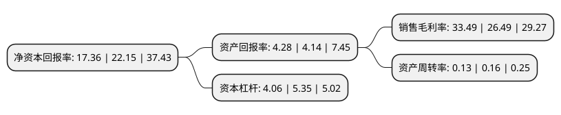

> 本页面由自动化程序生成于 2022年5月20日 01:04
> 内容可能存在错误，如有bug请提交issue至：https://github.com/Eroleice/doc-pi/issues
{.is-warning}

# 上市公司基本情况

## 基本资料

国家电投集团产融控股股份有限公司（以下简称“电投产融”）成立于1998年09月14日，石家庄市。于1999年12月23日在深交所主板上市。

电投产融注册资本538,341.852万元，主要产品:热力，电力。主要业务:发电，供热，电力服务等。以下是详细信息：

- 公司名称: 国家电投集团产融控股股份有限公司
- 股票代码: 000958.SZ
- 所在地: 河北 - 石家庄市
- 成立日期: 1998年09月14日
- 注册资本: 538,341.852万元
- 法定代表人: 李固旺
- 主营业务: 主要产品:热力，电力发电，供热，电力服务等
- 公司官网: www.spichebei.com
- 公司介绍: 公司作为石家庄市主要热力供应企业，根据热电联产生产特点及国家政策要求，在供热范围内具有明显的区域垄断性，公司生产区域集中，管理半径小，有利于提高管理效率，节约管理费用。公司主要产品为电力及热力。公司致力于能源高效利用、清洁能源等领域的发展。通过不断开拓、改革和创新，公司业务涵盖热电联产、风电、太阳能发电及分布式供能等领域；产业布局由河北省并逐步向京津冀及全国开拓。公司清洁能源业务符合国家能源及环保政策，受到大力扶持，市场前景广阔，公司可持续发展能力较强，同时，公司具有多年的热电联产管理和运营经验，热电联产行业符合国家产业政策，对石家庄市市民生活及部分工商业运行来说不可或缺。

## 股东及高管情况

上市公司第一大股东为国家电力投资集团有限公司，持股2,866,624,216股，占比53.25%，为上市公司实际控制人。

截至2022年03月31日，上市公司的前十大股东中，共有1名自然人股东，7名机构股东，1个产品账户，1个海外主体，其中5%以上大股东共有3名。上市公司前十大股东明细如下：

> 截至2022年03月31日，上市公司前十大股东信息如下：

| 股东名称 | 持股数量（股） | 持股比例 |
| --- | --- | --- |
| 国家电力投资集团有限公司 | 2,866,624,216 | 53.25% |
| 南方电网资本控股有限公司 | 642,171,794 | 11.93% |
| 云南能投资本投资有限公司 | 642,171,794 | 11.93% |
| 中国长江三峡集团有限公司 | 260,940,200 | 4.85% |
| 上海国盛资本管理有限公司-上海国企改革发展股权投资基金合伙企业(有限合伙) | 131,696,272 | 2.45% |
| 河南中豪置业有限公司 | 105,357,018 | 1.96% |
| 国家电投集团河北电力有限公司 | 69,311,196 | 1.29% |
| 香港中央结算有限公司(陆股通) | 17,018,101 | 0.32% |
| 熊奕明 | 9,551,434 | 0.18% |
| 阿拉丁能源集团有限公司 | 6,025,000 | 0.11% |

## 杜邦分析

> 数据列示周期：2021年 | 2020年 | 2019年
{.is-info}

上市公司的净资产收益率在近一年有所下降，下降幅度为-21.63%，其变化情况分解如下：
- 上市公司的销售毛利率在近一年上升了26.43%，可能是生产效率的提升、商品原材料价格下跌或商品价格的上涨所致。
- 上市公司的资产周转率在近一年下降了-18.75%，可能是源自于更慢的销售回款或库存管理效果下降。
- 上市公司的财务杠杆比率在近一年下降了-24.11%，可能是减少负债降低财务费用。

