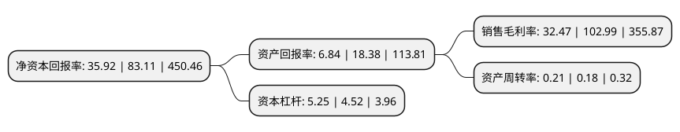

> 本页面由自动化程序生成于 2022年5月20日 01:09
> 内容可能存在错误，如有bug请提交issue至：https://github.com/Eroleice/doc-pi/issues
{.is-warning}

# 上市公司基本情况

## 基本资料

中粮资本控股股份有限公司（以下简称“中粮资本”）成立于2004年12月29日，济源市。于2010年06月03日在深交所中小板上市。

中粮资本注册资本230,410.558万元，信托，期货，寿险，银行等金融业务以下是详细信息：

- 公司名称: 中粮资本控股股份有限公司
- 股票代码: 002423.SZ
- 所在地: 河南 - 济源市
- 成立日期: 2004年12月29日
- 注册资本: 230,410.558万元
- 法定代表人: 孙彦敏
- 主营业务: 信托，期货，寿险，银行等金融业务
- 公司官网: www.cofco-capital.com
- 公司介绍: 公司原是一家回收利用废钢熔炼高品质特殊钢的资源节约型高新技术企业，主要从事以高品质特殊钢材料为基础的工业专用装备和高品质特殊钢坯料的研发、生产、销售和服务。2019年，公司置出原有资产，置入中粮资本100%股权，并将间接持有中粮资本下属相关金融企业股权，公司的业务范围将涵盖信托、期货、保险、银行等多项金融业务，成为以农业金融为特色的投资控股平台。中粮资本是中粮集团旗下运营管理金融业务的专业化公司，以中粮集团产业链为依托，完善全金融链，在业务专业化发展基础上，利用消费金融，整合资产管理和财富管理资源，促进产融协同、服务三农，成为以农业金融为特色，拥有信托、期货、保险、银行等多项业务的投资控股平台。中粮资本主要通过下属企业开展信托、期货、寿险、银行等金融业务。

## 股东及高管情况

上市公司第一大股东为中粮集团有限公司，持股1,446,543,440股，占比62.78%，为上市公司实际控制人。

截至2022年03月31日，上市公司的前十大股东中，共有6名机构股东，3个产品账户，1个海外主体，其中5%以上大股东共有2名。上市公司前十大股东明细如下：

> 截至2022年03月31日，上市公司前十大股东信息如下：

| 股东名称 | 持股数量（股） | 持股比例 |
| --- | --- | --- |
| 中粮集团有限公司 | 1,446,543,440 | 62.78% |
| 弘毅弘量(深圳)股权投资基金合伙企业(有限合伙) | 179,646,793 | 7.8% |
| 北京首农食品集团有限公司 | 90,481,396 | 3.93% |
| 兴业国信资产管理有限公司-宁波梅山保税港区雾繁投资管理合伙企业(有限合伙) | 80,427,908 | 3.49% |
| 上海国际集团资产管理有限公司 | 80,427,906 | 3.49% |
| 广东温氏投资有限公司 | 71,819,195 | 3.12% |
| 中国国有企业结构调整基金股份有限公司 | 40,213,956 | 1.75% |
| 中国航发资产管理有限公司 | 34,735,808 | 1.51% |
| 香港中央结算有限公司(陆股通) | 24,209,949 | 1.05% |
| 博时基金-中国航发资产管理有限公司-博时基金稳航1号单一资产管理计划 | 20,110,000 | 0.87% |

## 利润表分析

上市公司2021年总收入为197.07亿元，净利润为20.61亿元，实现盈利。

## 杜邦分析

> 数据列示周期：2021年 | 2020年 | 2019年
{.is-info}

上市公司的净资产收益率在近一年有所下降，下降幅度为-56.78%，其变化情况分解如下：
- 上市公司的销售毛利率在近一年下降了-68.47%，可能是生产效率的下降、商品原材料价格上涨或商品价格的下跌所致。
- 上市公司的资产周转率在近一年上升了16.67%，可能是源自于更快的销售回款或库存管理效果提升。
- 上市公司的财务杠杆比率在近一年上升了16.15%，可能是增加负债扩大生产规模。

