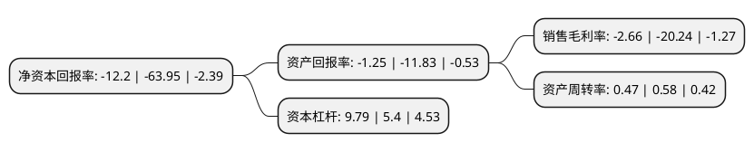

> 本页面由自动化程序生成于 2022年5月20日 01:11
> 内容可能存在错误，如有bug请提交issue至：https://github.com/Eroleice/doc-pi/issues
{.is-warning}

# 上市公司基本情况

## 基本资料

仁东控股股份有限公司（以下简称“仁东控股”）成立于1998年07月24日，绍兴市。于2011年12月28日在深交所中小板上市。

仁东控股注册资本55,993.665万元，主营业务为第三方支付，商业保理，供应链管理，金融科技产品研发的业务。以下是详细信息：

- 公司名称: 仁东控股股份有限公司
- 股票代码: 002647.SZ
- 所在地: 浙江 - 绍兴市
- 成立日期: 1998年07月24日
- 注册资本: 55,993.665万元
- 法定代表人: 王石山
- 主营业务: 主营业务为第三方支付，商业保理，供应链管理，金融科技产品研发的业务
- 公司官网: www.rendongholdings.com
- 公司介绍: 公司股票为全国首只金融科技指数-香蜜湖金融科技指数样本股。按照中国证监会最新发布的行业分类，公司属其他金融类上市公司。主营业务涵盖第三方支付、融资租赁、互联网小贷等，公司将以全方位视角积极搭建满足用户需求的金融科技体系。

## 股东及高管情况

上市公司第一大股东为北京仁东信息技术有限公司，持股74,400,000股，占比13.29%，**疑似为**上市公司实际控制人。

截至2022年05月10日，上市公司的前十大股东中，共有3名自然人股东，6名机构股东，1个海外主体，其中5%以上大股东共有4名。上市公司前十大股东明细如下：

> 未能通过持股比例判定出上市公司实际控制人（持股30%以上）
> 可能存在通过间接持股、联合持股、协议控制等方式拥有实际控制权的主体，具体请参考上市公司定期公告！
{.is-warning}

> 截至2022年05月10日，上市公司前十大股东信息如下：

| 股东名称 | 持股数量（股） | 持股比例 |
| --- | --- | --- |
| 北京仁东信息技术有限公司 | 74,400,000 | 13.29% |
| 北京仁东信息技术有限公司 | 74,400,000 | 13.29% |
| 天津和柚技术有限公司 | 48,312,117 | 8.63% |
| 山西潞城农村商业银行股份有限公司 | 28,197,750 | 5.04% |
| 仁东(天津)科技有限公司 | 10,880,958 | 1.94% |
| 青岛三和泰投资有限公司 | 1,000,100 | 0.18% |
| MORGAN STANLEY & CO. INTERNATIONAL PLC. | 941,839 | 0.17% |
| 刘伟 | 767,400 | 0.14% |
| 蔡毅 | 727,800 | 0.13% |
| 钟向前 | 724,300 | 0.13% |

## 利润表分析

上市公司2021年总收入为17.28亿元，净利润为-0.46亿元，**未实现盈利**。

## 杜邦分析

> 数据列示周期：2021年 | 2020年 | 2019年
{.is-info}

上市公司的净资产收益率在近一年有所下降，下降幅度为-80.92%，其变化情况分解如下：
- 上市公司的销售毛利率在近一年下降了-86.86%，可能是生产效率的下降、商品原材料价格上涨或商品价格的下跌所致。
- 上市公司的资产周转率在近一年下降了-18.97%，可能是源自于更慢的销售回款或库存管理效果下降。
- 上市公司的财务杠杆比率在近一年上升了81.3%，可能是增加负债扩大生产规模。

