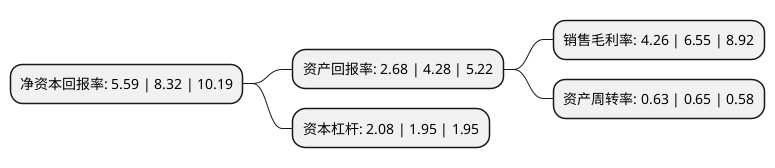

> 本页面由自动化程序生成于 2022年5月20日 01:24
> 内容可能存在错误，如有bug请提交issue至：https://github.com/Eroleice/doc-pi/issues
{.is-warning}

# 上市公司基本情况

## 基本资料

浙江东方金融控股集团股份有限公司（以下简称“浙江东方”）成立于1994年10月26日，杭州市。于1997年12月01日在上交所主板上市。

浙江东方注册资本289,632.312万元，主要业务:商品流通，服装加工业务，房地产销售，货物运输代理及其他。以下是详细信息：

- 公司名称: 浙江东方金融控股集团股份有限公司
- 股票代码: 600120.SH
- 所在地: 浙江 - 杭州市
- 成立日期: 1994年10月26日
- 注册资本: 289,632.312万元
- 法定代表人: 金朝萍
- 主营业务: 商品流通，服装加工业务，房地产销售，货物运输代理及其他
- 公司官网: www.zjorient.com
- 公司介绍: 浙江东方金融控股集团股份有限公司系浙江省国资委下属浙江省国际贸易集团有限公司旗下的核心企业，成立于1988年，1997年在上海证券交易所上市。2017年完成资产重组后，公司成为一家拥有信托、期货、保险、融资租赁、基金投资与管理、财富管理等多项金融业务的控股集团，实现了从传统外贸企业到浙江省省属国有上市金控平台的跨越式发展。目前公司旗下控股子公司39家，参股公司20余家，核心业务涉及金融、类金融及国内外贸易等领域。在金融板块，公司通过浙金信托、大地期货、中韩人寿、国金租赁、东方产融、般若财富、东方嘉富等金融和投资类子公司开展业务，为客户提供多层次全方位的资产管理服务；此外，公司还持有永安期货(833840)、华安证券(600909)、硅谷天堂(833044)等企业股权。在商贸板块，公司持续推进整合重组和转型升级，推出“东方优品”定制品牌，打造拳头产品，创新营销方式，积极融入国内国际“双循环”。

## 股东及高管情况

上市公司第一大股东为浙江省国际贸易集团有限公司，持股1,405,252,709股，占比48.52%，为上市公司实际控制人。

截至2022年03月31日，上市公司的前十大股东中，共有2名自然人股东，4名机构股东，3个产品账户，1个海外主体，其中5%以上大股东共有1名。上市公司前十大股东明细如下：

> 截至2022年03月31日，上市公司前十大股东信息如下：

| 股东名称 | 持股数量（股） | 持股比例 |
| --- | --- | --- |
| 浙江省国际贸易集团有限公司 | 1,405,252,709 | 48.52% |
| 浙江浙盐控股有限公司 | 87,159,838 | 3.01% |
| 中央汇金资产管理有限责任公司 | 30,125,579 | 1.04% |
| 香港中央结算有限公司(陆股通) | 24,434,802 | 0.84% |
| 芜湖华融融斌投资中心(有限合伙) | 24,038,846 | 0.83% |
| 嘉实基金-农业银行-嘉实中证金融资产管理计划 | 17,911,584 | 0.62% |
| 陈穗强 | 14,380,017 | 0.5% |
| 吴晓阳 | 13,923,259 | 0.48% |
| 温州启元资产管理有限公司-启元尊享2号私募证券投资基金 | 13,430,000 | 0.46% |
| 温州启元资产管理有限公司-启元尊享1号私募证券投资基金 | 13,220,000 | 0.46% |

## 利润表分析

上市公司2021年总收入为176.69亿元，净利润为7.22亿元，实现盈利。

## 杜邦分析

> 数据列示周期：2021年 | 2020年 | 2019年
{.is-info}

上市公司的净资产收益率在近一年有所下降，下降幅度为-32.81%，其变化情况分解如下：
- 上市公司的销售毛利率在近一年下降了-34.96%，可能是生产效率的下降、商品原材料价格上涨或商品价格的下跌所致。
- 上市公司的资产周转率在近一年下降了-3.08%，可能是源自于更慢的销售回款或库存管理效果下降。
- 上市公司的财务杠杆比率在近一年上升了6.67%，可能是增加负债扩大生产规模。

