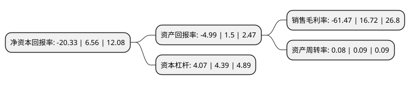

> 本页面由自动化程序生成于 2022年5月20日 01:25
> 内容可能存在错误，如有bug请提交issue至：https://github.com/Eroleice/doc-pi/issues
{.is-warning}

# 上市公司基本情况

## 基本资料

安徽新力金融股份有限公司（以下简称“新力金融”）成立于2007年06月27日，合肥市。于2000年12月08日在上交所主板上市。

新力金融注册资本51,272.763万元，主要产品:水泥产品，商品熟料。以下是详细信息：

- 公司名称: 安徽新力金融股份有限公司
- 股票代码: 600318.SH
- 所在地: 安徽 - 合肥市
- 成立日期: 2007年06月27日
- 注册资本: 51,272.763万元
- 法定代表人: 朱金和
- 主营业务: 主要产品:水泥产品，商品熟料
- 公司官网: www.xinlijinrong.cn
- 公司介绍: 公司地处安徽省巢湖市，是经安徽省人民政府皖政秘[1998]273号文批准，由安徽省巢湖水泥厂、东关水泥厂作为主发起人联合其他三个法人股东共同发起设立的股份有限公司。公司主营业务包括水泥生产与销售及类金融服务业并行的双主业,后通过重大资产出售，将主营业务中的水泥业务置出，进一步聚焦类金融服务业，实现转型升级与长远发展。公司主营业务变更为融资租赁、小贷、融资性担保、典当等类金融服务业务。

## 股东及高管情况

上市公司第一大股东为安徽新力科创集团有限公司，持股120,999,907股，占比23.6%，**疑似为**上市公司实际控制人。

截至2022年03月31日，上市公司的前十大股东中，共有5名自然人股东，3名机构股东，2个产品账户，其中5%以上大股东共有2名。上市公司前十大股东明细如下：

> 未能通过持股比例判定出上市公司实际控制人（持股30%以上）
> 可能存在通过间接持股、联合持股、协议控制等方式拥有实际控制权的主体，具体请参考上市公司定期公告！
{.is-warning}

> 截至2022年03月31日，上市公司前十大股东信息如下：

| 股东名称 | 持股数量（股） | 持股比例 |
| --- | --- | --- |
| 安徽新力科创集团有限公司 | 120,999,907 | 23.6% |
| 安徽海螺水泥股份有限公司 | 26,070,650 | 5.08% |
| 张敬红 | 24,226,400 | 4.73% |
| 安徽新力金融股份有限公司-安徽新力金融股份有限公司员工持股计划 | 20,800,000 | 4.06% |
| 王剑 | 8,149,410 | 1.59% |
| 陆苏香 | 3,152,900 | 0.61% |
| 上海通怡投资管理有限公司-通怡麒麟5号私募证券投资基金 | 3,001,400 | 0.59% |
| 深圳市软银奥津科技有限公司 | 2,795,000 | 0.55% |
| 陈东阳 | 2,151,900 | 0.42% |
| 郑海御 | 2,035,257 | 0.4% |

## 利润表分析

上市公司2021年总收入为3.95亿元，净利润为-2.44亿元，**未实现盈利**。

## 杜邦分析

> 数据列示周期：2021年 | 2020年 | 2019年
{.is-info}

上市公司的净资产收益率在近一年有所下降，下降幅度为-409.91%，其变化情况分解如下：
- 上市公司的销售毛利率在近一年下降了-467.64%，可能是生产效率的下降、商品原材料价格上涨或商品价格的下跌所致。
- 上市公司的资产周转率在近一年下降了-11.11%，可能是源自于更慢的销售回款或库存管理效果下降。
- 上市公司的财务杠杆比率在近一年下降了-7.29%，可能是减少负债降低财务费用。

