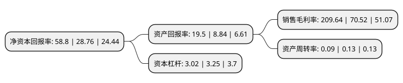

> 本页面由自动化程序生成于 2022年5月20日 01:26
> 内容可能存在错误，如有bug请提交issue至：https://github.com/Eroleice/doc-pi/issues
{.is-warning}

# 上市公司基本情况

## 基本资料

五矿资本股份有限公司（以下简称“五矿资本”）成立于1999年08月31日，长沙市。于2001年01月15日在上交所主板上市。

五矿资本注册资本449,806.546万元，主要产品:超硬材料，电子基础材料。主营业务为锰及锰系产品和电池正极材料，证券，期货，信托，金融租赁等多项金融牌照业务以下是详细信息：

- 公司名称: 五矿资本股份有限公司
- 股票代码: 600390.SH
- 所在地: 湖南 - 长沙市
- 成立日期: 1999年08月31日
- 注册资本: 449,806.546万元
- 法定代表人: 赵立功
- 主营业务: 主要产品:超硬材料，电子基础材料主营业务为锰及锰系产品和电池正极材料，证券，期货，信托，金融租赁等多项金融牌照业务
- 公司官网: www.minfinance.com.cn
- 公司介绍: 公司原是一家主营电子基础材料和超硬材料的企业，公司致力于新材料的研发和生产，主要涉及电池材料和锰系材料两大板块，电池材料产品包括多元复合材料、钴酸锂系列、锰酸锂系列等锂电正极材料产品及球形氢氧化镍系列产品,后经过重大资产重组后五矿资本成为上市公司的全资子公司，上市公司的主营业务中增加金融业务，且金融业务规模占比较高。五矿资本是中国五矿的金融控股型平台公司，其核心覆盖证券、期货、信托、金融租赁等多项金融牌照业务，竞争优势较为显著。

## 股东及高管情况

上市公司第一大股东为中国五矿股份有限公司，持股2,117,064,042股，占比47.07%，为上市公司实际控制人。

截至2022年03月31日，上市公司的前十大股东中，共有6名机构股东，4个产品账户，其中5%以上大股东共有1名。上市公司前十大股东明细如下：

> 截至2022年03月31日，上市公司前十大股东信息如下：

| 股东名称 | 持股数量（股） | 持股比例 |
| --- | --- | --- |
| 中国五矿股份有限公司 | 2,117,064,042 | 47.07% |
| 中建资本控股有限公司 | 177,339,901 | 3.94% |
| 华宝证券-平安银行-华宝证券华增五号集合资产管理计划 | 160,825,621 | 3.58% |
| 长沙矿冶研究院有限责任公司 | 150,751,955 | 3.35% |
| 前海开源基金-农业银行-上海茁蓄投资管理合伙企业(有限合伙) | 106,555,030 | 2.37% |
| 颐和银丰天元(天津)集团有限公司 | 104,168,681 | 2.32% |
| 中远海运发展股份有限公司 | 101,135,591 | 2.25% |
| 深圳市平安置业投资有限公司 | 66,019,517 | 1.47% |
| 兴业全球基金-招商银行-中航信托股份有限公司 | 35,467,980 | 0.79% |
| 兴业全球基金-招商银行-哈尔滨银行股份有限公司 | 35,467,980 | 0.79% |

## 利润表分析

上市公司2021年总收入为130.31亿元，净利润为41.73亿元，实现盈利。

## 杜邦分析

> 数据列示周期：2021年 | 2020年 | 2019年
{.is-info}

上市公司的净资产收益率在近一年有所上升，上升幅度为104.45%，其变化情况分解如下：
- 上市公司的销售毛利率在近一年上升了197.28%，可能是生产效率的提升、商品原材料价格下跌或商品价格的上涨所致。
- 上市公司的资产周转率在近一年下降了-30.77%，可能是源自于更慢的销售回款或库存管理效果下降。
- 上市公司的财务杠杆比率在近一年下降了-7.08%，可能是减少负债降低财务费用。

