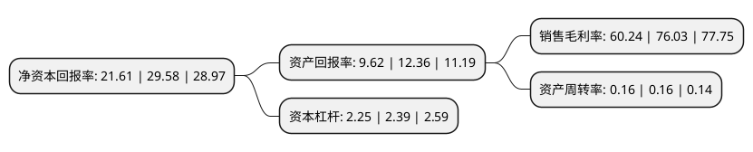

> 本页面由自动化程序生成于 2022年5月20日 01:28
> 内容可能存在错误，如有bug请提交issue至：https://github.com/Eroleice/doc-pi/issues
{.is-warning}

# 上市公司基本情况

## 基本资料

上海爱建集团股份有限公司（以下简称“爱建集团”）成立于1983年11月28日，上海市。于1993年04月26日在上交所主板上市。

爱建集团注册资本162,192.245万元，工业，商业，旅游饮食服务业。以下是详细信息：

- 公司名称: 上海爱建集团股份有限公司
- 股票代码: 600643.SH
- 所在地: 上海 - 上海市
- 成立日期: 1983年11月28日
- 注册资本: 162,192.245万元
- 法定代表人: 王均金
- 主营业务: 工业，商业，旅游饮食服务业
- 公司官网: www.aj.com.cn
- 公司介绍: 公司主营信托、房地产管理和进出口代理等业务，是上海市实力强大的金融、房地产类上市公司，也是我国上市公司中少数几家具备信托金融牌照的上市之一。因受国家政策的影响，对原公司房地产分公司进行重大决策调整，探索资产管理业务，发挥房产经营管理专长，管理的田林爱建园小区获得了上海市“园林式居住区”和“节水示范小区”称号。未来公司将坚定不移地贯彻实施“财富管理和资产管理综合服务提供商”主战略，并抓紧完善与战略目标相适应的业务布局、管理架构、内控体系、人力资源、体制机制，力争通过努力，把爱建公司建设成为一家以金融业为主体、专注于提供财富管理和资产管理综合服务的、具备优质服务、优良业绩、优秀形象的成长性上市公司，为上海国际金融中心的建设做出积极贡献。

## 股东及高管情况

上市公司第一大股东为上海均瑶(集团)有限公司，持股483,333,355股，占比29.8%，**疑似为**上市公司实际控制人。

截至2022年03月31日，上市公司的前十大股东中，共有2名自然人股东，2名机构股东，4个产品账户，1个海外主体，1名其他股东，其中5%以上大股东共有3名。上市公司前十大股东明细如下：

> 未能通过持股比例判定出上市公司实际控制人（持股30%以上）
> 可能存在通过间接持股、联合持股、协议控制等方式拥有实际控制权的主体，具体请参考上市公司定期公告！
{.is-warning}

> 截至2022年03月31日，上市公司前十大股东信息如下：

| 股东名称 | 持股数量（股） | 持股比例 |
| --- | --- | --- |
| 上海均瑶(集团)有限公司 | 483,333,355 | 29.8% |
| 上海工商界爱国建设特种基金会 | 176,740,498 | 10.9% |
| 广州产业投资基金管理有限公司 | 104,883,445 | 6.47% |
| 香港中央结算有限公司(陆股通) | 49,477,386 | 3.05% |
| 上海华豚企业管理有限公司 | 24,089,000 | 1.49% |
| 广州汇垠天粤股权投资基金管理有限公司 | 20,910,000 | 1.29% |
| 刘靖基 | 9,085,727 | 0.56% |
| 中国农业银行股份有限公司-中证500交易型开放式指数证券投资基金 | 4,972,105 | 0.31% |
| 上海市工商业联合会 | 4,353,583 | 0.27% |
| 刘克明 | 4,185,200 | 0.26% |

## 利润表分析

上市公司2021年总收入为43.22亿元，净利润为11.52亿元，实现盈利。

## 杜邦分析

> 数据列示周期：2021年 | 2020年 | 2019年
{.is-info}

上市公司的净资产收益率在近一年有所下降，下降幅度为-26.94%，其变化情况分解如下：
- 上市公司的销售毛利率在近一年下降了-20.77%，可能是生产效率的下降、商品原材料价格上涨或商品价格的下跌所致。
- 上市公司的资产周转率在近一年下降了0%，可能是源自于更慢的销售回款或库存管理效果下降。
- 上市公司的财务杠杆比率在近一年下降了-5.86%，可能是减少负债降低财务费用。

