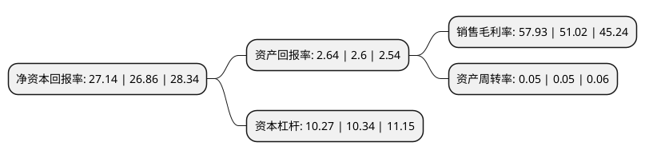

> 本页面由自动化程序生成于 2022年5月20日 01:28
> 内容可能存在错误，如有bug请提交issue至：https://github.com/Eroleice/doc-pi/issues
{.is-warning}

# 上市公司基本情况

## 基本资料

中航工业产融控股股份有限公司（以下简称“中航产融”）成立于1992年07月24日，哈尔滨市。于1996年05月16日在上交所主板上市。

中航产融注册资本891,997.463万元，实业投资，股权投资和投资咨询(服务);法律法规允许公司经营的其他业务。以下是详细信息：

- 公司名称: 中航工业产融控股股份有限公司
- 股票代码: 600705.SH
- 所在地: 黑龙江 - 哈尔滨市
- 成立日期: 1992年07月24日
- 注册资本: 891,997.463万元
- 法定代表人: 姚江涛
- 主营业务: 实业投资，股权投资和投资咨询(服务);法律法规允许公司经营的其他业务
- 公司官网: www.avicindustry-finance.com
- 公司介绍: 公司是一家以证券、租赁、期货、财务公司等金融业务和财务性实业股权投资为主要业务的公司，隶属于中国航空工业集团公司，是中国航空工业集团公司的重要平台—金融投资平台。公司旗下拥有证券、信托、租赁、财务公司、期货等牌照，坚持以客户为中心，通过整合牌照、人力、资金等资源，发挥协同优势，为客户提供一揽子金融解决方案。公司通过构建金融产业投资、航空产业投资和战略新兴产业投资三大平台模式对金融产业、航空高科技产业和新兴产业公司进行投资。一方面，公司依托股东中航工业高新技术、产业资源高速发展和品牌优势，紧密围绕航空产业链，进行航空产业投资，有效提升国家航空工业实力，拓展产融结合深度与广度。另一方面，公司紧紧围绕国家战略新兴产业发展，积极挖掘市场机会，投资了一系列涉及高新技术产业，有效夯实了投资基础。同时，公司通过参股并购基金模式，构建多层次资产管理体系，形成业务结构多元化。

## 股东及高管情况

上市公司第一大股东为中国航空工业集团有限公司，持股3,518,510,294股，占比39.45%，为上市公司实际控制人。

截至2022年03月31日，上市公司的前十大股东中，共有8名机构股东，1个产品账户，1个海外主体，其中5%以上大股东共有1名。上市公司前十大股东明细如下：

> 截至2022年03月31日，上市公司前十大股东信息如下：

| 股东名称 | 持股数量（股） | 持股比例 |
| --- | --- | --- |
| 中国航空工业集团有限公司 | 3,518,510,294 | 39.45% |
| 中国航空技术深圳有限公司 | 358,248,288 | 4.02% |
| 中国航空技术国际控股有限公司 | 319,766,434 | 3.58% |
| 中国证券金融股份有限公司 | 239,944,462 | 2.69% |
| 中国铁路哈尔滨局集团有限公司 | 197,012,788 | 2.21% |
| 香港中央结算有限公司(陆股通) | 185,984,975 | 2.09% |
| 共青城羽绒服装创业基地公共服务有限公司 | 98,175,340 | 1.1% |
| 中航资本控股股份有限公司回购专用证券账户 | 89,282,615 | 1% |
| 中国电子科技集团有限公司 | 57,887,306 | 0.65% |
| 江西省财政投资管理公司 | 54,978,918 | 0.62% |

## 利润表分析

上市公司2021年总收入为190.84亿元，净利润为61.17亿元，实现盈利。

## 杜邦分析

> 数据列示周期：2021年 | 2020年 | 2019年
{.is-info}

上市公司的净资产收益率在近一年有所上升，上升幅度为1.04%，其变化情况分解如下：
- 上市公司的销售毛利率在近一年上升了13.54%，可能是生产效率的提升、商品原材料价格下跌或商品价格的上涨所致。
- 上市公司的资产周转率在近一年下降了0%，可能是源自于更慢的销售回款或库存管理效果下降。
- 上市公司的财务杠杆比率在近一年下降了-0.68%，可能是减少负债降低财务费用。

