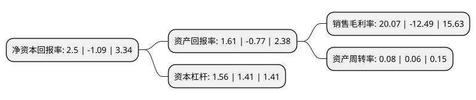

> 本页面由自动化程序生成于 2022年5月20日 01:29
> 内容可能存在错误，如有bug请提交issue至：https://github.com/Eroleice/doc-pi/issues
{.is-warning}

# 上市公司基本情况

## 基本资料

香溢融通控股集团股份有限公司（以下简称“香溢融通”）成立于1998年01月08日，宁波市。于1994年02月24日在上交所主板上市。

香溢融通注册资本45,432.275万元，主要业务:商品销售，餐饮，保险服务，典当。以下是详细信息：

- 公司名称: 香溢融通控股集团股份有限公司
- 股票代码: 600830.SH
- 所在地: 浙江 - 宁波市
- 成立日期: 1998年01月08日
- 注册资本: 45,432.275万元
- 法定代表人: 邵松长
- 主营业务: 商品销售，餐饮，保险服务，典当
- 公司官网: www.sunnyloantop.cn
- 公司介绍: 公司是中国证券A股市场以投融资服务商为市场定位，以集团化协同运作多种金融工具为主营的上市公司。致力以先进的阳光服务理念、便捷的业务操作流程、专业的服务团队、合理的融资费率为客户提供优质的定制化服务体验。目前公司从事的主要业务有：典当、担保、融资租赁、财富管理、贸易等。公司致力以先进的阳光服务理念、便捷的业务操作流程、专业的服务团队、合理的融资费率为客户提供优质的定制化服务体验。公司坚持以科学发展观为指导，积极稳健，开拓创新，和谐进取，正不懈努力，打造以典当、财富管理、租赁、担保等类金融业务为主体，以贸易和投资为两翼的“一主两翼”格局。

## 股东及高管情况

上市公司第一大股东为浙江香溢控股有限公司，持股69,342,233股，占比15.26%，**疑似为**上市公司实际控制人。

截至2022年03月31日，上市公司的前十大股东中，共有2名自然人股东，8名机构股东，其中5%以上大股东共有2名。上市公司前十大股东明细如下：

> 未能通过持股比例判定出上市公司实际控制人（持股30%以上）
> 可能存在通过间接持股、联合持股、协议控制等方式拥有实际控制权的主体，具体请参考上市公司定期公告！
{.is-warning}

> 截至2022年03月31日，上市公司前十大股东信息如下：

| 股东名称 | 持股数量（股） | 持股比例 |
| --- | --- | --- |
| 浙江香溢控股有限公司 | 69,342,233 | 15.26% |
| 浙江烟草投资管理有限责任公司 | 54,710,381 | 12.04% |
| 中天控股集团有限公司 | 22,681,625 | 4.99% |
| 浙江中烟投资管理有限公司 | 13,500,000 | 2.97% |
| 宁波海曙产业投资有限公司 | 12,546,841 | 2.76% |
| 宁波大红鹰投资有限公司 | 5,460,000 | 1.2% |
| 宋天峰 | 4,706,928 | 1.04% |
| 北京大成康太餐饮有限公司 | 3,266,800 | 0.72% |
| 林高 | 2,600,000 | 0.57% |
| 北京中成泰富餐饮有限公司 | 1,763,377 | 0.39% |

## 利润表分析

上市公司2021年总收入为2.6亿元，净利润为0.32亿元，实现盈利。

## 杜邦分析

> 数据列示周期：2021年 | 2020年 | 2019年
{.is-info}

上市公司的净资产收益率在近一年有所下降，下降幅度为-329.36%，其变化情况分解如下：
- 上市公司的销售毛利率在近一年下降了-260.69%，可能是生产效率的下降、商品原材料价格上涨或商品价格的下跌所致。
- 上市公司的资产周转率在近一年上升了33.33%，可能是源自于更快的销售回款或库存管理效果提升。
- 上市公司的财务杠杆比率在近一年上升了10.64%，可能是增加负债扩大生产规模。

