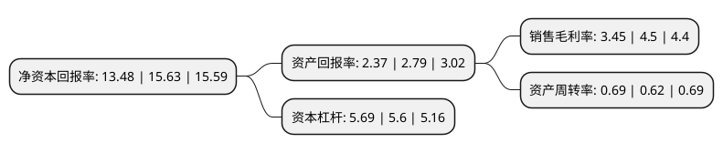

> 本页面由自动化程序生成于 2022年5月20日 01:29
> 内容可能存在错误，如有bug请提交issue至：https://github.com/Eroleice/doc-pi/issues
{.is-warning}

# 上市公司基本情况

## 基本资料

永安期货股份有限公司（以下简称“永安期货”）成立于1992年09月07日，杭州市。于2021年12月23日在上交所主板上市。

永安期货注册资本145,555.556万元，商品期货经纪，金融期货经纪，期货投资咨询，资产管理，基金销售，风险管理等以下是详细信息：

- 公司名称: 永安期货股份有限公司
- 股票代码: 600927.SH
- 所在地: 浙江 - 杭州市
- 成立日期: 1992年09月07日
- 注册资本: 145,555.556万元
- 法定代表人: 葛国栋
- 主营业务: 商品期货经纪，金融期货经纪，期货投资咨询，资产管理，基金销售，风险管理等
- 公司官网: www.yafco.com
- 公司介绍: 公司是国内同行中规模最大、业务范围最宽、研究实力最强的期货公司之一，公司从事的主要业务为：商品期货经纪、金融期货经纪、期货投资咨询、资产管理、基金销售。公司实际控制人为浙江省财政厅，持有公司股权主要股东有：财通证券股份有限公司、浙江省产业基金有限公司、浙江东方金融控股集团、浙江省经济建设投资有限公司、浙江省协作大厦有限公司。自成立以来，永安期货的经营规模牢固占据浙江省第一，且自2003年起，经营规模基本稳定在全国前三，是国内唯一连续十五年跻身全国十强行列的期货公司。公司积极创新拓展混业经营、风险管理、财富管理、互联网化、全球配置五大业务领域，致力于成为国际一流的衍生品综合服务商。

## 股东及高管情况

上市公司第一大股东为财通证券股份有限公司，持股439,347,825股，占比30.18%，为上市公司实际控制人。

截至2022年03月31日，上市公司的前十大股东中，共有1名自然人股东，6名机构股东，3个产品账户，其中5%以上大股东共有5名。上市公司前十大股东明细如下：

> 截至2022年03月31日，上市公司前十大股东信息如下：

| 股东名称 | 持股数量（股） | 持股比例 |
| --- | --- | --- |
| 财通证券股份有限公司 | 439,347,825 | 30.18% |
| 浙江省产业基金有限公司 | 350,000,000 | 24.05% |
| 浙江东方金融控股集团股份有限公司 | 166,427,690 | 11.43% |
| 浙江省经济建设投资有限公司 | 138,689,727 | 9.53% |
| 浙江省金融控股有限公司 | 138,689,727 | 9.53% |
| 物产中大集团股份有限公司 | 27,500,000 | 1.89% |
| 方继方 | 5,842,000 | 0.4% |
| 南通金玖惠通三期创业投资基金合伙企业(有限合伙) | 4,795,000 | 0.33% |
| 江苏柏博产业基金管理有限公司-南京柏载投资合伙企业(有限合伙) | 3,393,000 | 0.23% |
| 浙江省经协集团有限公司 | 3,020,000 | 0.21% |

## 利润表分析

上市公司2021年总收入为378.41亿元，净利润为13.06亿元，实现盈利。

## 杜邦分析

> 数据列示周期：2021年 | 2020年 | 2019年
{.is-info}

上市公司的净资产收益率在近一年有所下降，下降幅度为-13.76%，其变化情况分解如下：
- 上市公司的销售毛利率在近一年下降了-23.33%，可能是生产效率的下降、商品原材料价格上涨或商品价格的下跌所致。
- 上市公司的资产周转率在近一年上升了11.29%，可能是源自于更快的销售回款或库存管理效果提升。
- 上市公司的财务杠杆比率在近一年上升了1.61%，可能是增加负债扩大生产规模。

