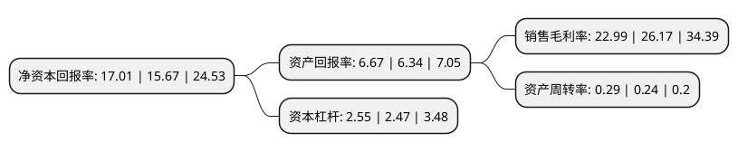

> 本页面由自动化程序生成于 2022年5月20日 01:33
> 内容可能存在错误，如有bug请提交issue至：https://github.com/Eroleice/doc-pi/issues
{.is-warning}

# 上市公司基本情况

## 基本资料

浙江华铁应急设备科技股份有限公司（以下简称“华铁应急”）成立于2008年11月21日，杭州市。于2015年05月29日在上交所主板上市。

华铁应急注册资本90,195.251万元，公司主营业务为建筑安全支护设备租赁，公司的建筑安全支护设备主要包括钢支撑类，贝雷类，脚手架类等三大基础类别。以下是详细信息：

- 公司名称: 浙江华铁应急设备科技股份有限公司
- 股票代码: 603300.SH
- 所在地: 浙江 - 杭州市
- 成立日期: 2008年11月21日
- 注册资本: 90,195.251万元
- 法定代表人: 胡丹锋
- 主营业务: 公司主营业务为建筑安全支护设备租赁，公司的建筑安全支护设备主要包括钢支撑类，贝雷类，脚手架类等三大基础类别
- 公司官网: www.zjhuatie.cn
- 公司介绍: 公司是一家旨在维护建筑体在施工过程中的稳定及施工人员安全，为各类城市轨道建设、高架桥梁建设、民用建设等提供专业的建筑安全支护设备租赁、成套方案优化以及深基坑维护、支持的高科技跟踪技术服务的安全科技型企业。在资产规模的快速扩充和业务快速发展的基础上，公司不断优化内部组织架构，先后设立了全资子公司，陆续在全国多个主要城市设立分公司及办事处。自公司创建以来，先后参与了中国中铁股份有限公司、中国铁建股份有限公司、中国交通建设股份有限公司等旗下各局多项国家重大工程建筑安全支护设备的租赁、优化设计、维护等业务服务，并研发了应力监测系统和自动加压系统，全方位保障施工安全。

## 股东及高管情况

上市公司第一大股东为胡丹锋，持股120,352,400股，占比13.34%，**疑似为**上市公司实际控制人。

截至2022年03月31日，上市公司的前十大股东中，共有4名自然人股东，1名机构股东，5个产品账户，其中5%以上大股东共有1名。上市公司前十大股东明细如下：

> 未能通过持股比例判定出上市公司实际控制人（持股30%以上）
> 可能存在通过间接持股、联合持股、协议控制等方式拥有实际控制权的主体，具体请参考上市公司定期公告！
{.is-warning}

> 截至2022年03月31日，上市公司前十大股东信息如下：

| 股东名称 | 持股数量（股） | 持股比例 |
| --- | --- | --- |
| 胡丹锋 | 120,352,400 | 13.34% |
| 中国农业银行股份有限公司-大成新锐产业混合型证券投资基金 | 37,234,820 | 4.13% |
| 红塔红土基金-云南信托-云清5号单一资金信托-红塔红土致远2号单一资产管理计划 | 36,231,884 | 4.02% |
| 黄建新 | 21,784,722 | 2.42% |
| 广发证券股份有限公司-大成睿景灵活配置混合型证券投资基金 | 21,227,740 | 2.35% |
| 马锡金 | 20,075,456 | 2.23% |
| 吴丽敏 | 19,927,536 | 2.21% |
| 南华基金-云南信托-云清6号单一资金信托-南华优选2号单一资产管理计划 | 19,019,904 | 2.11% |
| 景宁恒发股权投资合伙企业(有限合伙) | 15,811,079 | 1.75% |
| 深圳市恒泰融安投资管理有限公司-恒泰融安晟睿1号私募证券投资基金 | 15,733,142 | 1.74% |

## 利润表分析

上市公司2021年总收入为26.06亿元，净利润为5.99亿元，实现盈利。

## 杜邦分析

> 数据列示周期：2021年 | 2020年 | 2019年
{.is-info}

上市公司的净资产收益率在近一年有所上升，上升幅度为8.55%，其变化情况分解如下：
- 上市公司的销售毛利率在近一年下降了-12.15%，可能是生产效率的下降、商品原材料价格上涨或商品价格的下跌所致。
- 上市公司的资产周转率在近一年上升了20.83%，可能是源自于更快的销售回款或库存管理效果提升。
- 上市公司的财务杠杆比率在近一年上升了3.24%，可能是增加负债扩大生产规模。

