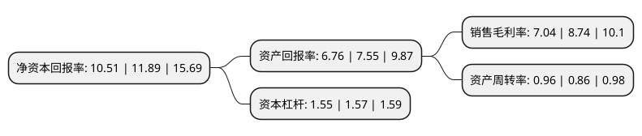

> 本页面由自动化程序生成于 2022年5月20日 01:04
> 内容可能存在错误，如有bug请提交issue至：https://github.com/Eroleice/doc-pi/issues
{.is-warning}

# 上市公司基本情况

## 基本资料

大亚圣象家居股份有限公司（以下简称“大亚圣象”）成立于1999年04月20日，镇江市。于1999年06月30日在深交所主板上市。

大亚圣象注册资本54,739.75万元，主要产品:中高密度板，木地板产品，中高密度板，木地板产品等以下是详细信息：

- 公司名称: 大亚圣象家居股份有限公司
- 股票代码: 000910.SZ
- 所在地: 江苏 - 镇江市
- 成立日期: 1999年04月20日
- 注册资本: 54,739.75万元
- 法定代表人: 陈建军
- 主营业务: 主要产品:中高密度板，木地板产品，中高密度板，木地板产品等
- 公司官网: www.dareglobal.com.cn
- 公司介绍: 公司是国家林业重点龙头企业、高新技术企业，地板和人造板行业龙头企业。公司以人造板、地板为主业，已建成一条完善的涵盖资源、基材、工厂、研发、设计、营销、服务等各大环节的森工行业上下游的绿色产业链。公司目前已通过ISO9001、ISO14001国际质量、环境管理体系认证，公司主导产品已达欧洲的E0、E1级环保标准。公司倡导绿色消费理念，打造“高品质、高环保”产品，坚持做大做强人造板和木地板两大主业，坚定绿色产业链、大家居、品牌发展、国际化、可持续性发展战略，拓宽公司的未来发展空间。

## 股东及高管情况

上市公司第一大股东为大亚科技集团有限公司，持股254,200,800股，占比46.44%，为上市公司实际控制人。

截至2022年03月31日，上市公司的前十大股东中，共有1名自然人股东，1名机构股东，7个产品账户，1个海外主体，其中5%以上大股东共有1名。上市公司前十大股东明细如下：

> 截至2022年03月31日，上市公司前十大股东信息如下：

| 股东名称 | 持股数量（股） | 持股比例 |
| --- | --- | --- |
| 大亚科技集团有限公司 | 254,200,800 | 46.44% |
| 全国社保基金一一三组合 | 22,283,542 | 4.07% |
| 香港中央结算有限公司(陆股通) | 19,502,916 | 3.56% |
| 中国建设银行股份有限公司-中欧价值发现股票型证券投资基金 | 16,696,814 | 3.05% |
| 中国工商银行股份有限公司-中欧潜力价值灵活配置混合型证券投资基金 | 11,482,849 | 2.1% |
| 基本养老保险基金八零二组合 | 10,498,492 | 1.92% |
| 前海人寿保险股份有限公司-分红保险产品 | 3,859,975 | 0.71% |
| 基本养老保险基金一二零一组合 | 3,631,799 | 0.66% |
| 瞿惠玲 | 3,439,064 | 0.63% |
| 交通银行-华夏蓝筹核心混合型证券投资基金(LOF) | 3,250,400 | 0.59% |

## 利润表分析

上市公司2021年总收入为87.5亿元，净利润为6.16亿元，实现盈利。

## 杜邦分析

> 数据列示周期：2021年 | 2020年 | 2019年
{.is-info}

上市公司的净资产收益率在近一年有所下降，下降幅度为-11.61%，其变化情况分解如下：
- 上市公司的销售毛利率在近一年下降了-19.45%，可能是生产效率的下降、商品原材料价格上涨或商品价格的下跌所致。
- 上市公司的资产周转率在近一年上升了11.63%，可能是源自于更快的销售回款或库存管理效果提升。
- 上市公司的财务杠杆比率在近一年下降了-1.27%，可能是减少负债降低财务费用。

