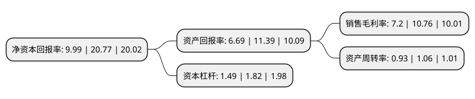

> 本页面由自动化程序生成于 2022年5月20日 01:05
> 内容可能存在错误，如有bug请提交issue至：https://github.com/Eroleice/doc-pi/issues
{.is-warning}

# 上市公司基本情况

## 基本资料

双枪科技股份有限公司（以下简称“双枪科技”）成立于2002年09月20日，杭州市。于2021年08月05日在深交所主板上市。

双枪科技注册资本7,200万元，公司致力于日用餐厨的研发，设计，生产和销售，主要产品包括筷子，砧板，勺铲，签类和其他餐厨具5个大类。以下是详细信息：

- 公司名称: 双枪科技股份有限公司
- 股票代码: 001211.SZ
- 所在地: 浙江 - 杭州市
- 成立日期: 2002年09月20日
- 注册资本: 7,200万元
- 法定代表人: 郑承烈
- 主营业务: 公司致力于日用餐厨的研发，设计，生产和销售，主要产品包括筷子，砧板，勺铲，签类和其他餐厨具5个大类
- 公司官网: www.sqzm.com
- 公司介绍: 公司系一家领先的日用餐厨具供应商。自成立以来，公司致力于日用餐厨具的研发、设计、生产和销售，拥有筷子、砧板、勺铲、签类和其他餐厨具5个大类，超过1000种单品。公司已建立包括商超、经销商、电商、外贸、其他直营等在内的多元化立体式的销售网络，营销渠道覆盖全国以及欧美部分国家。公司以自有品牌“双枪”向国内外终端消费者供应系列齐全、设计独特、材质新颖的环保日用餐厨具产品，深受消费者喜爱，年销售筷子约3亿双、砧板约1000万片。公司系2008年北京奥运会礼品筷、2010年上海世博会礼品筷、2016年杭州G20峰会礼品筷制造厂商，曾被评为“浙江省名牌林产品”、“浙江省著名商标”、“浙江省知名商号”等。公司高度重视研发创新，子公司浙江双枪系高新技术企业，拥有省重点企业研究院，并设有“浙江省博士后工作站”。公司以研发设计为驱动，截至报告期期末，公司及下属子公司共计拥有40项发明专利、110项实用新型和108项外观专利，并荣获“省级高新技术企业研究开发中心”、“浙江省专利示范企业”、“第二届中国绿色产业博览会金孔雀奖”等殊荣。

## 股东及高管情况

上市公司第一大股东为浙江天珺投资有限公司，持股23,619,654股，占比32.81%，为上市公司实际控制人。

截至2022年03月31日，上市公司的前十大股东中，共有4名自然人股东，6名机构股东，其中5%以上大股东共有3名。上市公司前十大股东明细如下：

> 截至2022年03月31日，上市公司前十大股东信息如下：

| 股东名称 | 持股数量（股） | 持股比例 |
| --- | --- | --- |
| 浙江天珺投资有限公司 | 23,619,654 | 32.81% |
| 浙江华睿泰信创业投资有限公司 | 7,502,868 | 10.42% |
| 郑承烈 | 4,524,482 | 6.28% |
| 叶丽榕 | 3,401,298 | 4.72% |
| 俞洪泉 | 1,620,000 | 2.25% |
| 杭州科发创业投资合伙企业(有限合伙) | 1,579,500 | 2.19% |
| 舟山金永信润禾创业投资合伙企业(有限合伙) | 1,405,782 | 1.95% |
| 方国升 | 1,080,000 | 1.5% |
| 宁波科发海鼎创业投资合伙企业(有限合伙) | 1,053,000 | 1.46% |
| 上海凯珩投资管理有限公司-宁波梅山保税港区凯珩凯信投资合伙企业(有限合伙) | 1,000,000 | 1.39% |

## 利润表分析

上市公司2021年总收入为9.75亿元，净利润为0.7亿元，实现盈利。

## 杜邦分析

> 数据列示周期：2021年 | 2020年 | 2019年
{.is-info}

上市公司的净资产收益率在近一年有所下降，下降幅度为-51.9%，其变化情况分解如下：
- 上市公司的销售毛利率在近一年下降了-33.09%，可能是生产效率的下降、商品原材料价格上涨或商品价格的下跌所致。
- 上市公司的资产周转率在近一年下降了-12.26%，可能是源自于更慢的销售回款或库存管理效果下降。
- 上市公司的财务杠杆比率在近一年下降了-18.13%，可能是减少负债降低财务费用。

