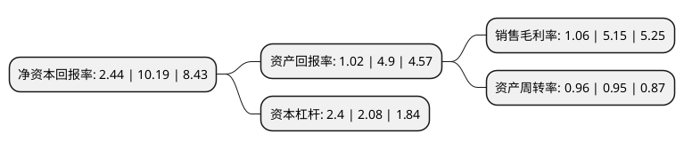

> 本页面由自动化程序生成于 2022年5月20日 01:06
> 内容可能存在错误，如有bug请提交issue至：https://github.com/Eroleice/doc-pi/issues
{.is-warning}

# 上市公司基本情况

## 基本资料

广州海鸥住宅工业股份有限公司（以下简称“海鸥住工”）成立于1998年01月08日，广州市。于2006年11月24日在深交所中小板上市。

海鸥住工注册资本60,780.85万元，主营业务:水龙头零组件等卫浴五金产品的设计，开发，制造和销售。以下是详细信息：

- 公司名称: 广州海鸥住宅工业股份有限公司
- 股票代码: 002084.SZ
- 所在地: 广东 - 广州市
- 成立日期: 1998年01月08日
- 注册资本: 60,780.85万元
- 法定代表人: 唐台英
- 主营业务: 主营业务:水龙头零组件等卫浴五金产品的设计，开发，制造和销售
- 公司官网: www.seagullgroup.cn
- 公司介绍: 公司主要从事高档水龙头零组件、排水器、温控阀、地暖系统、浴缸、淋浴房、陶瓷洁具、木作、智能家居等定制整装卫浴空间内的部品部件的研发、生产，销售遍布欧洲、美洲和亚洲市场，主要客户包括全球前十大卫浴品牌。公司在第一主业“卫浴”领域，大力提升自主设计、配套服务、整体卫浴等高增值的全面制造服务能力，提高全面竞争优势；在第二主业“节能”领域，分别进入智能家居和工业节能领域。公司秉持传承工匠精神、畅享工艺之美的宗旨，持续巩固转型升级成果，大力弘扬工匠精神，厚植工匠文化，崇尚精益求精，完善激励机制，培养价值型员工，通过大数据时代下的信息化工具，有效推动公司运营管理，为股东创造更高的价值，为客户提供优质、高效、多元化、高附加值的服务。

## 股东及高管情况

上市公司第一大股东为中馀投资有限公司，持股166,020,239股，占比27.31%，**疑似为**上市公司实际控制人。

截至2022年03月31日，上市公司的前十大股东中，共有1名自然人股东，8名机构股东，1个产品账户，其中5%以上大股东共有2名。上市公司前十大股东明细如下：

> 未能通过持股比例判定出上市公司实际控制人（持股30%以上）
> 可能存在通过间接持股、联合持股、协议控制等方式拥有实际控制权的主体，具体请参考上市公司定期公告！
{.is-warning}

> 截至2022年03月31日，上市公司前十大股东信息如下：

| 股东名称 | 持股数量（股） | 持股比例 |
| --- | --- | --- |
| 中馀投资有限公司 | 166,020,239 | 27.31% |
| 中盛集团有限公司 | 39,739,400 | 6.54% |
| 上海齐煜信息科技有限公司 | 21,780,000 | 3.58% |
| 广州海鸥住宅工业股份有限公司回购专用证券账户 | 18,106,056 | 2.98% |
| 广州市裕进贸易有限公司 | 14,460,543 | 2.38% |
| 广发证券股份有限公司 | 11,546,613 | 1.9% |
| 广东东鹏文化创意股份有限公司 | 10,724,751 | 1.76% |
| 齐家网(上海)网络科技有限公司 | 8,082,630 | 1.33% |
| 上海齐盛电子商务有限公司 | 6,081,510 | 1% |
| 余荣琳 | 5,647,639 | 0.93% |

## 利润表分析

上市公司2021年总收入为41.25亿元，净利润为0.43亿元，实现盈利。

## 杜邦分析

> 数据列示周期：2021年 | 2020年 | 2019年
{.is-info}

上市公司的净资产收益率在近一年有所下降，下降幅度为-76.05%，其变化情况分解如下：
- 上市公司的销售毛利率在近一年下降了-79.42%，可能是生产效率的下降、商品原材料价格上涨或商品价格的下跌所致。
- 上市公司的资产周转率在近一年上升了1.05%，可能是源自于更快的销售回款或库存管理效果提升。
- 上市公司的财务杠杆比率在近一年上升了15.38%，可能是增加负债扩大生产规模。

