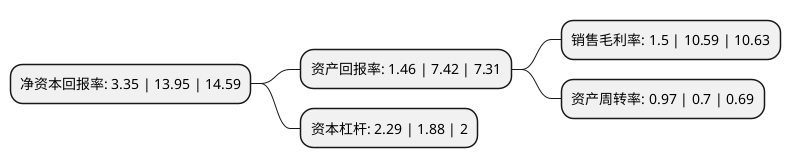

> 本页面由自动化程序生成于 2022年5月20日 01:09
> 内容可能存在错误，如有bug请提交issue至：https://github.com/Eroleice/doc-pi/issues
{.is-warning}

# 上市公司基本情况

## 基本资料

浙江永强集团股份有限公司（以下简称“浙江永强”）成立于2001年06月18日，台州市。于2010年10月21日在深交所中小板上市。

浙江永强注册资本217,573.65万元，从事户外休闲家具及用品的设计研发，生产和销售。主要产品包括桌，椅，秋千，普通遮阳伞，吊伞，帐篷等户外休闲消费品。以下是详细信息：

- 公司名称: 浙江永强集团股份有限公司
- 股票代码: 002489.SZ
- 所在地: 浙江 - 台州市
- 成立日期: 2001年06月18日
- 注册资本: 217,573.65万元
- 法定代表人: 谢建勇
- 主营业务: 从事户外休闲家具及用品的设计研发，生产和销售主要产品包括桌，椅，秋千，普通遮阳伞，吊伞，帐篷等户外休闲消费品
- 公司官网: www.yotrio.com
- 公司介绍: 公司是专业生产户外休闲家具、太阳伞、帐篷等产品的大型现代企业集团，拥有自主品牌YOTRIO。现已成为中国生产户外旅游用品的骨干企业之一，是中国礼仪用品工业协会理事单位。主要从事户外休闲家具及用品的设计研发、生产和销售。公司拥有自营进出口权，产品销往美国、德国、澳大利亚、中国香港等国家和地区。公司先后获临海市“实力企业”、台州市十五期间突出贡献企业、浙江省“五个一批”重点企业、浙江省外贸出口50强企业、中华人民共和国海关“A类企业”等荣誉称号。

## 股东及高管情况

上市公司第一大股东为浙江永强实业有限公司，持股825,492,924股，占比37.94%，为上市公司实际控制人。

截至2022年03月31日，上市公司的前十大股东中，共有7名自然人股东，1名机构股东，1个产品账户，1个海外主体，其中5%以上大股东共有4名。上市公司前十大股东明细如下：

> 截至2022年03月31日，上市公司前十大股东信息如下：

| 股东名称 | 持股数量（股） | 持股比例 |
| --- | --- | --- |
| 浙江永强实业有限公司 | 825,492,924 | 37.94% |
| 谢建勇 | 134,606,749 | 6.19% |
| 谢建强 | 129,329,985 | 5.94% |
| 谢建平 | 128,374,485 | 5.9% |
| 香港中央结算有限公司(陆股通) | 45,982,159 | 2.11% |
| 陈洋浮 | 6,986,839 | 0.32% |
| 纪国 | 6,005,432 | 0.28% |
| 浙江永强集团股份有限公司-2021年员工持股计划 | 5,000,000 | 0.23% |
| 张灿红 | 4,116,000 | 0.19% |
| 廖兴梅 | 3,721,220 | 0.17% |

## 杜邦分析

> 数据列示周期：2021年 | 2020年 | 2019年
{.is-info}

上市公司的净资产收益率在近一年有所下降，下降幅度为-75.99%，其变化情况分解如下：
- 上市公司的销售毛利率在近一年下降了-85.84%，可能是生产效率的下降、商品原材料价格上涨或商品价格的下跌所致。
- 上市公司的资产周转率在近一年上升了38.57%，可能是源自于更快的销售回款或库存管理效果提升。
- 上市公司的财务杠杆比率在近一年上升了21.81%，可能是增加负债扩大生产规模。

