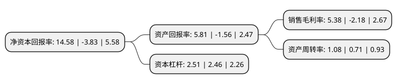

> 本页面由自动化程序生成于 2022年5月20日 01:10
> 内容可能存在错误，如有bug请提交issue至：https://github.com/Eroleice/doc-pi/issues
{.is-warning}

# 上市公司基本情况

## 基本资料

浙江哈尔斯真空器皿股份有限公司（以下简称“哈尔斯”）成立于1995年05月23日，金华市。于2011年09月09日在深交所中小板上市。

哈尔斯注册资本41,411.942万元，主要从事日用不锈钢真空保温器皿的研发设计，生产与销售。主要产品包括保温杯，保温瓶，保温壶，保温饭盒，焖烧壶等不锈钢真空保温器皿以及部分不锈钢非真空器皿。以下是详细信息：

- 公司名称: 浙江哈尔斯真空器皿股份有限公司
- 股票代码: 002615.SZ
- 所在地: 浙江 - 金华市
- 成立日期: 1995年05月23日
- 注册资本: 41,411.942万元
- 法定代表人: 吕强
- 主营业务: 主要从事日用不锈钢真空保温器皿的研发设计，生产与销售主要产品包括保温杯，保温瓶，保温壶，保温饭盒，焖烧壶等不锈钢真空保温器皿以及部分不锈钢非真空器皿
- 公司官网: www.haersgroup.com
- 公司介绍: 公司从事主要业务为不锈钢真空保温器皿的研发设计、生产与销售，主要产品包括保温杯、保温瓶、保温壶、保温饭盒、焖烧壶、真空保温电热水壶等不锈钢真空保温器皿以及铝瓶、玻璃杯，PP、PC、Tritan等材质的塑料杯。公司的主要经营模式为自主研发、生产及销售的经营模式，采用经销为主直销为辅的销售模式实现国内市场自主品牌的销售，以及通过OEM及ODM的业务模式与国际知名品牌商进行合作来拓展国际市场实现产品销售。公司通过研发积累和持续的技术改造形成了较强的产品制造的核心能力，具备行业先进的优势。“哈尔斯”品牌产品在2006年被评为“浙江名牌产品”，2007年被评为“浙江省著名商标”，2008年被评为“浙江出口名牌”。

## 股东及高管情况

上市公司第一大股东为吕强，持股197,327,685股，占比47.65%，为上市公司实际控制人。

截至2022年03月31日，上市公司的前十大股东中，共有9名自然人股东，1个产品账户，其中5%以上大股东共有2名。上市公司前十大股东明细如下：

> 截至2022年03月31日，上市公司前十大股东信息如下：

| 股东名称 | 持股数量（股） | 持股比例 |
| --- | --- | --- |
| 吕强 | 197,327,685 | 47.65% |
| 吕丽珍 | 20,776,500 | 5.02% |
| 欧阳波 | 13,843,800 | 3.34% |
| 吕懿 | 6,925,500 | 1.67% |
| 吕丽妃 | 5,751,000 | 1.39% |
| 蔡鉴灿 | 3,908,150 | 0.94% |
| 胡俊娥 | 3,210,000 | 0.78% |
| 应丽香 | 1,543,725 | 0.37% |
| 沈怡雯 | 1,200,800 | 0.29% |
| 中国民生银行股份有限公司-金元顺安元启灵活配置混合型证券投资基金 | 1,200,000 | 0.29% |

## 利润表分析

上市公司2021年总收入为23.88亿元，净利润为1.28亿元，实现盈利。

## 杜邦分析

> 数据列示周期：2021年 | 2020年 | 2019年
{.is-info}

上市公司的净资产收益率在近一年有所下降，下降幅度为-480.68%，其变化情况分解如下：
- 上市公司的销售毛利率在近一年下降了-346.79%，可能是生产效率的下降、商品原材料价格上涨或商品价格的下跌所致。
- 上市公司的资产周转率在近一年上升了52.11%，可能是源自于更快的销售回款或库存管理效果提升。
- 上市公司的财务杠杆比率在近一年上升了2.03%，可能是增加负债扩大生产规模。

