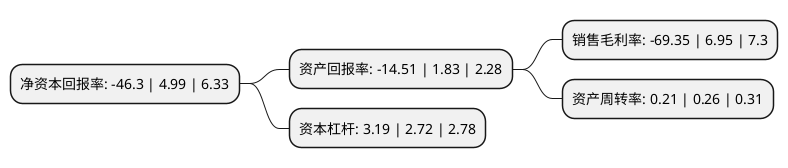

> 本页面由自动化程序生成于 2022年5月20日 01:11
> 内容可能存在错误，如有bug请提交issue至：https://github.com/Eroleice/doc-pi/issues
{.is-warning}

# 上市公司基本情况

## 基本资料

深圳市易尚展示股份有限公司（以下简称“*ST易尚”）成立于2004年04月28日，深圳市。于2015年04月24日在深交所中小板上市。

*ST易尚注册资本15,452.961万元，公司主营业务是为企业营销终端提供展示产品及服务，专注于为企业的营销终端提供展示策划，形象设计，展示道具生产，装饰装潢等一体化的解决方案以及展示道具产品。按照公司提供的展示服务类别，可以分为品牌终端展示产品，虚拟展示产品和循环会展产品。以下是详细信息：

- 公司名称: 深圳市易尚展示股份有限公司
- 股票代码: 002751.SZ
- 所在地: 广东 - 深圳市
- 成立日期: 2004年04月28日
- 注册资本: 15,452.961万元
- 法定代表人: 刘梦龙
- 主营业务: 公司主营业务是为企业营销终端提供展示产品及服务，专注于为企业的营销终端提供展示策划，形象设计，展示道具生产，装饰装潢等一体化的解决方案以及展示道具产品按照公司提供的展示服务类别，可以分为品牌终端展示产品，虚拟展示产品和循环会展产品
- 公司官网: www.es-display.com
- 公司介绍: 公司是国内品牌终端展示、低碳循环会展、3D扫描打印和虚拟现实领域居领先地位的“文化+科技”型国家级高新技术企业。公司设计的低碳循环会展系统，是国家发改委认定并重点支持的“循环经济和资源节约重大示范项目”。系统在国家级展会中国国际高新技术成果交易会、中国国际文化产业博览会、中国国际循环经济博览会及各项专业性展会中得到广泛应用。在品牌终端展示领域，公司以品牌文化为核心，设计与创新为手段，建立了品牌战略规划、品牌概念设计、品牌形象传播及商业连锁终端研发制作的全方位专业服务体系，以完整的一体化产业链优势，成为华为、联想、海尔、中国联通、三星、玛莎拉蒂、法拉利等世界知名企业的长期合作伙伴。公司大力拓展3D和虚拟现实技术在电子商务领域的应用，为电商3D数字化和虚拟现实等应用提供技术支持和专有3D扫描设备，实现在线商品和服务的虚拟现实全景体验。

## 股东及高管情况

上市公司第一大股东为刘梦龙，持股32,250,268股，占比20.87%，**疑似为**上市公司实际控制人。

截至2022年03月31日，上市公司的前十大股东中，共有9名自然人股东，1名机构股东，其中5%以上大股东共有2名。上市公司前十大股东明细如下：

> 未能通过持股比例判定出上市公司实际控制人（持股30%以上）
> 可能存在通过间接持股、联合持股、协议控制等方式拥有实际控制权的主体，具体请参考上市公司定期公告！
{.is-warning}

> 截至2022年03月31日，上市公司前十大股东信息如下：

| 股东名称 | 持股数量（股） | 持股比例 |
| --- | --- | --- |
| 刘梦龙 | 32,250,268 | 20.87% |
| 林庆得 | 7,738,000 | 5.01% |
| 姚镇荣 | 2,029,401 | 1.31% |
| 向开兵 | 1,217,189 | 0.79% |
| 易小强 | 802,500 | 0.52% |
| 高文水 | 690,000 | 0.45% |
| 宝厦地产有限公司 | 643,600 | 0.42% |
| 王玉政 | 500,000 | 0.32% |
| 孙志超 | 489,700 | 0.32% |
| 李富军 | 480,000 | 0.31% |

## 利润表分析

上市公司2021年总收入为8.03亿元，净利润为-5.58亿元，**未实现盈利**。

## 杜邦分析

> 数据列示周期：2021年 | 2020年 | 2019年
{.is-info}

上市公司的净资产收益率在近一年有所下降，下降幅度为-1027.86%，其变化情况分解如下：
- 上市公司的销售毛利率在近一年下降了-1097.84%，可能是生产效率的下降、商品原材料价格上涨或商品价格的下跌所致。
- 上市公司的资产周转率在近一年下降了-19.23%，可能是源自于更慢的销售回款或库存管理效果下降。
- 上市公司的财务杠杆比率在近一年上升了17.28%，可能是增加负债扩大生产规模。

