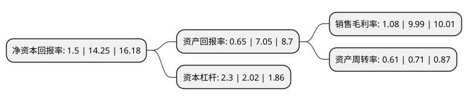

> 本页面由自动化程序生成于 2022年5月20日 01:12
> 内容可能存在错误，如有bug请提交issue至：https://github.com/Eroleice/doc-pi/issues
{.is-warning}

# 上市公司基本情况

## 基本资料

帝欧家居集团股份有限公司（以下简称“帝欧家居”）成立于1994年03月14日，成都市。于2016年05月25日在深交所中小板上市。

帝欧家居注册资本38,689.306万元，卫生洁具，建筑陶瓷两大重要家居装饰，装修产品的生产，研发，销售。以下是详细信息：

- 公司名称: 帝欧家居集团股份有限公司
- 股票代码: 002798.SZ
- 所在地: 四川 - 成都市
- 成立日期: 1994年03月14日
- 注册资本: 38,689.306万元
- 法定代表人: 刘进
- 主营业务: 卫生洁具，建筑陶瓷两大重要家居装饰，装修产品的生产，研发，销售
- 公司官网: www.monarch-sw.com
- 公司介绍: 公司是一家生产高端亚克力与陶瓷产品的综合卫浴品牌，产品系列涵盖浴室柜、坐便器、浴缸、淋浴房、花洒、龙头等全系卫浴精品。公司一直致力于高品质生活艺术的探索与帝王般尊享卫浴体验的创造，为顾客提供更多卫浴产品选择及一站式整体卫浴解决方案。公司成为中国第一批A股上市的综合卫浴企业，在推动提升品牌影响力与企业竞争力的同时，致力于战略提升与服务升级。在不断进取的过程中，公司携手欧神诺，成立帝欧家居股份有限公司，正式开启泛家居时代。未来公司将以全新的技术、独特的设计风格，将智能化与定制化服务融入产品，为追求高品质生活及个性化表达的消费者提供全面的品质服务，打造深受消费者喜爱与推崇的卫浴品牌。

## 股东及高管情况

上市公司第一大股东为刘进，持股55,134,789股，占比14.25%，**疑似为**上市公司实际控制人。

截至2022年03月31日，上市公司的前十大股东中，共有9名自然人股东，1个产品账户，其中5%以上大股东共有4名。上市公司前十大股东明细如下：

> 未能通过持股比例判定出上市公司实际控制人（持股30%以上）
> 可能存在通过间接持股、联合持股、协议控制等方式拥有实际控制权的主体，具体请参考上市公司定期公告！
{.is-warning}

> 截至2022年03月31日，上市公司前十大股东信息如下：

| 股东名称 | 持股数量（股） | 持股比例 |
| --- | --- | --- |
| 刘进 | 55,134,789 | 14.25% |
| 吴志雄 | 53,518,797 | 13.83% |
| 陈伟 | 53,423,597 | 13.81% |
| 鲍杰军 | 30,206,351 | 7.81% |
| 陈家旺 | 7,318,761 | 1.89% |
| 上海久铭投资管理有限公司-久铭9号私募证券投资基金 | 5,090,400 | 1.32% |
| 钟宝申 | 4,476,689 | 1.16% |
| 丁同文 | 4,111,840 | 1.06% |
| 司绍华 | 3,925,173 | 1.01% |
| 黄建起 | 3,863,264 | 1% |

## 利润表分析

上市公司2021年总收入为61.47亿元，净利润为0.66亿元，实现盈利。

## 杜邦分析

> 数据列示周期：2021年 | 2020年 | 2019年
{.is-info}

上市公司的净资产收益率在近一年有所下降，下降幅度为-89.47%，其变化情况分解如下：
- 上市公司的销售毛利率在近一年下降了-89.19%，可能是生产效率的下降、商品原材料价格上涨或商品价格的下跌所致。
- 上市公司的资产周转率在近一年下降了-14.08%，可能是源自于更慢的销售回款或库存管理效果下降。
- 上市公司的财务杠杆比率在近一年上升了13.86%，可能是增加负债扩大生产规模。

