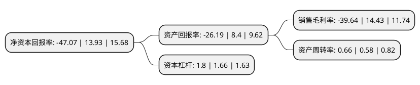

> 本页面由自动化程序生成于 2022年5月20日 01:12
> 内容可能存在错误，如有bug请提交issue至：https://github.com/Eroleice/doc-pi/issues
{.is-warning}

# 上市公司基本情况

## 基本资料

广东皮阿诺科学艺术家居股份有限公司（以下简称“皮阿诺”）成立于2005年06月14日，中山市。于2017年03月10日在深交所中小板上市。

皮阿诺注册资本18,654.275万元，公司主要从事定制厨柜，衣柜等定制家居产品的研发，设计，生产和销售。公司主要产品包括定制厨柜，定制衣柜等。以下是详细信息：

- 公司名称: 广东皮阿诺科学艺术家居股份有限公司
- 股票代码: 002853.SZ
- 所在地: 广东 - 中山市
- 成立日期: 2005年06月14日
- 注册资本: 18,654.275万元
- 法定代表人: 马礼斌
- 主营业务: 公司主要从事定制厨柜，衣柜等定制家居产品的研发，设计，生产和销售公司主要产品包括定制厨柜，定制衣柜等
- 公司官网: www.pianuo.net
- 公司介绍: 公司是一家主要经营定制橱柜、定制衣柜及其配套家居产品研发、生产和销售的A股上市公司。公司专业从事定制橱柜、衣柜、全屋定制及配套家居产品的设计、研发、生产、销售和相关服务的提供，致力于通过科学艺术设计为消费者提供个性化、定制化的大家居解决方案。公司作为科学艺术家居的倡导者和定制家居的践行者，经过多年的经营积累，凭借突出的创新设计、精益品质和市场开拓能力，获得较高的市场口碑和品牌知名度，已成为国内领先的定制橱柜、衣柜及配套家居产品企业之一。公司主要产品包括厨房、卧室、书房、客餐厅、儿童房等家居空间所需的整体橱柜、整体衣柜、整体书柜、整体酒柜、整体鞋柜、榻榻米及其家居配套产品等。

## 股东及高管情况

上市公司第一大股东为马礼斌，持股95,337,986股，占比51.11%，为上市公司实际控制人。

截至2022年03月31日，上市公司的前十大股东中，共有3名自然人股东，4名机构股东，3个产品账户，其中5%以上大股东共有1名。上市公司前十大股东明细如下：

> 截至2022年03月31日，上市公司前十大股东信息如下：

| 股东名称 | 持股数量（股） | 持股比例 |
| --- | --- | --- |
| 马礼斌 | 95,337,986 | 51.11% |
| 保利(横琴)资本管理有限公司-共青城慧星股权投资合伙企业(有限合伙) | 5,920,436 | 3.17% |
| 红杉锦程(厦门)股权投资合伙企业(有限合伙) | 5,200,208 | 2.79% |
| 张开宇 | 2,000,000 | 1.07% |
| 保利(横琴)资本管理有限公司-共青城齐利股权投资合伙企业(有限合伙) | 1,879,875 | 1.01% |
| 中山金投创业投资有限公司 | 1,560,062 | 0.84% |
| 中国石油天然气集团公司企业年金计划-中国工商银行股份有限公司 | 1,092,043 | 0.59% |
| 南方基金乐养混合型养老金产品-中国建设银行股份有限公司 | 1,057,421 | 0.57% |
| 基本养老保险基金一零零三组合 | 1,013,743 | 0.54% |
| 吕宏 | 950,000 | 0.51% |

## 利润表分析

上市公司2021年总收入为18.23亿元，净利润为-7.23亿元，**未实现盈利**。

## 杜邦分析

> 数据列示周期：2021年 | 2020年 | 2019年
{.is-info}

上市公司的净资产收益率在近一年有所下降，下降幅度为-437.9%，其变化情况分解如下：
- 上市公司的销售毛利率在近一年下降了-374.71%，可能是生产效率的下降、商品原材料价格上涨或商品价格的下跌所致。
- 上市公司的资产周转率在近一年上升了13.79%，可能是源自于更快的销售回款或库存管理效果提升。
- 上市公司的财务杠杆比率在近一年上升了8.43%，可能是增加负债扩大生产规模。

