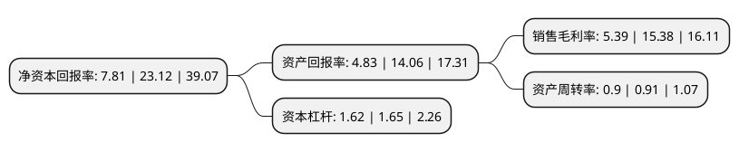

> 本页面由自动化程序生成于 2022年5月20日 01:13
> 内容可能存在错误，如有bug请提交issue至：https://github.com/Eroleice/doc-pi/issues
{.is-warning}

# 上市公司基本情况

## 基本资料

浙江海象新材料股份有限公司（以下简称“海象新材”）成立于2013年12月09日，嘉兴市。于2020年09月30日在深交所中小板上市。

海象新材注册资本10,267.6万元，主要从事PVC地板的研发，生产和销售。产品分为LVT地板，WPC地板和SPC地板三大类。以下是详细信息：

- 公司名称: 浙江海象新材料股份有限公司
- 股票代码: 003011.SZ
- 所在地: 浙江 - 嘉兴市
- 成立日期: 2013年12月09日
- 注册资本: 10,267.6万元
- 法定代表人: 王周林
- 主营业务: 主要从事PVC地板的研发，生产和销售产品分为LVT地板，WPC地板和SPC地板三大类
- 公司官网: www.haixiang.com.cn
- 公司介绍: 公司是目前国内领先的PVC地板生产及出口商之一，主要从事PVC地板的研发、生产和销售。根据产品的结构，公司产品分为LVT地板、WPC地板和SPC地板三大类，主要用于建筑物的室内地面装饰，产品功能与木地板、瓷砖等传统地面装饰材料相似。PVC地板由高分子材料聚氯乙烯(PVC)加工制成，与木地板、瓷砖等传统地面装饰材料相比，PVC地板具有环保、可回收利用、安装简便、耐磨、防潮、防滑和防火阻燃等优点，深受欧美市场欢迎，广泛应用于商场、酒店、写字楼、医院、学校、体育场馆等公共建筑以及住宅。公司具有较强的自主研发能力和较高的技术水平，凭借多年的技术研发积累、可靠的产品质量以及多年的市场推广，公司已具有较高的行业知名度，产品已在PVC地板客户群中建立了良好的口碑，2017年度公司被中国建筑装饰装修材料协会评为“中国地板行业十大家装品牌(弹性地板类)”，2018年度公司被中国建筑装饰装修材料协会评为“中国弹性地板行业十大品牌(片材类)”，市场遍布美洲、欧洲、澳洲等地区。

## 股东及高管情况

上市公司第一大股东为王周林，持股27,809,460股，占比27.08%，**疑似为**上市公司实际控制人。

截至2022年03月31日，上市公司的前十大股东中，共有6名自然人股东，3名机构股东，1个产品账户，其中5%以上大股东共有2名。上市公司前十大股东明细如下：

> 未能通过持股比例判定出上市公司实际控制人（持股30%以上）
> 可能存在通过间接持股、联合持股、协议控制等方式拥有实际控制权的主体，具体请参考上市公司定期公告！
{.is-warning}

> 截至2022年03月31日，上市公司前十大股东信息如下：

| 股东名称 | 持股数量（股） | 持股比例 |
| --- | --- | --- |
| 王周林 | 27,809,460 | 27.08% |
| 海宁晶美投资管理合伙企业(有限合伙) | 11,550,000 | 11.25% |
| 鲁国强 | 4,492,706 | 4.38% |
| 陈建良 | 3,768,149 | 3.67% |
| 海宁市弄潮儿股权投资合伙企业(有限合伙) | 2,691,154 | 2.62% |
| 沈财兴 | 2,659,874 | 2.59% |
| 陈云 | 1,669,600 | 1.63% |
| 海南翎展私募基金管理合伙企业(有限合伙)-翎展稳进价值私募证券投资基金 | 1,131,100 | 1.1% |
| 左建明 | 1,050,020 | 1.02% |
| 宁波云水戊戌股权投资合伙企业(有限合伙) | 1,033,430 | 1.01% |

## 利润表分析

上市公司2021年总收入为17.97亿元，净利润为0.96亿元，实现盈利。

## 杜邦分析

> 数据列示周期：2021年 | 2020年 | 2019年
{.is-info}

上市公司的净资产收益率在近一年有所下降，下降幅度为-66.22%，其变化情况分解如下：
- 上市公司的销售毛利率在近一年下降了-64.95%，可能是生产效率的下降、商品原材料价格上涨或商品价格的下跌所致。
- 上市公司的资产周转率在近一年下降了-1.1%，可能是源自于更慢的销售回款或库存管理效果下降。
- 上市公司的财务杠杆比率在近一年下降了-1.82%，可能是减少负债降低财务费用。

