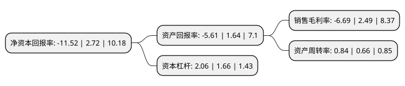

> 本页面由自动化程序生成于 2022年5月20日 01:20
> 内容可能存在错误，如有bug请提交issue至：https://github.com/Eroleice/doc-pi/issues
{.is-warning}

# 上市公司基本情况

## 基本资料

广东顶固集创家居股份有限公司（以下简称“顶固集创”）成立于2002年12月04日，中山市。于2018年09月25日在深交所创业板上市。

顶固集创注册资本20,689.64万元，公司的主营业务为定制衣柜及配套家具，精品五金，智能五金，定制生态门和其他智能家居产品的研发，生产和销售;主要产品为定制衣柜及配套家具，精品五金，定制生态门三大主要产品系列。以下是详细信息：

- 公司名称: 广东顶固集创家居股份有限公司
- 股票代码: 300749.SZ
- 所在地: 广东 - 中山市
- 成立日期: 2002年12月04日
- 注册资本: 20,689.64万元
- 法定代表人: 林新达
- 主营业务: 公司的主营业务为定制衣柜及配套家具，精品五金，智能五金，定制生态门和其他智能家居产品的研发，生产和销售;主要产品为定制衣柜及配套家具，精品五金，定制生态门三大主要产品系列
- 公司官网: www.dinggu.net
- 公司介绍: 公司专业从事定制衣柜及配套家具、精品五金、智能五金、定制生态门和其他智能家居产品的研发、生产和销售，是国内定制衣柜及精品五金领域知名品牌之一。配备有国际领先的德国板式家具生产线、进口生态门系列生产线、精密液压门控系列生产线及成套的五金锁具、精密模具数控生产线等。公司以高品质的产品享誉海内外，各品类均跻身行业领导品牌阵容。公司注重产品研发与技术创新，长期与广西大学等多所著名高校开展校企合作，共同开发高新技术产品和创新管理技术，并首创金象6D(精英顾问、精致设计、精准安装、精良品质、精心维护、精诚物流)服务新模式。公司技术创新与产品创新能力领跑全行业，荣获“广东省高新技术企业”称号。公司倡导精致设计、精准安装、精良品质、精心维护的“金象4D”服务体系，向全国消费者提供24小时不间断无忧服务。

## 股东及高管情况

上市公司第一大股东为林新达，持股63,698,400股，占比30.79%，为上市公司实际控制人。

截至2022年03月31日，上市公司的前十大股东中，共有7名自然人股东，3名机构股东，其中5%以上大股东共有3名。上市公司前十大股东明细如下：

> 截至2022年03月31日，上市公司前十大股东信息如下：

| 股东名称 | 持股数量（股） | 持股比例 |
| --- | --- | --- |
| 林新达 | 63,698,400 | 30.79% |
| 林彩菊 | 12,549,600 | 6.07% |
| 曹岩 | 11,735,100 | 5.67% |
| 中山市凯悦投资企业(有限合伙) | 8,413,200 | 4.07% |
| 中山市建达饰品有限公司 | 4,601,500 | 2.22% |
| 林根法 | 3,607,500 | 1.74% |
| 中山市顶盛企业管理咨询有限公司 | 2,984,700 | 1.44% |
| 任丽峰 | 2,870,000 | 1.39% |
| 张燕 | 2,706,500 | 1.31% |
| 孟福卿 | 2,600,000 | 1.26% |

## 利润表分析

上市公司2021年总收入为12.98亿元，净利润为-0.87亿元，**未实现盈利**。

## 杜邦分析

> 数据列示周期：2021年 | 2020年 | 2019年
{.is-info}

上市公司的净资产收益率在近一年有所下降，下降幅度为-523.53%，其变化情况分解如下：
- 上市公司的销售毛利率在近一年下降了-368.67%，可能是生产效率的下降、商品原材料价格上涨或商品价格的下跌所致。
- 上市公司的资产周转率在近一年上升了27.27%，可能是源自于更快的销售回款或库存管理效果提升。
- 上市公司的财务杠杆比率在近一年上升了24.1%，可能是增加负债扩大生产规模。

