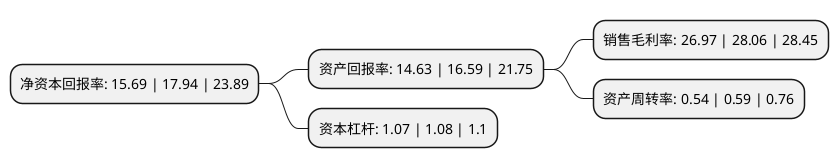

> 本页面由自动化程序生成于 2022年5月20日 01:22
> 内容可能存在错误，如有bug请提交issue至：https://github.com/Eroleice/doc-pi/issues
{.is-warning}

# 上市公司基本情况

## 基本资料

山东玉马遮阳科技股份有限公司（以下简称“玉马遮阳”）成立于2014年07月04日，潍坊市。于2021年05月24日在深交所创业板上市。

玉马遮阳注册资本13,168万元，专注于功能性遮阳材料的研发，生产和销售，主要产品包括遮光面料，可调光面料和阳光面料。以下是详细信息：

- 公司名称: 山东玉马遮阳科技股份有限公司
- 股票代码: 300993.SZ
- 所在地: 山东 - 潍坊市
- 成立日期: 2014年07月04日
- 注册资本: 13,168万元
- 法定代表人: 孙承志
- 主营业务: 专注于功能性遮阳材料的研发，生产和销售，主要产品包括遮光面料，可调光面料和阳光面料
- 公司官网: www.yumate.com
- 公司介绍: 公司自成立以来一直专注于功能性遮阳材料的研发、生产和销售，主要产品包括遮光面料、可调光面料和阳光面料。公司所生产的功能性遮阳材料是集遮阳、节能、环保等多功能为一体，还可兼具抗菌、防污、除甲醛等特殊功能的新型绿色材料，符合国家科技创新和产业发展的方向，属于国家重点发展的战略性新兴产业。公司立足于全球建筑遮阳产业并全面参与全球高端市场的竞争，致力于为遮阳成品生产商提供高品质、高性能、高附加值的功能性遮阳材料与服务，综合实力处于行业领先地位。公司在持续提升技术工艺的同时，积累了大量的经验，充分利用国内外专业资源优势，应用于产品研发中，获得了多项技术专利，实现了技术的持续创新和业务领域的不断拓展，建立并巩固了公司在行业内的领先地位。

## 股东及高管情况

上市公司第一大股东为孙承志，持股35,000,000股，占比26.58%，**疑似为**上市公司实际控制人。

截至2022年03月31日，上市公司的前十大股东中，共有4名自然人股东，6名机构股东，其中5%以上大股东共有4名。上市公司前十大股东明细如下：

> 未能通过持股比例判定出上市公司实际控制人（持股30%以上）
> 可能存在通过间接持股、联合持股、协议控制等方式拥有实际控制权的主体，具体请参考上市公司定期公告！
{.is-warning}

> 截至2022年03月31日，上市公司前十大股东信息如下：

| 股东名称 | 持股数量（股） | 持股比例 |
| --- | --- | --- |
| 孙承志 | 35,000,000 | 26.58% |
| 山东玉马保丰投资有限公司 | 26,000,000 | 19.74% |
| 崔月青 | 15,000,000 | 11.39% |
| 寿光钰鑫投资中心(有限合伙) | 8,000,000 | 6.08% |
| 北京智明浩金投资管理有限公司-赣州浩金致信股权投资中心(有限合伙) | 3,330,000 | 2.53% |
| 北京智明浩金投资管理有限公司-宁波梅山保税港区浩金致同股权投资合伙企业(有限合伙) | 3,330,000 | 2.53% |
| 寿光钜鑫投资中心(有限合伙) | 2,600,000 | 1.97% |
| 青岛永合金丰集团有限公司 | 2,100,000 | 1.59% |
| 崔贵贤 | 1,000,000 | 0.76% |
| 李其忠 | 1,000,000 | 0.76% |

## 利润表分析

上市公司2021年总收入为5.2亿元，净利润为1.4亿元，实现盈利。

## 杜邦分析

> 数据列示周期：2021年 | 2020年 | 2019年
{.is-info}

上市公司的净资产收益率在近一年有所下降，下降幅度为-12.54%，其变化情况分解如下：
- 上市公司的销售毛利率在近一年下降了-3.88%，可能是生产效率的下降、商品原材料价格上涨或商品价格的下跌所致。
- 上市公司的资产周转率在近一年下降了-8.47%，可能是源自于更慢的销售回款或库存管理效果下降。
- 上市公司的财务杠杆比率在近一年下降了-0.93%，可能是减少负债降低财务费用。

