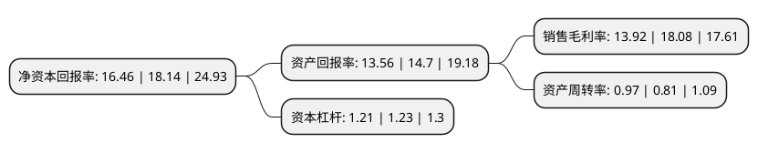

> 本页面由自动化程序生成于 2022年5月20日 01:22
> 内容可能存在错误，如有bug请提交issue至：https://github.com/Eroleice/doc-pi/issues
{.is-warning}

# 上市公司基本情况

## 基本资料

浙江嘉益保温科技股份有限公司（以下简称“嘉益股份”）成立于2004年05月12日，金华市。于2021年06月25日在深交所创业板上市。

嘉益股份注册资本10,000万元，公司的主营业务为各种不同材质的饮品，食品容器的研发设计，生产与销售，主要产品包括不锈钢真空保温器皿(保温杯，保温瓶，焖烧罐，保温壶，智能杯等)，不锈钢器皿，塑料器皿(PP，AS，Tritan等材质)，玻璃器皿以及其他新材料的日用饮品，食品容器。以下是详细信息：

- 公司名称: 浙江嘉益保温科技股份有限公司
- 股票代码: 301004.SZ
- 所在地: 浙江 - 金华市
- 成立日期: 2004年05月12日
- 注册资本: 10,000万元
- 法定代表人: 戚兴华
- 主营业务: 公司的主营业务为各种不同材质的饮品，食品容器的研发设计，生产与销售，主要产品包括不锈钢真空保温器皿(保温杯，保温瓶，焖烧罐，保温壶，智能杯等)，不锈钢器皿，塑料器皿(PP，AS，Tritan等材质)，玻璃器皿以及其他新材料的日用饮品，食品容器
- 公司官网: www.cayigroup.com
- 公司介绍: 公司的主营业务为各种不同材质的饮品、食品容器的研发设计、生产与销售，主要产品包括不锈钢真空保温器皿(保温杯、保温瓶、焖烧罐、保温壶、智能杯等)、不锈钢器皿、塑料器皿(PP、AS、Tritan等材质)、玻璃器皿以及其他新材料的日用饮品、食品容器。经过多年发展，公司产品已形成不锈钢真空保温器皿和非真空器皿两大系列。基于不锈钢真空保温器皿形成了较为丰富的产品线，涵盖保温杯、保温壶、焖烧罐、保温瓶等多种类型产品，具备保温性能好、安全便携、节能环保、外观时尚、功能丰富等优势。非真空器皿主要包括汽车杯、塑料杯、玻璃杯等。

## 股东及高管情况

上市公司第一大股东为浙江嘉韶云华投资管理有限公司，持股49,218,750股，占比49.22%，为上市公司实际控制人。

截至2022年03月31日，上市公司的前十大股东中，共有4名自然人股东，4名机构股东，2个产品账户，其中5%以上大股东共有4名。上市公司前十大股东明细如下：

> 截至2022年03月31日，上市公司前十大股东信息如下：

| 股东名称 | 持股数量（股） | 持股比例 |
| --- | --- | --- |
| 浙江嘉韶云华投资管理有限公司 | 49,218,750 | 49.22% |
| 武义嘉金投资管理合伙企业(有限合伙) | 9,375,000 | 9.38% |
| 戚兴华 | 8,531,250 | 8.53% |
| 陈曙光 | 7,875,000 | 7.88% |
| 中信银行股份有限公司-中信建投量化进取6个月持有期混合型证券投资基金 | 200,500 | 0.2% |
| 中国农业银行股份有限公司-西部利得量化成长混合型发起式证券投资基金 | 185,500 | 0.19% |
| 华泰证券股份有限公司 | 184,267 | 0.18% |
| 华泰金融控股(香港)有限公司-自有资金 | 170,614 | 0.17% |
| 王正 | 150,000 | 0.15% |
| 麦锦明 | 112,207 | 0.11% |

## 利润表分析

上市公司2021年总收入为5.85亿元，净利润为0.81亿元，实现盈利。

## 杜邦分析

> 数据列示周期：2021年 | 2020年 | 2019年
{.is-info}

上市公司的净资产收益率在近一年有所下降，下降幅度为-9.26%，其变化情况分解如下：
- 上市公司的销售毛利率在近一年下降了-23.01%，可能是生产效率的下降、商品原材料价格上涨或商品价格的下跌所致。
- 上市公司的资产周转率在近一年上升了19.75%，可能是源自于更快的销售回款或库存管理效果提升。
- 上市公司的财务杠杆比率在近一年下降了-1.63%，可能是减少负债降低财务费用。

