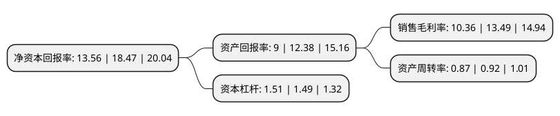

> 本页面由自动化程序生成于 2022年5月20日 01:22
> 内容可能存在错误，如有bug请提交issue至：https://github.com/Eroleice/doc-pi/issues
{.is-warning}

# 上市公司基本情况

## 基本资料

张小泉股份有限公司（以下简称“张小泉”）成立于2008年09月10日，杭州市。于2021年09月06日在深交所创业板上市。

张小泉注册资本15,600万元，公司是一家集设计，研发，生产，销售和服务于一体的现代生活五金用品制造企业。公司的主要产品包括剪具，刀具，套刀剪组合和其他生活家居用品。以下是详细信息：

- 公司名称: 张小泉股份有限公司
- 股票代码: 301055.SZ
- 所在地: 浙江 - 杭州市
- 成立日期: 2008年09月10日
- 注册资本: 15,600万元
- 法定代表人: 张国标
- 主营业务: 公司是一家集设计，研发，生产，销售和服务于一体的现代生活五金用品制造企业公司的主要产品包括剪具，刀具，套刀剪组合和其他生活家居用品
- 公司官网: www.zhangxiaoquan.cn
- 公司介绍: 公司是一家集设计、研发、生产、销售和服务于一体的现代生活五金用品制造企业。公司的主要产品包括剪具、刀具、套刀剪组合和其他生活家居用品。报告期内，公司的销售模式为经销为主、直销和代销为辅。经销模式指公司通过经销商向下游销售，公司的经销商采取线下流通渠道及电子商务平台进行销售；直销模式主要包括线下直营门店、大客户直销以及电子商务平台；代销模式指公司通过电子商务代销平台及部分商超开展代销业务。公司是目前国内生产规模较大、生产技术较为先进、产品质量较高、品牌影响力较强的刀剪行业企业之一。“张小泉”是国家商务部认定的第一批中华老字号，其产品标识被国家工商总局认定为我国刀剪行业驰名商标、首届中华老字号品牌价值100强。

## 股东及高管情况

上市公司第一大股东为杭州张小泉集团有限公司，持股76,000,000股，占比48.72%，为上市公司实际控制人。

截至2022年03月31日，上市公司的前十大股东中，共有2名自然人股东，7名机构股东，1个产品账户，其中5%以上大股东共有2名。上市公司前十大股东明细如下：

> 截至2022年03月31日，上市公司前十大股东信息如下：

| 股东名称 | 持股数量（股） | 持股比例 |
| --- | --- | --- |
| 杭州张小泉集团有限公司 | 76,000,000 | 48.72% |
| 杭州嵘泉投资合伙企业(有限合伙) | 15,162,400 | 9.72% |
| 杭州市实业投资集团有限公司 | 4,000,000 | 2.56% |
| 中信证券-中信银行-中信证券张小泉员工参与创业板战略配售集合资产管理计划 | 3,866,200 | 2.48% |
| 俞补孝 | 2,000,000 | 1.28% |
| 亚东北辰创业投资有限公司 | 2,000,000 | 1.28% |
| 西藏稳盛进达投资有限公司 | 2,000,000 | 1.28% |
| 万丰锦源投资有限公司 | 2,000,000 | 1.28% |
| 陈德军 | 2,000,000 | 1.28% |
| 上海均瑶(集团)有限公司 | 2,000,000 | 1.28% |

## 利润表分析

上市公司2021年总收入为7.6亿元，净利润为0.78亿元，实现盈利。

## 杜邦分析

> 数据列示周期：2021年 | 2020年 | 2019年
{.is-info}

上市公司的净资产收益率在近一年有所下降，下降幅度为-26.58%，其变化情况分解如下：
- 上市公司的销售毛利率在近一年下降了-23.2%，可能是生产效率的下降、商品原材料价格上涨或商品价格的下跌所致。
- 上市公司的资产周转率在近一年下降了-5.43%，可能是源自于更慢的销售回款或库存管理效果下降。
- 上市公司的财务杠杆比率在近一年上升了1.34%，可能是增加负债扩大生产规模。

