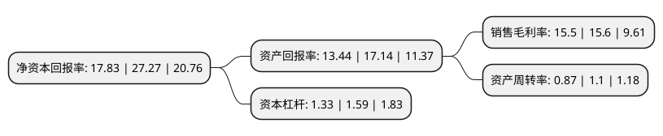

> 本页面由自动化程序生成于 2022年5月20日 01:22
> 内容可能存在错误，如有bug请提交issue至：https://github.com/Eroleice/doc-pi/issues
{.is-warning}

# 上市公司基本情况

## 基本资料

常州匠心独具智能家居股份有限公司（以下简称“匠心家居”）成立于2002年05月31日，常州市。于2021年09月13日在深交所创业板上市。

匠心家居注册资本8,000万元，主要从事智能电动沙发，智能电动床及其核心配件的研发，设计，生产和销售。公司主要产品包括智能电动沙发，智能电动床及其核心配件。以下是详细信息：

- 公司名称: 常州匠心独具智能家居股份有限公司
- 股票代码: 301061.SZ
- 所在地: 江苏 - 常州市
- 成立日期: 2002年05月31日
- 注册资本: 8,000万元
- 法定代表人: 李小勤
- 主营业务: 主要从事智能电动沙发，智能电动床及其核心配件的研发，设计，生产和销售公司主要产品包括智能电动沙发，智能电动床及其核心配件
- 公司官网: www.hhc-group.com.cn
- 公司介绍: 公司是一家主要从事智能电动沙发、智能电动床及其核心配件的研发、设计、生产和销售的高新技术企业，是江苏省家具行业协会副会长单位。公司秉承“让智能家居奢而不贵，无所不在”的使命，坚持创新、环保、安全、健康的设计理念和制造标准，深耕美国及国际市场多年，是全球智能电动沙发、智能电动床行业重要的ODM供应商；同时，公司拥有MotoMotion、MotoSleep、HHC、Yourway等具有一定国际知名度的自主品牌，大力开展自主品牌业务，其中MotoMotion品牌被常州市商务局评定为“2020-2021年度常州市重点培育和发展的国际知名品牌”。凭借优秀的设计研发、卓越的产品品质和可靠的售后服务，公司已经与Ashley Furniture、Pride Mobility、HomeStretch、Raymours Furniture、R.C.Willey等国际知名家具企业建立了良好的长期业务合作关系。目前，公司正积极拓展国内市场。

## 股东及高管情况

上市公司第一大股东为李小勤，持股34,680,000股，占比43.35%，为上市公司实际控制人。

截至2022年03月31日，上市公司的前十大股东中，共有3名自然人股东，3名机构股东，4个产品账户，其中5%以上大股东共有2名。上市公司前十大股东明细如下：

> 截至2022年03月31日，上市公司前十大股东信息如下：

| 股东名称 | 持股数量（股） | 持股比例 |
| --- | --- | --- |
| 李小勤 | 34,680,000 | 43.35% |
| 宁波梅山保税港区随遇心蕊投资有限公司 | 19,320,000 | 24.15% |
| 宁波明明白白企业管理合伙企业(有限合伙) | 3,150,000 | 3.94% |
| 常州清庙之器企业管理咨询合伙企业(有限合伙) | 1,650,000 | 2.06% |
| 徐梅钧 | 1,200,000 | 1.5% |
| 中国工商银行股份有限公司-诺安先锋混合型证券投资基金 | 816,293 | 1.02% |
| 上海睿亿投资发展中心(有限合伙)-睿亿投资攀山二期证券私募投资基金 | 464,198 | 0.58% |
| 李文北 | 443,823 | 0.55% |
| 上海睿亿投资发展中心(有限合伙)-睿亿投资定增精选十期私募证券投资基金 | 365,500 | 0.46% |
| 中国农业银行股份有限公司-大成景阳领先混合型证券投资基金 | 226,740 | 0.28% |

## 利润表分析

上市公司2021年总收入为19.24亿元，净利润为2.98亿元，实现盈利。

## 杜邦分析

> 数据列示周期：2021年 | 2020年 | 2019年
{.is-info}

上市公司的净资产收益率在近一年有所下降，下降幅度为-34.62%，其变化情况分解如下：
- 上市公司的销售毛利率在近一年下降了-0.64%，可能是生产效率的下降、商品原材料价格上涨或商品价格的下跌所致。
- 上市公司的资产周转率在近一年下降了-20.91%，可能是源自于更慢的销售回款或库存管理效果下降。
- 上市公司的财务杠杆比率在近一年下降了-16.35%，可能是减少负债降低财务费用。

