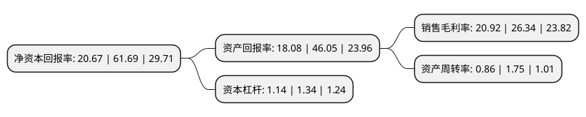

> 本页面由自动化程序生成于 2022年5月20日 01:23
> 内容可能存在错误，如有bug请提交issue至：https://github.com/Eroleice/doc-pi/issues
{.is-warning}

# 上市公司基本情况

## 基本资料

浙江雅艺金属科技股份有限公司（以下简称“雅艺科技”）成立于2005年06月09日，金华市。于2021年12月22日在深交所创业板上市。

雅艺科技注册资本7,000万元，公司主要从事户外火盆，气炉等户外休闲家具的研发，设计，生产和销售。公司的主要产品包括火盆，气炉系列产品。以下是详细信息：

- 公司名称: 浙江雅艺金属科技股份有限公司
- 股票代码: 301113.SZ
- 所在地: 浙江 - 金华市
- 成立日期: 2005年06月09日
- 注册资本: 7,000万元
- 法定代表人: 叶跃庭
- 主营业务: 公司主要从事户外火盆，气炉等户外休闲家具的研发，设计，生产和销售公司的主要产品包括火盆，气炉系列产品
- 公司官网: www.china-yayi.com
- 公司介绍: 浙江雅艺金属制造有限公司是专业生产户外火炉等休闲产品的外向型公司,公司总部设在武义茭道工业区,拥有标准化的厂房、员工公寓楼、食堂、篮球场等生产和生活设施，逐步建立了一套积极的管理体系和企业文化；公司产品出口欧美发达国家，主要进入沃尔玛等大型超市，能为客户提供从设计、开发、生产、销售及售后一整套的服务。浙江雅艺金属制造有限公司坚持务实创新、和谐共赢的经营理念，注重客户关系及内部员工关系，在过去的10年发展历程中，不断赢得了来自国外客户、当地政府及员工的好评。然而，企业的进一步发展始终离不开人才，欢迎广大有志青年积极的加入我们的团队，共创未来。

## 股东及高管情况

上市公司第一大股东为叶跃庭，持股36,405,600股，占比52.01%，为上市公司实际控制人。

截至2022年03月31日，上市公司的前十大股东中，共有6名自然人股东，2名机构股东，1个产品账户，1个海外主体，其中5%以上大股东共有2名。上市公司前十大股东明细如下：

> 截至2022年03月31日，上市公司前十大股东信息如下：

| 股东名称 | 持股数量（股） | 持股比例 |
| --- | --- | --- |
| 叶跃庭 | 36,405,600 | 52.01% |
| 金飞春 | 13,125,000 | 18.75% |
| 金新军 | 795,500 | 1.14% |
| 武义勤艺投资合伙企业(有限合伙) | 689,000 | 0.98% |
| 黄跃军 | 534,500 | 0.76% |
| 华泰证券股份有限公司 | 280,389 | 0.4% |
| 金时(厦门)资产管理有限公司-金时昌易1号私募证券投资基金 | 238,600 | 0.34% |
| 程丽英 | 227,000 | 0.32% |
| 金新胜 | 204,000 | 0.29% |
| UBS AG | 184,620 | 0.26% |

## 利润表分析

上市公司2021年总收入为4.48亿元，净利润为0.93亿元，实现盈利。

## 杜邦分析

> 数据列示周期：2021年 | 2020年 | 2019年
{.is-info}

上市公司的净资产收益率在近一年有所下降，下降幅度为-66.49%，其变化情况分解如下：
- 上市公司的销售毛利率在近一年下降了-20.58%，可能是生产效率的下降、商品原材料价格上涨或商品价格的下跌所致。
- 上市公司的资产周转率在近一年下降了-50.86%，可能是源自于更慢的销售回款或库存管理效果下降。
- 上市公司的财务杠杆比率在近一年下降了-14.93%，可能是减少负债降低财务费用。

