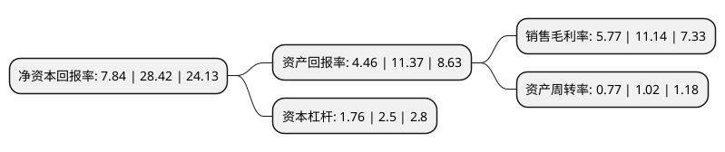

> 本页面由自动化程序生成于 2022年5月20日 01:23
> 内容可能存在错误，如有bug请提交issue至：https://github.com/Eroleice/doc-pi/issues
{.is-warning}

# 上市公司基本情况

## 基本资料

宁波家联科技股份有限公司（以下简称“家联科技”）成立于2009年08月07日，宁波市。于2021年12月09日在深交所创业板上市。

家联科技注册资本12,000万元，从事高端塑料制品及生物全降解制品的研发，生产与销售。公司主要产品包括刀叉勺，杯碗盘，吸管，航空餐饮套件等。以下是详细信息：

- 公司名称: 宁波家联科技股份有限公司
- 股票代码: 301193.SZ
- 所在地: 浙江 - 宁波市
- 成立日期: 2009年08月07日
- 注册资本: 12,000万元
- 法定代表人: 王熊
- 主营业务: 从事高端塑料制品及生物全降解制品的研发，生产与销售公司主要产品包括刀叉勺，杯碗盘，吸管，航空餐饮套件等
- 公司官网: www.nbhomelink.cn
- 公司介绍: 宁波家联科技股份有限公司是一家从事高端塑料制品及生物全降解制品的研发、生产与销售的高新技术企业。公司为全球塑料餐饮具制造行业的领先企业，全国生物基全降解日用塑料制品单项冠军企业。公司主要产品包括餐饮具、耐用性家居用品等多种产品，广泛应用于家居、快消、餐饮、航空等领域。公司产品的主要客户包括Amazon(亚马逊)、IKEA(宜家)、Walmart(沃尔玛)、KFC(肯德基)、Starbucks(星巴克)、Pizza Hut(必胜客)、Costco(好市多)、Woolworths(伍尔沃斯)、Sysco(西斯科)、USFood(美国食品)、Safeway(西夫韦)、Target(塔吉特)、Loblaws(洛布劳斯)、Tesco(特易购)、小肥羊、吉野家、蜜雪冰城、大润发、麦德龙、欧尚等众多国内外知名企业。自设立以来，公司一直专注于新型塑料、全降解材料、高端塑料制品及全自动化生产等领域的研究、开发与技术改进。公司已经拥有国内外发明专利20项、实用新型专利25项、外观设计专利48项。

## 股东及高管情况

上市公司第一大股东为王熊，持股45,790,500股，占比38.16%，为上市公司实际控制人。

截至2022年03月31日，上市公司的前十大股东中，共有6名自然人股东，2名机构股东，2个产品账户，其中5%以上大股东共有4名。上市公司前十大股东明细如下：

> 截至2022年03月31日，上市公司前十大股东信息如下：

| 股东名称 | 持股数量（股） | 持股比例 |
| --- | --- | --- |
| 王熊 | 45,790,500 | 38.16% |
| 张三云 | 20,250,000 | 16.88% |
| 宁波镇海金塑股权投资管理合伙企业(有限合伙) | 9,000,000 | 7.5% |
| 赵建光 | 6,750,000 | 5.63% |
| 宁波镇海金模股权投资管理合伙企业(有限合伙) | 3,600,000 | 3% |
| 蔡礼永 | 3,150,000 | 2.63% |
| 林慧勤 | 1,459,500 | 1.22% |
| 招商证券资管-招商银行-招商资管家联科技员工参与创业板战略配售集合资产管理计划 | 1,384,520 | 1.15% |
| 阳光资管-工商银行-阳光资产-周期主题精选资产管理产品 | 609,938 | 0.51% |
| 盛波 | 471,300 | 0.39% |

## 利润表分析

上市公司2021年总收入为12.34亿元，净利润为0.71亿元，实现盈利。

## 杜邦分析

> 数据列示周期：2021年 | 2020年 | 2019年
{.is-info}

上市公司的净资产收益率在近一年有所下降，下降幅度为-72.41%，其变化情况分解如下：
- 上市公司的销售毛利率在近一年下降了-48.2%，可能是生产效率的下降、商品原材料价格上涨或商品价格的下跌所致。
- 上市公司的资产周转率在近一年下降了-24.51%，可能是源自于更慢的销售回款或库存管理效果下降。
- 上市公司的财务杠杆比率在近一年下降了-29.6%，可能是减少负债降低财务费用。

