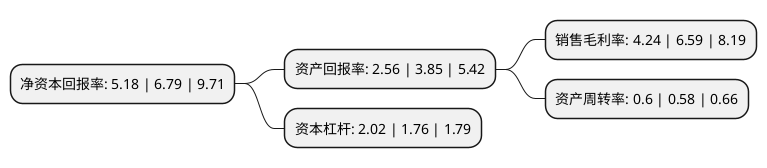

> 本页面由自动化程序生成于 2022年5月20日 01:26
> 内容可能存在错误，如有bug请提交issue至：https://github.com/Eroleice/doc-pi/issues
{.is-warning}

# 上市公司基本情况

## 基本资料

美克国际家居用品股份有限公司（以下简称“美克家居”）成立于1995年08月16日，赣州市。于2000年11月27日在上交所主板上市。

美克家居注册资本162,832.722万元，主要产品:餐桌，餐椅，茶几，橱柜。以下是详细信息：

- 公司名称: 美克国际家居用品股份有限公司
- 股票代码: 600337.SH
- 所在地: 江西 - 赣州市
- 成立日期: 1995年08月16日
- 注册资本: 162,832.722万元
- 法定代表人: 寇卫平
- 主营业务: 主要产品:餐桌，餐椅，茶几，橱柜
- 公司官网: www.markorfurniture.com
- 公司介绍: 公司已发展成为中国多品牌、多渠道和一体化的国际综合家居消费品的代表性公司，经营家居全产业链业务。家具制造业作为公司的主营业务之一，形成了从产品设计、产品开发、产品生产及产品销售为一体的完整进化链。公司拥有规模化、专业化的加工生产基地、高效的企业管理平台、实力雄厚的研发机构及覆盖全球的销售网络。通过进口国外的木材资源，生产色彩多样且充满文化内涵的高档家具产品，产品出口美国、加拿大、欧洲、日本、澳大利亚等国家和地区。公司的生产规模、装备水平、技术水平及工业化生产水平居同行业领先水平，公司的管理、销售和产品开发方面的能力已经跻身于世界著名的制造商行列，是我国最大的家具出口企业之一。公司拥有规模化、专业化、绿色化的生产园区和入选工信部“互联网+”在工业应用领域十大新锐案例的智能工厂，高效的企业管理平台、实力雄厚的工业设计中心及覆盖全球的销售网络。

## 股东及高管情况

上市公司第一大股东为美克投资集团有限公司，持股415,209,350股，占比25.499%，**疑似为**上市公司实际控制人。

截至2022年05月11日，上市公司的前十大股东中，共有1名自然人股东，2名机构股东，6个产品账户，1个海外主体，其中5%以上大股东共有3名。上市公司前十大股东明细如下：

> 未能通过持股比例判定出上市公司实际控制人（持股30%以上）
> 可能存在通过间接持股、联合持股、协议控制等方式拥有实际控制权的主体，具体请参考上市公司定期公告！
{.is-warning}

> 截至2022年05月11日，上市公司前十大股东信息如下：

| 股东名称 | 持股数量（股） | 持股比例 |
| --- | --- | --- |
| 美克投资集团有限公司 | 415,209,350 | 25.499% |
| 赣州发展美家家居产业基金合伙企业(有限合伙) | 176,677,274 | 10.85% |
| 美克国际家居用品股份有限公司回购专用证券账户 | 132,382,337 | 8.13% |
| 美克集团-中山证券-19美04EB担保及信托财产专户 | 73,240,000 | 4.5% |
| 中阅资本管理股份公司-中阅战略优选2号私募证券投资基金 | 56,807,505 | 3.49% |
| 国泰元鑫资管-赣州金融控股集团有限责任公司-国泰元鑫睿鑫一号单一资产管理计划 | 52,617,300 | 3.23% |
| 泰康人寿保险有限责任公司-传统-普通保险产品-019L-CT001沪 | 33,890,886 | 2.08% |
| 上海牧鑫资产管理有限公司-牧鑫鼎泰4号私募证券投资基金 | 28,632,000 | 1.76% |
| 泰康人寿保险有限责任公司-分红-个人分红-019L-FH002沪 | 21,378,177 | 1.31% |
| 周泉 | 15,788,002 | 0.97% |

## 利润表分析

上市公司2021年总收入为52.75亿元，净利润为2.23亿元，实现盈利。

## 杜邦分析

> 数据列示周期：2021年 | 2020年 | 2019年
{.is-info}

上市公司的净资产收益率在近一年有所下降，下降幅度为-23.71%，其变化情况分解如下：
- 上市公司的销售毛利率在近一年下降了-35.66%，可能是生产效率的下降、商品原材料价格上涨或商品价格的下跌所致。
- 上市公司的资产周转率在近一年上升了3.45%，可能是源自于更快的销售回款或库存管理效果提升。
- 上市公司的财务杠杆比率在近一年上升了14.77%，可能是增加负债扩大生产规模。

