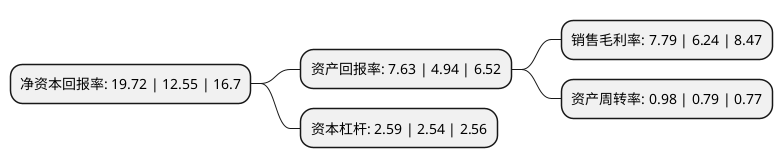

> 本页面由自动化程序生成于 2022年5月20日 01:32
> 内容可能存在错误，如有bug请提交issue至：https://github.com/Eroleice/doc-pi/issues
{.is-warning}

# 上市公司基本情况

## 基本资料

喜临门家具股份有限公司（以下简称“喜临门”）成立于1996年11月06日，绍兴市。于2012年07月17日在上交所主板上市。

喜临门注册资本38,741.779万元，公司主营业务包括民用家具业务和酒店家具业务两大类。民用家具业务主要是销售以床垫，软床为主的中高档卧室家具，酒店家具业务主要是向星级酒店或大型公建项目提供室内家具及装修配套的木制品。公司专注于床垫，软床及其他家具产品的设计研发，生产和销售，旗下有“喜临门”，“法诗曼”和“SLEEMON”三大品牌。以下是详细信息：

- 公司名称: 喜临门家具股份有限公司
- 股票代码: 603008.SH
- 所在地: 浙江 - 绍兴市
- 成立日期: 1996年11月06日
- 注册资本: 38,741.779万元
- 法定代表人: 陈阿裕
- 主营业务: 公司主营业务包括民用家具业务和酒店家具业务两大类民用家具业务主要是销售以床垫，软床为主的中高档卧室家具，酒店家具业务主要是向星级酒店或大型公建项目提供室内家具及装修配套的木制品公司专注于床垫，软床及其他家具产品的设计研发，生产和销售，旗下有“喜临门”，“法诗曼”和“SLEEMON”三大品牌
- 公司官网: www.sleemon.cn
- 公司介绍: 公司是国内床垫行业的领军企业，专注于设计、研发、生产、销售以床垫为核心的高品质家具。公司旗下有“喜临门”、“法诗曼”和“SLEEMON”等品牌。公司主营业务包括民用家具业务和酒店家具业务两大类，民用家具业务主要是销售以床垫、软床为主的中高档卧室家具，酒店家具业务主要是向星级酒店或大型公建项目提供室内家具及装修配套的木制品。公司拥有多项技术专利，其中，“弹簧垫热处理方法”和“一种清凉型软硬两用席梦思床垫”获国家发明专利。公司是床垫行业内第一家“国家火炬计划重点高新技术企业”。公司一直坚持“诚信、责任、同进、共赢”的核心价值观，向“成为全球寝具行业领先者”的愿景目标持续迈进。

## 股东及高管情况

上市公司第一大股东为浙江华易智能制造有限公司，持股84,799,659股，占比21.89%，**疑似为**上市公司实际控制人。

截至2022年03月31日，上市公司的前十大股东中，共有3名自然人股东，3名机构股东，3个产品账户，1个海外主体，其中5%以上大股东共有3名。上市公司前十大股东明细如下：

> 未能通过持股比例判定出上市公司实际控制人（持股30%以上）
> 可能存在通过间接持股、联合持股、协议控制等方式拥有实际控制权的主体，具体请参考上市公司定期公告！
{.is-warning}

> 截至2022年03月31日，上市公司前十大股东信息如下：

| 股东名称 | 持股数量（股） | 持股比例 |
| --- | --- | --- |
| 浙江华易智能制造有限公司 | 84,799,659 | 21.89% |
| 绍兴市越城区华瀚股权投资合伙企业(有限合伙) | 36,807,950 | 9.5% |
| 香港中央结算有限公司(陆股通) | 25,053,352 | 6.47% |
| 周伟成 | 13,300,705 | 3.43% |
| 沈冬良 | 5,025,000 | 1.3% |
| 陈阿裕 | 4,228,125 | 1.09% |
| 新华人寿保险股份有限公司-分红-个人分红-018L-FH002沪 | 4,110,390 | 1.06% |
| 招商银行股份有限公司-工银瑞信新金融股票型证券投资基金 | 3,999,984 | 1.03% |
| 杭州金投乾憬投资管理有限公司-乾憬伯乐1号私募证券投资基金 | 3,790,000 | 0.98% |
| 全国社保基金四一三组合 | 3,656,552 | 0.94% |

## 利润表分析

上市公司2021年总收入为77.71亿元，净利润为6.05亿元，实现盈利。

## 杜邦分析

> 数据列示周期：2021年 | 2020年 | 2019年
{.is-info}

上市公司的净资产收益率在近一年有所上升，上升幅度为57.13%，其变化情况分解如下：
- 上市公司的销售毛利率在近一年上升了24.84%，可能是生产效率的提升、商品原材料价格下跌或商品价格的上涨所致。
- 上市公司的资产周转率在近一年上升了24.05%，可能是源自于更快的销售回款或库存管理效果提升。
- 上市公司的财务杠杆比率在近一年上升了1.97%，可能是增加负债扩大生产规模。

