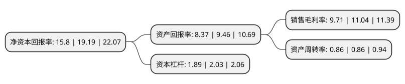

> 本页面由自动化程序生成于 2022年5月20日 01:33
> 内容可能存在错误，如有bug请提交issue至：https://github.com/Eroleice/doc-pi/issues
{.is-warning}

# 上市公司基本情况

## 基本资料

金牌厨柜家居科技股份有限公司（以下简称“金牌厨柜”）成立于1999年01月26日，厦门市。于2017年05月12日在上交所主板上市。

金牌厨柜注册资本15,438.266万元，主要产品:整体橱柜。主营业务:本公司专业提供整体厨柜的研发，设计，生产，销售，安装及售后等整体服务。以下是详细信息：

- 公司名称: 金牌厨柜家居科技股份有限公司
- 股票代码: 603180.SH
- 所在地: 福建 - 厦门市
- 成立日期: 1999年01月26日
- 注册资本: 15,438.266万元
- 法定代表人: 潘孝贞
- 主营业务: 主要产品:整体橱柜主营业务:本公司专业提供整体厨柜的研发，设计，生产，销售，安装及售后等整体服务
- 公司官网: www.goldenhome.cc
- 公司介绍: 公司是一家提供高品质整体橱柜的企业，专业提供整体橱柜的研发、设计、生产、销售、安装及售后等整体服务，以“更专业的高端橱柜”为品牌发展战略、以“大规模定制化生产”为基础，采取“经销为主、直营及大宗业务为辅”的销售模式。公司从德国、意大利引进国际一流生产设备，确保产品的高品质。公司应用信息化高新技术，对订单进行分解，为所有零部件产生条码，在整个生产、包装、发货过程中全条码管路，品质全称可拍。公司拥有多项专利，被橱柜行业国家认定为“厨房工业设计中心”，是国家标准和行业标准的起草和修订单位。公司不断坚持“金牌服务季”，树立了业内服务创新的标杆。

## 股东及高管情况

上市公司第一大股东为厦门市建潘集团有限公司，持股64,044,322股，占比41.48%，为上市公司实际控制人。

截至2022年03月31日，上市公司的前十大股东中，共有6名自然人股东，1名机构股东，3个产品账户，其中5%以上大股东共有3名。上市公司前十大股东明细如下：

> 截至2022年03月31日，上市公司前十大股东信息如下：

| 股东名称 | 持股数量（股） | 持股比例 |
| --- | --- | --- |
| 厦门市建潘集团有限公司 | 64,044,322 | 41.48% |
| 温建怀 | 18,049,784 | 11.69% |
| 潘孝贞 | 10,761,403 | 6.97% |
| 温建北 | 4,759,055 | 3.08% |
| 潘美玲 | 3,805,214 | 2.46% |
| 中国建设银行股份有限公司-华夏兴和混合型证券投资基金 | 3,650,920 | 2.36% |
| 交通银行-华夏蓝筹核心混合型证券投资基金(LOF) | 2,979,285 | 1.93% |
| 中国建设银行股份有限公司-华夏新兴消费混合型证券投资基金 | 2,047,847 | 1.33% |
| 潘宜琴 | 1,983,124 | 1.28% |
| 温建河 | 1,981,968 | 1.28% |

## 利润表分析

上市公司2021年总收入为34.47亿元，净利润为3.34亿元，实现盈利。

## 杜邦分析

> 数据列示周期：2021年 | 2020年 | 2019年
{.is-info}

上市公司的净资产收益率在近一年有所下降，下降幅度为-17.67%，其变化情况分解如下：
- 上市公司的销售毛利率在近一年下降了-12.05%，可能是生产效率的下降、商品原材料价格上涨或商品价格的下跌所致。
- 上市公司的资产周转率在近一年下降了0%，可能是源自于更慢的销售回款或库存管理效果下降。
- 上市公司的财务杠杆比率在近一年下降了-6.9%，可能是减少负债降低财务费用。

