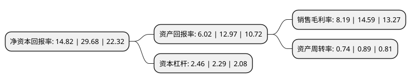

> 本页面由自动化程序生成于 2022年5月20日 01:33
> 内容可能存在错误，如有bug请提交issue至：https://github.com/Eroleice/doc-pi/issues
{.is-warning}

# 上市公司基本情况

## 基本资料

江山欧派门业股份有限公司（以下简称“江山欧派”）成立于2006年07月31日，衢州市。于2017年02月10日在上交所主板上市。

江山欧派注册资本10,506.53万元，目前主要生产实木复合门和夹板模压门两大类产品。欧派门业是一家集研发，生产，销售和服务于一体的木门企业。以下是详细信息：

- 公司名称: 江山欧派门业股份有限公司
- 股票代码: 603208.SH
- 所在地: 浙江 - 衢州市
- 成立日期: 2006年07月31日
- 注册资本: 10,506.53万元
- 法定代表人: 吴水根
- 主营业务: 目前主要生产实木复合门和夹板模压门两大类产品欧派门业是一家集研发，生产，销售和服务于一体的木门企业
- 公司官网: www.oupaigroup.com
- 公司介绍: 公司是一家集研发、生产、销售、服务于一体的专业木门制造企业，是上海证券交易所主板上市公司。公司以“全球木门制造专家”为己任，自创立以来，专注于木门，专心于创新，成立了“木门研发中心”和“产学研基地”，多年匠心打造优质木门。公司依靠管理创新和技术革新，已取得大量的专利，推动企业科技进步。公司自有多个大型制造基地，拥有国际一流的自动化生产设备、检验仪器和标准化大型厂房，及完善的生活娱乐配套设施。公司全渠道立体建立布局全国的营销网络及服务体系，与恒大、万科等著名房地产企业建立了战略合作伙伴关系。公司拥有自营进出口权，产品出口欧、美、非等数十个国家和地区，为全球消费者提供优质的产品与服务。先后荣获中国质量诚信企业、国家林业标准化示范企业、国家高新技术企业、中国木门协会副会长单位、省高新技术企业研究开发中心、省标准创新型企业等称号。

## 股东及高管情况

上市公司第一大股东为吴水根，持股30,550,000股，占比29.08%，**疑似为**上市公司实际控制人。

截至2022年03月31日，上市公司的前十大股东中，共有4名自然人股东，1名机构股东，5个产品账户，其中5%以上大股东共有3名。上市公司前十大股东明细如下：

> 未能通过持股比例判定出上市公司实际控制人（持股30%以上）
> 可能存在通过间接持股、联合持股、协议控制等方式拥有实际控制权的主体，具体请参考上市公司定期公告！
{.is-warning}

> 截至2022年03月31日，上市公司前十大股东信息如下：

| 股东名称 | 持股数量（股） | 持股比例 |
| --- | --- | --- |
| 吴水根 | 30,550,000 | 29.08% |
| 王忠 | 24,050,000 | 22.89% |
| 吴水燕 | 10,400,000 | 9.9% |
| 招商银行股份有限公司-睿远成长价值混合型证券投资基金 | 4,028,098 | 3.83% |
| 王玮 | 2,396,200 | 2.28% |
| 交通银行股份有限公司-长城久富核心成长混合型证券投资基金(LOF) | 1,465,475 | 1.39% |
| 华夏人寿保险股份有限公司-分红-个险分红 | 849,473 | 0.81% |
| 中国工商银行股份有限公司-南方卓越优选3个月持有期混合型证券投资基金 | 811,869 | 0.77% |
| 中国工商银行股份有限公司-海富通改革驱动灵活配置混合型证券投资基金 | 710,800 | 0.68% |
| 上海盘京投资管理中心(有限合伙)-盛信2期私募证券投资基金 | 697,000 | 0.66% |

## 利润表分析

上市公司2021年总收入为31.57亿元，净利润为2.58亿元，实现盈利。

## 杜邦分析

> 数据列示周期：2021年 | 2020年 | 2019年
{.is-info}

上市公司的净资产收益率在近一年有所下降，下降幅度为-50.07%，其变化情况分解如下：
- 上市公司的销售毛利率在近一年下降了-43.87%，可能是生产效率的下降、商品原材料价格上涨或商品价格的下跌所致。
- 上市公司的资产周转率在近一年下降了-16.85%，可能是源自于更慢的销售回款或库存管理效果下降。
- 上市公司的财务杠杆比率在近一年上升了7.42%，可能是增加负债扩大生产规模。

