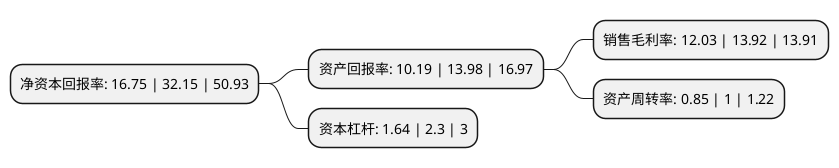

> 本页面由自动化程序生成于 2022年5月20日 01:33
> 内容可能存在错误，如有bug请提交issue至：https://github.com/Eroleice/doc-pi/issues
{.is-warning}

# 上市公司基本情况

## 基本资料

梦天家居集团股份有限公司（以下简称“梦天家居”）成立于2003年09月22日，嘉兴市。于2021年12月15日在上交所主板上市。

梦天家居注册资本22,136万元，主要产品为“梦天”品牌的系列木门，墙板，柜类等家具产品，主要从事木门，墙板，柜类等定制化木质家具的设计，研发，生产和销售，为客户提供家居的整体空间解决方案。以下是详细信息：

- 公司名称: 梦天家居集团股份有限公司
- 股票代码: 603216.SH
- 所在地: 浙江 - 嘉兴市
- 成立日期: 2003年09月22日
- 注册资本: 22,136万元
- 法定代表人: 余静渊
- 主营业务: 主要产品为“梦天”品牌的系列木门，墙板，柜类等家具产品，主要从事木门，墙板，柜类等定制化木质家具的设计，研发，生产和销售，为客户提供家居的整体空间解决方案
- 公司官网: www.mengtian.com
- 公司介绍: 公司主要从事定制化木质家具的设计、研发、生产和销售，通过不断对产品设计和工艺推陈出新，努力打造优质的市场形象和品牌，同时，公司为全国工商联家具装饰业商会门业专业委员会执行会长单位、中国木材与木制品流通协会及中国室内装饰协会副会长单位及国家幕墙、木门窗标准化技术委员会中的木门生产企业委员。另外，公司于2017年被工信部认定为“智能制造试点示范(全屋家具大规模个性化定制)”项目单位，在规模化全屋定制方面处于行业领先地位。

## 股东及高管情况

上市公司第一大股东为浙江梦天控股有限公司，持股124,500,000股，占比56.24%，为上市公司实际控制人。

截至2022年03月31日，上市公司的前十大股东中，共有5名自然人股东，5名机构股东，其中5%以上大股东共有3名。上市公司前十大股东明细如下：

> 截至2022年03月31日，上市公司前十大股东信息如下：

| 股东名称 | 持股数量（股） | 持股比例 |
| --- | --- | --- |
| 浙江梦天控股有限公司 | 124,500,000 | 56.24% |
| 嘉兴梦家投资管理合伙企业(有限合伙) | 16,600,000 | 7.5% |
| 范小珍 | 13,280,000 | 6% |
| 嘉兴梦悦投资管理合伙企业(有限合伙) | 8,300,000 | 3.75% |
| 余静滨 | 3,320,000 | 1.5% |
| 林美建 | 2,119,144 | 0.96% |
| 江兴莹 | 874,200 | 0.39% |
| 华泰证券股份有限公司 | 455,066 | 0.21% |
| 华泰金融控股(香港)有限公司-自有资金 | 374,920 | 0.17% |
| 周国华 | 374,741 | 0.17% |

## 利润表分析

上市公司2021年总收入为15.19亿元，净利润为1.82亿元，实现盈利。

## 杜邦分析

> 数据列示周期：2021年 | 2020年 | 2019年
{.is-info}

上市公司的净资产收益率在近一年有所下降，下降幅度为-47.9%，其变化情况分解如下：
- 上市公司的销售毛利率在近一年下降了-13.58%，可能是生产效率的下降、商品原材料价格上涨或商品价格的下跌所致。
- 上市公司的资产周转率在近一年下降了-15%，可能是源自于更慢的销售回款或库存管理效果下降。
- 上市公司的财务杠杆比率在近一年下降了-28.7%，可能是减少负债降低财务费用。

