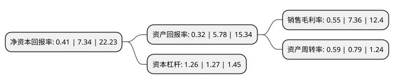

> 本页面由自动化程序生成于 2022年5月20日 01:33
> 内容可能存在错误，如有bug请提交issue至：https://github.com/Eroleice/doc-pi/issues
{.is-warning}

# 上市公司基本情况

## 基本资料

爱丽家居科技股份有限公司（以下简称“爱丽家居”）成立于1999年11月01日，苏州市。于2020年03月23日在上交所主板上市。

爱丽家居注册资本24,000万元，公司主营业务为PVC塑料地板的研发，生产和销售，主要产品包括悬浮地板，锁扣地板以及普通地板。以下是详细信息：

- 公司名称: 爱丽家居科技股份有限公司
- 股票代码: 603221.SH
- 所在地: 江苏 - 苏州市
- 成立日期: 1999年11月01日
- 注册资本: 24,000万元
- 法定代表人: 宋正兴
- 主营业务: 公司主营业务为PVC塑料地板的研发，生产和销售，主要产品包括悬浮地板，锁扣地板以及普通地板
- 公司官网: www.eletile.com
- 公司介绍: 公司是国内领先的PVC塑料地板生产及出口企业之一。公司主营业务为PVC塑料地板的研发、生产和销售，主要产品包括悬浮地板、锁扣地板以及普通地板。公司从设立至今，一直秉承“绿色家居”的生产理念，注重质量管理与环境体系管理，先后通过ISO9001:2015质量管理体系认证及ISO14001:2015环境管理体系认证。凭借较强的技术研发和新产品设计能力、稳定的产品质量以及规模化的生产能力，公司积累了稳定的客户及渠道资源，业务范围已覆盖北美、欧洲、东南亚、澳洲等地区。

## 股东及高管情况

上市公司第一大股东为张家港博华企业管理有限公司，持股154,800,000股，占比64.5%，为上市公司实际控制人。

截至2022年03月31日，上市公司的前十大股东中，共有7名自然人股东，3名机构股东，其中5%以上大股东共有2名。上市公司前十大股东明细如下：

> 截至2022年03月31日，上市公司前十大股东信息如下：

| 股东名称 | 持股数量（股） | 持股比例 |
| --- | --- | --- |
| 张家港博华企业管理有限公司 | 154,800,000 | 64.5% |
| 宋锦程 | 12,040,000 | 5.02% |
| 施慧璐 | 5,160,000 | 2.15% |
| 张家港泽慧企业管理中心(有限合伙) | 3,766,000 | 1.57% |
| 张家港泽兴企业管理中心(有限合伙) | 3,514,000 | 1.46% |
| 唐云良 | 1,298,000 | 0.54% |
| 殳冲 | 739,900 | 0.31% |
| 舒志兵 | 632,100 | 0.26% |
| 于树胜 | 500,100 | 0.21% |
| 陈峰 | 436,400 | 0.18% |

## 利润表分析

上市公司2021年总收入为10.78亿元，净利润为0.05亿元，实现盈利。

## 杜邦分析

> 数据列示周期：2021年 | 2020年 | 2019年
{.is-info}

上市公司的净资产收益率在近一年有所下降，下降幅度为-94.41%，其变化情况分解如下：
- 上市公司的销售毛利率在近一年下降了-92.53%，可能是生产效率的下降、商品原材料价格上涨或商品价格的下跌所致。
- 上市公司的资产周转率在近一年下降了-25.32%，可能是源自于更慢的销售回款或库存管理效果下降。
- 上市公司的财务杠杆比率在近一年下降了-0.79%，可能是减少负债降低财务费用。

