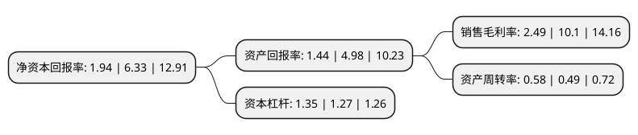

> 本页面由自动化程序生成于 2022年5月20日 01:33
> 内容可能存在错误，如有bug请提交issue至：https://github.com/Eroleice/doc-pi/issues
{.is-warning}

# 上市公司基本情况

## 基本资料

菲林格尔家居科技股份有限公司（以下简称“菲林格尔”）成立于1995年03月13日，上海市。于2017年06月15日在上交所主板上市。

菲林格尔注册资本27,345.521万元，主营业务为从事木地板(主要为强化复合地板，实木复合地板)，橱柜家具的研发，设计，生产及销售。主要产品包括强化复合地板，多层实木复合地板以及橱柜家具。以下是详细信息：

- 公司名称: 菲林格尔家居科技股份有限公司
- 股票代码: 603226.SH
- 所在地: 上海 - 上海市
- 成立日期: 1995年03月13日
- 注册资本: 27,345.521万元
- 法定代表人: Jürgen V？hringer
- 主营业务: 主营业务为从事木地板(主要为强化复合地板，实木复合地板)，橱柜家具的研发，设计，生产及销售主要产品包括强化复合地板，多层实木复合地板以及橱柜家具
- 公司官网: www.vohringer.com
- 公司介绍: 公司已成为亚洲首屈一指的强化地板制作商。公司主要经营生产实木地板、各种复合地板、人造板、地板、整体橱柜、家具，销售自产产品并提供售后服务等，年销量在业内名列前茅。三期投产后，新增实木等各类地板，同时引进先进家具、橱柜、生产线、制造欧洲风格的整体厨房和系统家具，由德国技术专家全程管理。第四期扩建工程动工，竣工后系列地板设计产能大幅度增加。公司将承载德国木业精神，以对细节的完美苛求，让每一款产品都能让人感受到德国人闪耀智慧和严谨思想所碰撞出的精巧，不断创造生活艺术，诠释更好的家居生活。

## 股东及高管情况

上市公司第一大股东为菲林格尔控股有限公司，持股79,399,580股，占比29.04%，**疑似为**上市公司实际控制人。

截至2022年05月09日，上市公司的前十大股东中，共有2名自然人股东，6名机构股东，2个海外主体，其中5%以上大股东共有7名。上市公司前十大股东明细如下：

> 未能通过持股比例判定出上市公司实际控制人（持股30%以上）
> 可能存在通过间接持股、联合持股、协议控制等方式拥有实际控制权的主体，具体请参考上市公司定期公告！
{.is-warning}

> 截至2022年05月09日，上市公司前十大股东信息如下：

| 股东名称 | 持股数量（股） | 持股比例 |
| --- | --- | --- |
| 菲林格尔控股有限公司 | 79,399,580 | 29.04% |
| 菲林格尔控股有限公司 | 79,399,580 | 29.04% |
| ASIA PACIFIC GROUP INTERNATIONAL LIMITED | 59,549,685 | 21.78% |
| ASIA PACIFIC GROUP INTERNATIONAL LIMITED | 59,549,685 | 21.78% |
| 新发展集团有限公司 | 50,536,042 | 18.4806% |
| 新发展集团有限公司 | 49,251,042 | 18.0106% |
| 新发展集团有限公司 | 48,632,242 | 17.78% |
| 上海申茂仓储有限公司 | 5,954,968 | 2.18% |
| 李秀山 | 1,210,000 | 0.44% |
| 虞美英 | 1,027,031 | 0.38% |

## 利润表分析

上市公司2021年总收入为7.81亿元，净利润为0.19亿元，实现盈利。

## 杜邦分析

> 数据列示周期：2021年 | 2020年 | 2019年
{.is-info}

上市公司的净资产收益率在近一年有所下降，下降幅度为-69.35%，其变化情况分解如下：
- 上市公司的销售毛利率在近一年下降了-75.35%，可能是生产效率的下降、商品原材料价格上涨或商品价格的下跌所致。
- 上市公司的资产周转率在近一年上升了18.37%，可能是源自于更快的销售回款或库存管理效果提升。
- 上市公司的财务杠杆比率在近一年上升了6.3%，可能是增加负债扩大生产规模。

