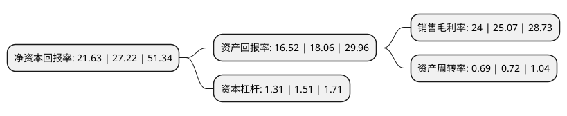

> 本页面由自动化程序生成于 2022年5月20日 01:33
> 内容可能存在错误，如有bug请提交issue至：https://github.com/Eroleice/doc-pi/issues
{.is-warning}

## 股东及高管情况

上市公司第一大股东为卜晓华，持股42,000,000股，占比40.53%，为上市公司实际控制人。

截至2022年05月20日，上市公司的前十大股东中，共有4名自然人股东，5名机构股东，1个产品账户，其中5%以上大股东共有4名。上市公司前十大股东明细如下：

> 截至2022年05月20日，上市公司前十大股东信息如下：

| 股东名称 | 持股数量（股） | 持股比例 |
| --- | --- | --- |
| 卜晓华 | 42,000,000 | 40.53% |
| 上海森隆投资管理中心(有限合伙) | 7,875,000 | 7.6% |
| 卜嘉翔 | 7,500,000 | 7.24% |
| 卜嘉城 | 7,500,000 | 7.24% |
| 宁波联翔企业管理咨询合伙企业(有限合伙) | 3,750,000 | 3.62% |
| 海通齐东(威海)股权投资基金合伙企业(有限合伙) | 3,750,000 | 3.62% |
| 德华兔宝宝投资管理有限公司 | 2,720,250 | 2.63% |
| 中咨华放股权投资海盐合伙企业(有限合伙) | 1,500,000 | 1.45% |
| 杭州领游投资管理合伙企业(有限合伙) | 750,000 | 0.72% |
| 陈燕凤 | 375,000 | 0.36% |

## 杜邦分析

> 数据列示周期：2021年 | 2020年 | 2019年
{.is-info}

上市公司的净资产收益率在近一年有所下降，下降幅度为-20.54%，其变化情况分解如下：
- 上市公司的销售毛利率在近一年下降了-4.27%，可能是生产效率的下降、商品原材料价格上涨或商品价格的下跌所致。
- 上市公司的资产周转率在近一年下降了-4.17%，可能是源自于更慢的销售回款或库存管理效果下降。
- 上市公司的财务杠杆比率在近一年下降了-13.25%，可能是减少负债降低财务费用。

