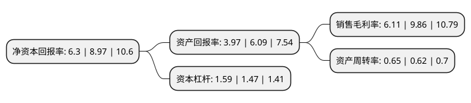

> 本页面由自动化程序生成于 2022年5月20日 01:34
> 内容可能存在错误，如有bug请提交issue至：https://github.com/Eroleice/doc-pi/issues
{.is-warning}

# 上市公司基本情况

## 基本资料

惠达卫浴股份有限公司（以下简称“惠达卫浴”）成立于1997年12月11日，唐山市。于2017年04月05日在上交所主板上市。

惠达卫浴注册资本38,450.23万元，公司是一家以满足消费者对高品质卫浴家居产品的需求为目标，通过卫浴产品的设计，研发，生产和销售，为消费者提供一站式卫浴产品综合解决方案的企业。公司产品主要包括卫生洁具和陶瓷砖，其中卫生洁具包括卫生陶瓷，五金洁具，浴缸浴房和浴室柜，陶瓷砖包括内墙砖和地砖。以下是详细信息：

- 公司名称: 惠达卫浴股份有限公司
- 股票代码: 603385.SH
- 所在地: 河北 - 唐山市
- 成立日期: 1997年12月11日
- 注册资本: 38,450.23万元
- 法定代表人: 王惠文
- 主营业务: 公司是一家以满足消费者对高品质卫浴家居产品的需求为目标，通过卫浴产品的设计，研发，生产和销售，为消费者提供一站式卫浴产品综合解决方案的企业公司产品主要包括卫生洁具和陶瓷砖，其中卫生洁具包括卫生陶瓷，五金洁具，浴缸浴房和浴室柜，陶瓷砖包括内墙砖和地砖
- 公司官网: www.huidagroup.com
- 公司介绍: 公司是一家以满足消费者对高品质卫浴家居产品的需求为目标，通过产品的设计、研发、生产和销售，为消费者提供一站式卫浴产品综合解决方案的企业。公司目前拥有“惠达”、“杜菲尼”两大自有核心品牌，通过强大的设计研发、丰富的产品组合、敏捷的供应链管理、全面的营销网络布局以及精准的品牌定位等，在国内外卫浴行业中树立了良好的品牌形象。公司实施全球化运营战略，构建了完善的销售和服务体系，通过覆盖全球主要市场的销售网络，为全球消费者提供一站式综合卫浴解决方案。

## 股东及高管情况

上市公司第一大股东为王惠文，持股66,982,269股，占比17.42%，**疑似为**上市公司实际控制人。

截至2022年03月31日，上市公司的前十大股东中，共有4名自然人股东，4名机构股东，1个产品账户，1名其他股东，其中5%以上大股东共有4名。上市公司前十大股东明细如下：

> 未能通过持股比例判定出上市公司实际控制人（持股30%以上）
> 可能存在通过间接持股、联合持股、协议控制等方式拥有实际控制权的主体，具体请参考上市公司定期公告！
{.is-warning}

> 截至2022年03月31日，上市公司前十大股东信息如下：

| 股东名称 | 持股数量（股） | 持股比例 |
| --- | --- | --- |
| 王惠文 | 66,982,269 | 17.42% |
| 唐山市丰南区黄各庄镇农村经济经营管理站 | 49,963,937 | 12.99% |
| 唐山市丰南区鼎立投资有限公司 | 39,133,910 | 10.18% |
| 王彦庆 | 28,912,887 | 7.52% |
| 唐山市丰南区庆伟投资有限公司 | 19,040,350 | 4.95% |
| 唐山市丰南区助达投资有限公司 | 17,527,834 | 4.56% |
| 董化忠 | 12,669,991 | 3.3% |
| 王彦伟 | 11,268,954 | 2.93% |
| 唐山市丰南区伟业投资有限公司 | 10,208,784 | 2.66% |
| 中国建设银行股份有限公司-信达澳银新能源产业股票型证券投资基金 | 1,911,013 | 0.5% |

## 利润表分析

上市公司2021年总收入为38.92亿元，净利润为2.37亿元，实现盈利。

## 杜邦分析

> 数据列示周期：2021年 | 2020年 | 2019年
{.is-info}

上市公司的净资产收益率在近一年有所下降，下降幅度为-29.77%，其变化情况分解如下：
- 上市公司的销售毛利率在近一年下降了-38.03%，可能是生产效率的下降、商品原材料价格上涨或商品价格的下跌所致。
- 上市公司的资产周转率在近一年上升了4.84%，可能是源自于更快的销售回款或库存管理效果提升。
- 上市公司的财务杠杆比率在近一年上升了8.16%，可能是增加负债扩大生产规模。

