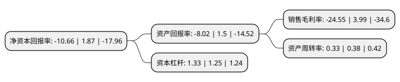

> 本页面由自动化程序生成于 2022年5月20日 01:34
> 内容可能存在错误，如有bug请提交issue至：https://github.com/Eroleice/doc-pi/issues
{.is-warning}

# 上市公司基本情况

## 基本资料

亚振家居股份有限公司（以下简称“亚振家居”）成立于2000年08月15日，南通市。于2016年12月15日在上交所主板上市。

亚振家居注册资本26,275.2万元，主要产品:中高档欧式家具;主营业务:家具产品的研发设计，生产和销售。以下是详细信息：

- 公司名称: 亚振家居股份有限公司
- 股票代码: 603389.SH
- 所在地: 江苏 - 南通市
- 成立日期: 2000年08月15日
- 注册资本: 26,275.2万元
- 法定代表人: 高伟
- 主营业务: 主要产品:中高档欧式家具;主营业务:家具产品的研发设计，生产和销售
- 公司官网: www.az.com.cn
- 公司介绍: 公司集产品研发、设计、生产与销售为一体，主要从事中高档木家具产品的生产与销售，主导产品为“亚振”、“亚振·利维亚”和“亚振·乔治亚”品牌系列欧式风格家具，是国内最早涉足欧式家具的专业制造商及销售商之一。公司已在北京、上海、南京、沈阳、哈尔滨、大连、杭州、苏州、成都、武汉等城市拥有多家品牌旗舰店，在广州、乌鲁木齐、天津、济南、深圳、重庆等多个经济发达城市拥有众多品牌形象店，初步建立了覆盖全国经济发达城市的营销网络。公司先后被评为“工业品牌培育试点企业”、“上海家具行业名优产品”、“上海名牌产品”和“江苏名牌产品”等。未来，公司将继续以增强公司核心竞争能力和可持续发展能力为总体目标，实现公司产品经营与资本运作相结合的发展之路，进一步提高公司的行业地位，将公司打造成为中国西式经典家具的领袖企业。

## 股东及高管情况

上市公司第一大股东为上海亚振投资有限公司，持股168,480,000股，占比64.12%，为上市公司实际控制人。

截至2022年03月31日，上市公司的前十大股东中，共有5名自然人股东，3名机构股东，1个产品账户，1个海外主体，其中5%以上大股东共有1名。上市公司前十大股东明细如下：

> 截至2022年03月31日，上市公司前十大股东信息如下：

| 股东名称 | 持股数量（股） | 持股比例 |
| --- | --- | --- |
| 上海亚振投资有限公司 | 168,480,000 | 64.12% |
| 上海恩源投资管理有限公司 | 7,700,500 | 2.93% |
| 上海浦振投资管理有限公司 | 7,677,640 | 2.92% |
| 张西举 | 2,103,380 | 0.8% |
| 高华-汇丰-GOLDMAN, SACHS & CO.LLC | 1,916,860 | 0.73% |
| 袁喜保 | 1,610,000 | 0.61% |
| 金科 | 1,370,000 | 0.52% |
| 鲁秀增 | 1,346,000 | 0.51% |
| 亚振家居股份有限公司回购专用证券账户 | 1,285,380 | 0.49% |
| 廖国钊 | 1,105,800 | 0.42% |

## 利润表分析

上市公司2021年总收入为2.75亿元，净利润为-0.68亿元，**未实现盈利**。

## 杜邦分析

> 数据列示周期：2021年 | 2020年 | 2019年
{.is-info}

上市公司的净资产收益率在近一年有所下降，下降幅度为-670.05%，其变化情况分解如下：
- 上市公司的销售毛利率在近一年下降了-715.29%，可能是生产效率的下降、商品原材料价格上涨或商品价格的下跌所致。
- 上市公司的资产周转率在近一年下降了-13.16%，可能是源自于更慢的销售回款或库存管理效果下降。
- 上市公司的财务杠杆比率在近一年上升了6.4%，可能是增加负债扩大生产规模。

