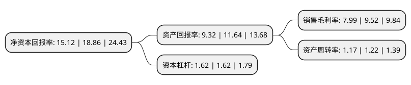

> 本页面由自动化程序生成于 2022年5月20日 01:34
> 内容可能存在错误，如有bug请提交issue至：https://github.com/Eroleice/doc-pi/issues
{.is-warning}

# 上市公司基本情况

## 基本资料

厦门建霖健康家居股份有限公司（以下简称“建霖家居”）成立于1990年06月30日，厦门市。于2020年07月30日在上交所主板上市。

建霖家居注册资本44,898万元，主要从事厨卫产品，净水产品和其他产品的研发，设计，生产和销售;公司主要产品可分为厨卫产品和净水产品两个大类以下是详细信息：

- 公司名称: 厦门建霖健康家居股份有限公司
- 股票代码: 603408.SH
- 所在地: 福建 - 厦门市
- 成立日期: 1990年06月30日
- 注册资本: 44,898万元
- 法定代表人: 吕理镇
- 主营业务: 主要从事厨卫产品，净水产品和其他产品的研发，设计，生产和销售;公司主要产品可分为厨卫产品和净水产品两个大类
- 公司官网: www.runner-corp.com
- 公司介绍: 公司秉承技术驱动发展的经营战略，主要从事厨卫产品、净水产品和其他产品的研发、设计、生产和销售；其中，厨卫产品包括淋浴系列、龙头系列、进排水系列和厨卫附属配件，净水产品包括净水器和净水配件，其他产品包括空气处理产品、护理产品、家电配件和管道安装等家居产品以及汽车配件等非家居产品。公司的主要客户包括马斯科集团、科勒集团、洁碧集团、摩恩集团、康丽根集团、3M集团、骊住集团、麦格纳集团、弗格森集团、荷兰皇家飞利浦、青岛海尔、美的集团等国际知名企业。公司系高新技术企业、国家知识产权优势企业、国家级工业设计中心、国家企业技术中心和厦门市创新型试点企业，多项技术获得科学技术部、中国表面工程协会、中国建筑卫生陶瓷协会和厦门市政府颁发的荣誉，多款产品获得德国“红点奖”、德国“iF设计奖”、美国“IDEA金奖”、日本“G-Mark奖”和中国“红星奖”等众多国际或国内工业设计奖项。

## 股东及高管情况

上市公司第一大股东为JADE FORTUNE LIMITED，持股90,361,531股，占比20.13%，**疑似为**上市公司实际控制人。

截至2022年04月19日，上市公司的前十大股东中，共有1名机构股东，9个海外主体，其中5%以上大股东共有5名。上市公司前十大股东明细如下：

> 未能通过持股比例判定出上市公司实际控制人（持股30%以上）
> 可能存在通过间接持股、联合持股、协议控制等方式拥有实际控制权的主体，具体请参考上市公司定期公告！
{.is-warning}

> 截至2022年04月19日，上市公司前十大股东信息如下：

| 股东名称 | 持股数量（股） | 持股比例 |
| --- | --- | --- |
| JADE FORTUNE LIMITED | 90,361,531 | 20.13% |
| PERFECT ESTATE LIMITED | 79,083,562 | 17.61% |
| YUEN TAI LIMITED | 40,664,075 | 9.06% |
| ESTEEM LEAD LIMITED | 40,664,075 | 9.06% |
| ALPHA LAND LIMITED | 31,173,983 | 6.94% |
| STAR EIGHT LIMITED | 20,084,000 | 4.47% |
| NEW EMPIRE LIMITED | 16,579,741 | 3.69% |
| 厦门序美投资咨询合伙企业(有限合伙) | 12,893,125 | 2.87% |
| HEROIC EPOCH LIMITED | 12,050,400 | 2.68% |
| Pitaya Limited | 7,564,057 | 1.68% |

## 杜邦分析

> 数据列示周期：2021年 | 2020年 | 2019年
{.is-info}

上市公司的净资产收益率在近一年有所下降，下降幅度为-19.83%，其变化情况分解如下：
- 上市公司的销售毛利率在近一年下降了-16.07%，可能是生产效率的下降、商品原材料价格上涨或商品价格的下跌所致。
- 上市公司的资产周转率在近一年下降了-4.1%，可能是源自于更慢的销售回款或库存管理效果下降。
- 上市公司的财务杠杆比率在近一年下降了0%，可能是减少负债降低财务费用。

