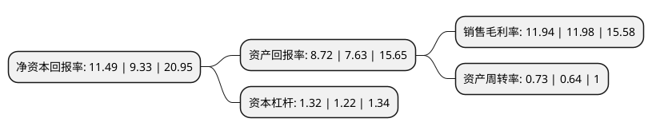

> 本页面由自动化程序生成于 2022年5月20日 01:34
> 内容可能存在错误，如有bug请提交issue至：https://github.com/Eroleice/doc-pi/issues
{.is-warning}

# 上市公司基本情况

## 基本资料

麒盛科技股份有限公司（以下简称“麒盛科技”）成立于2005年10月19日，嘉兴市。于2019年10月29日在上交所主板上市。

麒盛科技注册资本28,006.973万元，主营业务:主要从事智能电动床及配套产品研发，设计，生产与销售，主要产品为智能电动床，床垫，配件及其他。以下是详细信息：

- 公司名称: 麒盛科技股份有限公司
- 股票代码: 603610.SH
- 所在地: 浙江 - 嘉兴市
- 成立日期: 2005年10月19日
- 注册资本: 28,006.973万元
- 法定代表人: 唐国海
- 主营业务: 主营业务:主要从事智能电动床及配套产品研发，设计，生产与销售，主要产品为智能电动床，床垫，配件及其他
- 公司官网: www.keeson.com
- 公司介绍: 麒盛科技股份有限公司(原名嘉兴市舒福德电动床有限公司)是全球领先的健康睡眠解决方案提供商。公司为全球30多个国家和地区的家具销售商和家庭提供创新产品和健康睡眠服务，让全世界用户享受优质睡眠和健康生活。麒盛科技拥有智能家居行业最完整的产品线，最强大的研发、生产和销售团队，通过全系列的产品及持续的产品创新，灵活满足全球消费者的差异化需求以及对更高品质睡眠的追求。2016年，麒盛科技实现营业收入16亿元人民币，同比增长100%。公司产品“ERGOMOTION”、“索菲莉尔”智能床被广泛运用于酒店、别墅、高端会所等领域，每年为全球百万消费者提供舒适享受，深得行业和消费者的肯定与喜爱。目前，麒盛科技已全面领先于泛家居行业的竞争对手，成为“智能家居的标杆企业”。

## 股东及高管情况

上市公司第一大股东为嘉兴智海投资管理有限公司，持股65,335,410股，占比23.33%，**疑似为**上市公司实际控制人。

截至2022年03月31日，上市公司的前十大股东中，共有5名自然人股东，3名机构股东，1个产品账户，1个海外主体，其中5%以上大股东共有4名。上市公司前十大股东明细如下：

> 未能通过持股比例判定出上市公司实际控制人（持股30%以上）
> 可能存在通过间接持股、联合持股、协议控制等方式拥有实际控制权的主体，具体请参考上市公司定期公告！
{.is-warning}

> 截至2022年03月31日，上市公司前十大股东信息如下：

| 股东名称 | 持股数量（股） | 持股比例 |
| --- | --- | --- |
| 嘉兴智海投资管理有限公司 | 65,335,410 | 23.33% |
| 唐国海 | 48,290,401 | 17.24% |
| 徐建春 | 26,880,854 | 9.6% |
| 黄小卫 | 19,651,953 | 7.02% |
| 香港中央结算有限公司(陆股通) | 4,668,364 | 1.67% |
| 红星喜兆投资有限公司 | 4,018,803 | 1.43% |
| 傅伟 | 3,782,697 | 1.35% |
| 陕西省国际信托股份有限公司-陕国投·麒盛科技第一期员工持股集合资金信托计划 | 2,856,997 | 1.02% |
| 深圳市分享成长投资管理有限公司-宁波梅山保税港区分享鑫空间创业投资合伙企业(有限合伙) | 2,794,500 | 1% |
| 吴韬 | 2,740,080 | 0.98% |

## 利润表分析

上市公司2021年总收入为29.66亿元，净利润为3.54亿元，实现盈利。

## 杜邦分析

> 数据列示周期：2021年 | 2020年 | 2019年
{.is-info}

上市公司的净资产收益率在近一年有所上升，上升幅度为23.15%，其变化情况分解如下：
- 上市公司的销售毛利率在近一年下降了-0.33%，可能是生产效率的下降、商品原材料价格上涨或商品价格的下跌所致。
- 上市公司的资产周转率在近一年上升了14.06%，可能是源自于更快的销售回款或库存管理效果提升。
- 上市公司的财务杠杆比率在近一年上升了8.2%，可能是增加负债扩大生产规模。

