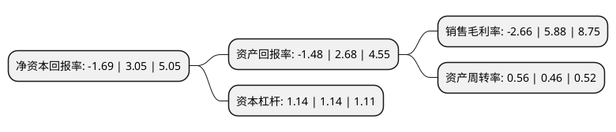

> 本页面由自动化程序生成于 2022年5月20日 01:34
> 内容可能存在错误，如有bug请提交issue至：https://github.com/Eroleice/doc-pi/issues
{.is-warning}

# 上市公司基本情况

## 基本资料

茶花现代家居用品股份有限公司（以下简称“茶花股份”）成立于1997年03月03日，福州市。于2017年02月13日在上交所主板上市。

茶花股份注册资本24,314万元，公司的主营业务为日用塑料制品为主的家居用品的研发，生产及销售。公司产品生产工艺主要有注塑(吹塑)，吹膜和布艺加工三大类。以下是详细信息：

- 公司名称: 茶花现代家居用品股份有限公司
- 股票代码: 603615.SH
- 所在地: 福建 - 福州市
- 成立日期: 1997年03月03日
- 注册资本: 24,314万元
- 法定代表人: 陈葵生
- 主营业务: 公司的主营业务为日用塑料制品为主的家居用品的研发，生产及销售公司产品生产工艺主要有注塑(吹塑)，吹膜和布艺加工三大类
- 公司官网: www.chahuajj.com
- 公司介绍: 公司专业从事现代家居用品的研发、生产和销售，是中国塑料家居用品行业的知名企业，公司目前拥有大型生产基地，配备先进的生产设备以及自动化生产线，具有强大的产品研发能力，不断开发出新颖、时尚、独具一格的家居用品，深受消费者的欢迎和喜爱。目前公司产品分类齐全、系列品项丰富，涵盖家居生活的方方面面。经过多年的发展，公司建立了完善的营销通路和网络，在全国范围拥有省、地级茶花专营销售代理商，独特的营销模式铸就了强大的渠道优势。公司的主要销售终端集中在大卖场和全国各地的地方性超市，并与沃尔玛、家乐福、大润发、华润万家、永辉、人人乐、物美、卜蜂莲花、欧尚等国内外全国性连锁超市建立了密切的长期合作伙伴关系。公司“茶花”商标被评为福建省著名商标，并荣获中国驰名商标。多年来，公司品牌得到了同行业及全国各大终端超市的一致认可，有着良好的品牌美誉度和知名度，茶花牌产品始终如一的高品质形象早已深入人心。

## 股东及高管情况

上市公司第一大股东为陈冠宇，持股61,062,111股，占比25.11%，**疑似为**上市公司实际控制人。

截至2022年03月31日，上市公司的前十大股东中，共有9名自然人股东，1个产品账户，其中5%以上大股东共有5名。上市公司前十大股东明细如下：

> 未能通过持股比例判定出上市公司实际控制人（持股30%以上）
> 可能存在通过间接持股、联合持股、协议控制等方式拥有实际控制权的主体，具体请参考上市公司定期公告！
{.is-warning}

> 截至2022年03月31日，上市公司前十大股东信息如下：

| 股东名称 | 持股数量（股） | 持股比例 |
| --- | --- | --- |
| 陈冠宇 | 61,062,111 | 25.11% |
| 陈葵生 | 35,894,312 | 14.76% |
| 陈明生 | 25,910,826 | 10.66% |
| 林世福 | 16,155,413 | 6.64% |
| 陈福生 | 12,930,275 | 5.32% |
| 陈苏敏 | 6,784,678 | 2.79% |
| 邓兰 | 5,286,300 | 2.17% |
| 陈昕 | 4,651,000 | 1.91% |
| 中国民生银行股份有限公司-金元顺安元启灵活配置混合型证券投资基金 | 798,300 | 0.33% |
| 蒋蔷薇 | 620,000 | 0.25% |

## 利润表分析

上市公司2021年总收入为7.98亿元，净利润为-0.21亿元，**未实现盈利**。

## 杜邦分析

> 数据列示周期：2021年 | 2020年 | 2019年
{.is-info}

上市公司的净资产收益率在近一年有所下降，下降幅度为-155.41%，其变化情况分解如下：
- 上市公司的销售毛利率在近一年下降了-145.24%，可能是生产效率的下降、商品原材料价格上涨或商品价格的下跌所致。
- 上市公司的资产周转率在近一年上升了21.74%，可能是源自于更快的销售回款或库存管理效果提升。
- 上市公司的财务杠杆比率在近一年下降了0%，可能是减少负债降低财务费用。

