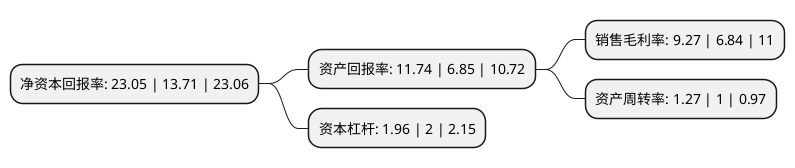

> 本页面由自动化程序生成于 2022年5月20日 01:35
> 内容可能存在错误，如有bug请提交issue至：https://github.com/Eroleice/doc-pi/issues
{.is-warning}

# 上市公司基本情况

## 基本资料

顾家家居股份有限公司（以下简称“顾家家居”）成立于2006年10月31日，杭州市。于2016年10月14日在上交所主板上市。

顾家家居注册资本63,222.425万元，主要从事客厅及卧室中高档软体家具产品的研发，设计，生产与销售，主要产品包括沙发，软床，餐椅和配套产品。以下是详细信息：

- 公司名称: 顾家家居股份有限公司
- 股票代码: 603816.SH
- 所在地: 浙江 - 杭州市
- 成立日期: 2006年10月31日
- 注册资本: 63,222.425万元
- 法定代表人: 顾江生
- 主营业务: 主要从事客厅及卧室中高档软体家具产品的研发，设计，生产与销售，主要产品包括沙发，软床，餐椅和配套产品
- 公司官网: www.kukahome.com
- 公司介绍: 公司专业从事客厅及卧室家具产品的研究、开发、生产与销售，为全球家庭提供健康、舒适、环保的客厅及卧室家居产品。公司旗下拥有“顾家工艺沙发”、“KUKAHOME全皮沙发”、“顾家软床”、“顾家床垫”、“顾家布艺”、“顾家功能”等系列产品，加上美国功能沙发合作品牌“LA-Z-BOY乐至宝”以及“米檬生活”组成了满足不同消费群体需求的产品矩阵。公司产品远销世界多个国家和地区，在国内外拥有超过多家品牌专卖店，为全球千万家庭提供高品质的产品和服务。公司把自身对客厅、卧室生活文化的深厚理解融入产品设计研发中，创造出国际化、时尚化、年轻化、休闲化的家居产品。公司成功引进国际顶尖家具生产设备及国际工业制造先进技术，拥有完整的手工工艺标准，集中了大批手工技艺精湛的技师。除了行业领先的本土设计团队，公司的国际家居研发中心还拥有来自意大利、德国、法国、日本等地的国际知名设计师。

## 股东及高管情况

上市公司第一大股东为顾家集团有限公司，持股181,460,420股，占比28.7%，**疑似为**上市公司实际控制人。

截至2022年03月31日，上市公司的前十大股东中，共有1名自然人股东，4名机构股东，3个产品账户，2个海外主体，其中5%以上大股东共有4名。上市公司前十大股东明细如下：

> 未能通过持股比例判定出上市公司实际控制人（持股30%以上）
> 可能存在通过间接持股、联合持股、协议控制等方式拥有实际控制权的主体，具体请参考上市公司定期公告！
{.is-warning}

> 截至2022年03月31日，上市公司前十大股东信息如下：

| 股东名称 | 持股数量（股） | 持股比例 |
| --- | --- | --- |
| 顾家集团有限公司 | 181,460,420 | 28.7% |
| TB Home Limited | 88,321,565 | 13.97% |
| 香港中央结算有限公司(陆股通) | 41,526,782 | 6.57% |
| 芜湖建信鼎信投资管理中心(有限合伙) | 31,700,000 | 5.01% |
| 顾家集团有限公司-顾家集团有限公司2021年非公开发行可交换公司债券(第二期)质押专户 | 31,350,000 | 4.96% |
| 顾家集团有限公司-顾家集团有限公司2021年非公开发行可交换公司债券质押专户 | 20,900,000 | 3.31% |
| 海通证券资管-工商银行-海通投融宝1号集合资产管理计划 | 12,680,859 | 2.01% |
| 中国人寿资管-广发银行-国寿资产-鼎坤优势甄选2122保险资产管理产品 | 10,879,264 | 1.72% |
| 招商银行股份有限公司-兴全合润混合型证券投资基金 | 9,139,260 | 1.45% |
| 李东来 | 7,145,084 | 1.13% |

## 利润表分析

上市公司2021年总收入为183.41亿元，净利润为17亿元，实现盈利。

## 杜邦分析

> 数据列示周期：2021年 | 2020年 | 2019年
{.is-info}

上市公司的净资产收益率在近一年有所上升，上升幅度为68.13%，其变化情况分解如下：
- 上市公司的销售毛利率在近一年上升了35.53%，可能是生产效率的提升、商品原材料价格下跌或商品价格的上涨所致。
- 上市公司的资产周转率在近一年上升了27%，可能是源自于更快的销售回款或库存管理效果提升。
- 上市公司的财务杠杆比率在近一年下降了-2%，可能是减少负债降低财务费用。

