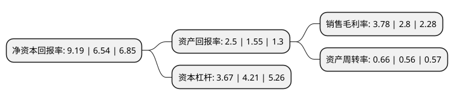

> 本页面由自动化程序生成于 2022年5月20日 01:35
> 内容可能存在错误，如有bug请提交issue至：https://github.com/Eroleice/doc-pi/issues
{.is-warning}

# 上市公司基本情况

## 基本资料

曲美家居集团股份有限公司（以下简称“曲美家居”）成立于1993年04月10日，北京市。于2015年04月22日在上交所主板上市。

曲美家居注册资本58,039.555万元，主要从事中高档民用家具的设计，生产和销售。公司主要产品为木质家具，具体包括实木类家具，人造板类家具和综合类家具。以下是详细信息：

- 公司名称: 曲美家居集团股份有限公司
- 股票代码: 603818.SH
- 所在地: 北京 - 北京市
- 成立日期: 1993年04月10日
- 注册资本: 58,039.555万元
- 法定代表人: 赵瑞海
- 主营业务: 主要从事中高档民用家具的设计，生产和销售公司主要产品为木质家具，具体包括实木类家具，人造板类家具和综合类家具
- 公司官网: www.qumei.com
- 公司介绍: 公司是一家在产品设计、产品质量、售后服务等方面居于国内同行业领先水平的家具企业，主要从事中高档民用家具的设计、生产和销售，产品范围涵盖了客厅、书房、卧室以及餐厅等家居生活所使用的主要家具。公司的主要产品为木质家具，具体包括实木类家具、人造板类家具和综合类家具。公司在家具经营模式创新，包括引进国外设计团队、开设家具独立店、发展O2O电子商务模式等方面走在行业前列；公司的“曲美”家具品牌在消费者中形成了较好的知名度和美誉度，在行业内拥有较高的品牌影响力。公司家具产品多次获得“中国创新设计红星奖”；产品“豌豆公主”休闲椅和“乐山居”沙发获得被誉为设计界“奥斯卡”的德国“IF产品设计奖”。

## 股东及高管情况

上市公司第一大股东为赵瑞海，持股127,744,972股，占比22.01%，**疑似为**上市公司实际控制人。

截至2022年03月31日，上市公司的前十大股东中，共有3名自然人股东，2名机构股东，5个产品账户，其中5%以上大股东共有3名。上市公司前十大股东明细如下：

> 未能通过持股比例判定出上市公司实际控制人（持股30%以上）
> 可能存在通过间接持股、联合持股、协议控制等方式拥有实际控制权的主体，具体请参考上市公司定期公告！
{.is-warning}

> 截至2022年03月31日，上市公司前十大股东信息如下：

| 股东名称 | 持股数量（股） | 持股比例 |
| --- | --- | --- |
| 赵瑞海 | 127,744,972 | 22.01% |
| 赵瑞宾 | 125,066,600 | 21.55% |
| 赵瑞杰 | 34,244,000 | 5.9% |
| 中国工商银行股份有限公司-中欧价值智选回报混合型证券投资基金 | 23,779,382 | 4.1% |
| 张家港产业资本投资有限公司 | 17,419,628 | 3% |
| 中国工商银行-广发稳健增长证券投资基金 | 13,500,000 | 2.33% |
| 中意人寿保险有限公司-中石油年金产品-股票账户 | 12,300,384 | 2.12% |
| 平安银行股份有限公司-中欧新兴价值一年持有期混合型证券投资基金 | 7,802,361 | 1.34% |
| 泰康人寿保险有限责任公司-投连-行业配置 | 6,945,200 | 1.2% |
| 基本养老保险基金一零零三组合 | 6,407,734 | 1.1% |

## 利润表分析

上市公司2021年总收入为50.73亿元，净利润为1.91亿元，实现盈利。

## 杜邦分析

> 数据列示周期：2021年 | 2020年 | 2019年
{.is-info}

上市公司的净资产收益率在近一年有所上升，上升幅度为40.52%，其变化情况分解如下：
- 上市公司的销售毛利率在近一年上升了35%，可能是生产效率的提升、商品原材料价格下跌或商品价格的上涨所致。
- 上市公司的资产周转率在近一年上升了17.86%，可能是源自于更快的销售回款或库存管理效果提升。
- 上市公司的财务杠杆比率在近一年下降了-12.83%，可能是减少负债降低财务费用。

