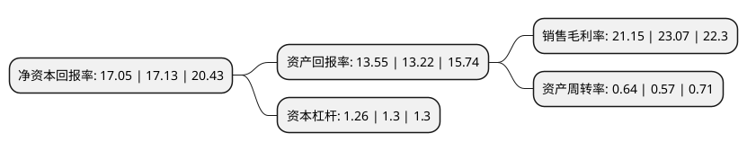

> 本页面由自动化程序生成于 2022年5月20日 01:35
> 内容可能存在错误，如有bug请提交issue至：https://github.com/Eroleice/doc-pi/issues
{.is-warning}

# 上市公司基本情况

## 基本资料

广东好太太科技集团股份有限公司（以下简称“好太太”）成立于2005年01月05日，广州市。于2017年12月01日在上交所主板上市。

好太太注册资本40,100万元，公司主要产品为不同功能的晾衣架和其他家居产品，主要产品按功能具体分为手摇晾衣架，智能晾衣机，落地晾衣架和外飘晾衣架四大系列晾衣架产品，以及包括智能家居产品在内的家居生活用品。以下是详细信息：

- 公司名称: 广东好太太科技集团股份有限公司
- 股票代码: 603848.SH
- 所在地: 广东 - 广州市
- 成立日期: 2005年01月05日
- 注册资本: 40,100万元
- 法定代表人: 沈汉标
- 主营业务: 公司主要产品为不同功能的晾衣架和其他家居产品，主要产品按功能具体分为手摇晾衣架，智能晾衣机，落地晾衣架和外飘晾衣架四大系列晾衣架产品，以及包括智能家居产品在内的家居生活用品
- 公司官网: www.hotata.com
- 公司介绍: 公司是一家集研发、生产、销售、服务于一体的智能家居企业，深耕晾晒为代表的智能家居领域逾十载，是本行业的领军企业，产品与服务涵盖智能晾晒、智能安防等智能家居领域。主要产品包括以智能晾衣机、智能锁为代表的智能家居产品和各系列晾衣架产品等。公司以成为全球知名的智能家居企业为愿景，凭借对智能家居的深入研究及前瞻性布局，在产品研发、技术创新、外观设计、生产制造等方面不断突破，为消费者提供全新体验的智能晾衣机、智能锁等智能家居产品。好太太始终专注科技创新，被广东省科学技术厅授予“广东省智能晾晒系统工程技术研究中心”称号，多次次被认定为“高新技术企业”；先后获得多项国家专利，“心连心结构”、“智能纠错”、“智能声控”、“APP云智能控制”、“高集成动力模块”等多项核心技术推动产品升级与行业变革。

## 股东及高管情况

上市公司第一大股东为沈汉标，持股217,395,000股，占比54.21%，为上市公司实际控制人。

截至2022年03月31日，上市公司的前十大股东中，共有9名自然人股东，1个产品账户，其中5%以上大股东共有3名。上市公司前十大股东明细如下：

> 截至2022年03月31日，上市公司前十大股东信息如下：

| 股东名称 | 持股数量（股） | 持股比例 |
| --- | --- | --- |
| 沈汉标 | 217,395,000 | 54.21% |
| 王妙玉 | 116,165,000 | 28.97% |
| 侯鹏德 | 22,500,000 | 5.61% |
| 林晓东 | 1,810,000 | 0.45% |
| 福建红移投资管理有限公司-红移安和一号私募证券投资基金 | 770,000 | 0.19% |
| 杨纲 | 691,500 | 0.17% |
| 桂勇 | 680,400 | 0.17% |
| 马志军 | 519,100 | 0.13% |
| 洪慰旋 | 461,000 | 0.11% |
| 陈庆军 | 460,000 | 0.11% |

## 杜邦分析

> 数据列示周期：2021年 | 2020年 | 2019年
{.is-info}

上市公司的净资产收益率在近一年有所下降，下降幅度为-0.47%，其变化情况分解如下：
- 上市公司的销售毛利率在近一年下降了-8.32%，可能是生产效率的下降、商品原材料价格上涨或商品价格的下跌所致。
- 上市公司的资产周转率在近一年上升了12.28%，可能是源自于更快的销售回款或库存管理效果提升。
- 上市公司的财务杠杆比率在近一年下降了-3.08%，可能是减少负债降低财务费用。

