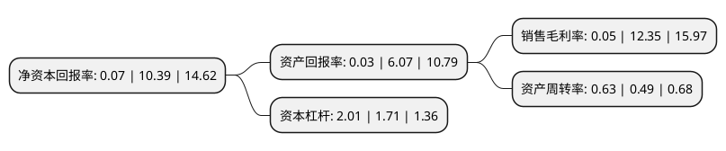

> 本页面由自动化程序生成于 2022年5月20日 01:35
> 内容可能存在错误，如有bug请提交issue至：https://github.com/Eroleice/doc-pi/issues
{.is-warning}

# 上市公司基本情况

## 基本资料

广州好莱客创意家居股份有限公司（以下简称“好莱客”）成立于2007年04月09日，广州市。于2015年02月17日在上交所主板上市。

好莱客注册资本31,127.708万元，主营业务:开发，生产，销售整体衣柜及配套家具，主要产品为整体衣柜，整体衣帽间，整体书柜及其它配套产品。以下是详细信息：

- 公司名称: 广州好莱客创意家居股份有限公司
- 股票代码: 603898.SH
- 所在地: 广东 - 广州市
- 成立日期: 2007年04月09日
- 注册资本: 31,127.708万元
- 法定代表人: 沈汉标
- 主营业务: 主营业务:开发，生产，销售整体衣柜及配套家具，主要产品为整体衣柜，整体衣帽间，整体书柜及其它配套产品
- 公司官网: www.holike.com
- 公司介绍: 公司专业专注于全屋定制领域，以板式家具的研发、设计、生产和销售为主营业务，同步配套开发销售成品家具及软装。公司销售网络已遍布全国大部分城市，在全国多个省都设有营销服务中心，经销商网络遍布全国多个城，营销及服务网络规模在同行属领先地位。公司始终立足现代家居市场需求、不断引领行业潮流，致力于为全球消费者定制专属的舒适生活体验。公司始终保持产品创新力，让每一件出品都更贴合人性；贯彻原态环保理念，采用“基材甲醛零添加”的原态板，为每个家庭量身定制更为舒适、健康和多元化的高品质生活方式；匠心打造生产工艺，引入“智造系统”确保每一件出品都更可靠耐用；创立10S定制管家服务，为消费者提供多维度全程优质体验。

## 股东及高管情况

上市公司第一大股东为沈汉标，持股127,121,300股，占比40.84%，为上市公司实际控制人。

截至2022年03月31日，上市公司的前十大股东中，共有5名自然人股东，1名机构股东，3个产品账户，1个海外主体，其中5%以上大股东共有2名。上市公司前十大股东明细如下：

> 截至2022年03月31日，上市公司前十大股东信息如下：

| 股东名称 | 持股数量（股） | 持股比例 |
| --- | --- | --- |
| 沈汉标 | 127,121,300 | 40.84% |
| 王妙玉 | 80,766,000 | 25.95% |
| 山东省国有资产投资控股有限公司 | 4,694,269 | 1.51% |
| 詹缅阳 | 3,793,072 | 1.22% |
| 建投拓安(安徽)股权投资管理有限公司-中德制造业(安徽)投资基金(有限合伙) | 3,549,245 | 1.14% |
| 中泰证券资管-兴业银行-中泰星信1号集合资产管理计划 | 2,520,000 | 0.81% |
| 中泰证券资管-兴业银行-中泰星信2号集合资产管理计划 | 2,500,364 | 0.8% |
| 蔡楚芳 | 2,332,468 | 0.75% |
| 郭良如 | 2,192,895 | 0.7% |
| 香港中央结算有限公司(陆股通) | 1,484,840 | 0.48% |

## 杜邦分析

> 数据列示周期：2021年 | 2020年 | 2019年
{.is-info}

上市公司的净资产收益率在近一年有所下降，下降幅度为-99.33%，其变化情况分解如下：
- 上市公司的销售毛利率在近一年下降了-99.6%，可能是生产效率的下降、商品原材料价格上涨或商品价格的下跌所致。
- 上市公司的资产周转率在近一年上升了28.57%，可能是源自于更快的销售回款或库存管理效果提升。
- 上市公司的财务杠杆比率在近一年上升了17.54%，可能是增加负债扩大生产规模。

