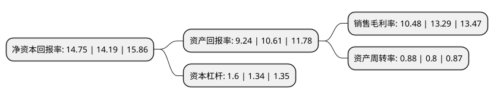

> 本页面由自动化程序生成于 2022年5月20日 01:36
> 内容可能存在错误，如有bug请提交issue至：https://github.com/Eroleice/doc-pi/issues
{.is-warning}

# 上市公司基本情况

## 基本资料

厦门松霖科技股份有限公司（以下简称“松霖科技”）成立于2004年05月11日，厦门市。于2019年08月26日在上交所主板上市。

松霖科技注册资本40,100.986万元，主营业务:花洒，淋浴系统，龙头，软管，升降杆及零配件等卫浴配件产品的研发，生产和销售。以下是详细信息：

- 公司名称: 厦门松霖科技股份有限公司
- 股票代码: 603992.SH
- 所在地: 福建 - 厦门市
- 成立日期: 2004年05月11日
- 注册资本: 40,100.986万元
- 法定代表人: 周华松
- 主营业务: 主营业务:花洒，淋浴系统，龙头，软管，升降杆及零配件等卫浴配件产品的研发，生产和销售
- 公司官网: www.solex-group.com
- 公司介绍: 公司主营业务为花洒、淋浴系统、龙头、软管、升降杆及零配件等卫浴配件产品的研发、生产和销售。自设立以来，公司始终致力于为全球各大知名卫浴企业及大型连锁建材零售商提供技术一流、质量领先的卫浴配件产品，主营业务未发生变化。公司产品设计能力突出。由公司设计团队主持设计的花洒、龙头等产品已先后多次获得了“iF设计奖”、“红点奖”、“IDEA”、“G-Mark”等国际工业设计领域的顶尖奖项。依靠优异的产品设计能力，公司在业内树立了良好的品牌形象，并获得了社会各界的高度认可，被认定为“厦门市市级工业设计中心”、“福建省省级工业设计中心”、“国家级工业设计中心”。公司技术研发实力领先。自2008年起公司即被连续认定为高新技术企业，2013年被认定为“国家火炬计划重点高新技术企业”。公司技术中心曾先后于2009年、2013年、2018年被认定为“厦门市企业技术中心”、“省级企业技术中心”、“国家企业技术中心”。

## 股东及高管情况

上市公司第一大股东为松霖集团投资有限公司，持股124,751,108股，占比31.11%，为上市公司实际控制人。

截至2022年03月31日，上市公司的前十大股东中，共有4名自然人股东，5名机构股东，1名其他股东，其中5%以上大股东共有4名。上市公司前十大股东明细如下：

> 截至2022年03月31日，上市公司前十大股东信息如下：

| 股东名称 | 持股数量（股） | 持股比例 |
| --- | --- | --- |
| 松霖集团投资有限公司 | 124,751,108 | 31.11% |
| 周华松 | 89,736,506 | 22.38% |
| 厦门松霖投资管理有限公司 | 88,965,300 | 22.19% |
| 吴文利 | 31,243,380 | 7.79% |
| 周华柏 | 5,940,376 | 1.48% |
| 厦门联正智创股权投资合伙企业(有限合伙) | 5,301,000 | 1.32% |
| 厦门信卓智创股权投资合伙企业(有限合伙) | 5,301,000 | 1.32% |
| 周丽华 | 2,970,188 | 0.74% |
| 科威特政府投资局-自有资金 | 2,659,275 | 0.66% |
| 厦门励众合股权投资合伙企业(有限合伙) | 2,001,000 | 0.5% |

## 利润表分析

上市公司2021年总收入为29.76亿元，净利润为3.12亿元，实现盈利。

## 杜邦分析

> 数据列示周期：2021年 | 2020年 | 2019年
{.is-info}

上市公司的净资产收益率在近一年有所上升，上升幅度为3.95%，其变化情况分解如下：
- 上市公司的销售毛利率在近一年下降了-21.14%，可能是生产效率的下降、商品原材料价格上涨或商品价格的下跌所致。
- 上市公司的资产周转率在近一年上升了10%，可能是源自于更快的销售回款或库存管理效果提升。
- 上市公司的财务杠杆比率在近一年上升了19.4%，可能是增加负债扩大生产规模。

