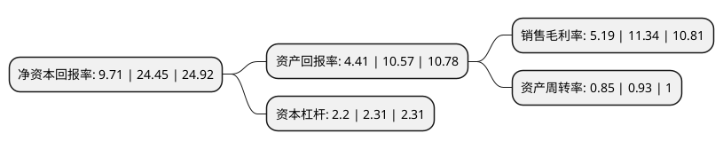

> 本页面由自动化程序生成于 2022年5月20日 01:37
> 内容可能存在错误，如有bug请提交issue至：https://github.com/Eroleice/doc-pi/issues
{.is-warning}

# 上市公司基本情况

## 基本资料

王力安防科技股份有限公司（以下简称“王力安防”）成立于2005年03月29日，金华市。于2021年02月24日在上交所主板上市。

王力安防注册资本43,600万元，公司的安全门等门类产品按材质分类主要有钢质门，装甲门，铜门，金木门，不锈钢门，铸铝门和木门等，锁具产品主要包括智能锁和机械锁，产品线布局丰富。主营业务为安全门等门类产品以及机械锁和智能锁等锁具产品的研发设计，生产和销售。以下是详细信息：

- 公司名称: 王力安防科技股份有限公司
- 股票代码: 605268.SH
- 所在地: 浙江 - 金华市
- 成立日期: 2005年03月29日
- 注册资本: 43,600万元
- 法定代表人: 王跃斌
- 主营业务: 公司的安全门等门类产品按材质分类主要有钢质门，装甲门，铜门，金木门，不锈钢门，铸铝门和木门等，锁具产品主要包括智能锁和机械锁，产品线布局丰富主营业务为安全门等门类产品以及机械锁和智能锁等锁具产品的研发设计，生产和销售
- 公司官网: www.wanglianfang.com
- 公司介绍: 公司以锁具研发为核心，以成熟的安全门研发、生产体系为支撑，向市场提供优质的门、锁产品，是集科研、设计、开发、制造、销售、服务于一体的门、锁业企业。公司拥有国内先进的门、锁业生产线和完善的营销服务体系，与世茂、恒大、融创、绿城和荣盛等国内知名房地产企业建立良好的战略合作关系。发行人是中国消防协会会员、浙江省防火门行业自律委员会理事、全国智能建筑及居住区数字化标准化技术委员会会员和中国安全防范产品行业协会的副理事长单位。发行人在锁具领域技术处于业内领先水平，是由全国智能建筑及居住区数字化标准化技术委员会组织编制的《建筑及居住区数字化技术应用智能门锁安全技术》(导则)的参与编制单位。

## 股东及高管情况

上市公司第一大股东为王力集团有限公司，持股193,725,000股，占比44.43%，为上市公司实际控制人。

截至2022年03月31日，上市公司的前十大股东中，共有3名自然人股东，6名机构股东，1个产品账户，其中5%以上大股东共有5名。上市公司前十大股东明细如下：

> 截至2022年03月31日，上市公司前十大股东信息如下：

| 股东名称 | 持股数量（股） | 持股比例 |
| --- | --- | --- |
| 王力集团有限公司 | 193,725,000 | 44.43% |
| 浙江王力电动车业有限公司 | 73,800,000 | 16.93% |
| 陈晓君 | 29,520,000 | 6.77% |
| 武义华爵股权投资管理有限公司 | 27,675,000 | 6.35% |
| 永康市共久股权投资管理合伙企业(有限合伙) | 22,140,000 | 5.08% |
| 王斌革 | 7,380,000 | 1.69% |
| 王斌坚 | 7,380,000 | 1.69% |
| 尚融(宁波)投资中心(有限合伙) | 6,150,123 | 1.41% |
| 兴业银行股份有限公司-南方金融主题灵活配置混合型证券投资基金 | 3,439,019 | 0.79% |
| 宁波高新区岠玲股权投资合伙企业(有限合伙) | 1,229,877 | 0.28% |

## 利润表分析

上市公司2021年总收入为26.44亿元，净利润为1.37亿元，实现盈利。

## 杜邦分析

> 数据列示周期：2021年 | 2020年 | 2019年
{.is-info}

上市公司的净资产收益率在近一年有所下降，下降幅度为-60.29%，其变化情况分解如下：
- 上市公司的销售毛利率在近一年下降了-54.23%，可能是生产效率的下降、商品原材料价格上涨或商品价格的下跌所致。
- 上市公司的资产周转率在近一年下降了-8.6%，可能是源自于更慢的销售回款或库存管理效果下降。
- 上市公司的财务杠杆比率在近一年下降了-4.76%，可能是减少负债降低财务费用。

