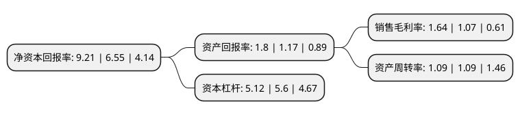

> 本页面由自动化程序生成于 2022年5月20日 01:01
> 内容可能存在错误，如有bug请提交issue至：https://github.com/Eroleice/doc-pi/issues
{.is-warning}

# 上市公司基本情况

## 基本资料

康佳集团股份有限公司（以下简称“深康佳A”）成立于1980年10月01日，深圳市。于1992年03月27日在深交所主板上市。

深康佳A注册资本240,794.541万元，主要产品:彩色电视机，数字移动电话及其配套产品。以下是详细信息：

- 公司名称: 康佳集团股份有限公司
- 股票代码: 000016.SZ
- 所在地: 广东 - 深圳市
- 成立日期: 1980年10月01日
- 注册资本: 240,794.541万元
- 法定代表人: 周彬
- 主营业务: 主要产品:彩色电视机，数字移动电话及其配套产品
- 公司官网: www.konka.com
- 公司介绍: 公司主要从事彩色电视机、手机、白色家电、厨卫电器，净水系列、日用生活电器、LED、机顶盒及相关产品的研发、制造和销售，兼及精密模具、注塑件、高频头、印制板、变压器及手机电池等配套业务，是中国领先的电子信息企业。公司拥有覆盖面广、服务完善的营销服务网络，在国内建立了多个营销分公司、数百个销售经营部及多个维修服务网点，海外业务也已拓展到世界多个国家和地区。公司按照“科技+产业+城镇化”的发展方向和“硬件+软件、终端+用户、科技+投控”的发展模式，以消费电子业务为基础，以“科技+投控”复合能力为支撑，向战略性新兴产业升级、向产业地产业务拓展、向互联网及供应链服务业务延伸，形成科技园区业务群、产业产品业务群、平台服务业务群和投资金融业务群四大业务群协同发展的全新局面。

## 股东及高管情况

上市公司第一大股东为华侨城集团有限公司，持股523,746,932股，占比21.75%，**疑似为**上市公司实际控制人。

截至2022年03月31日，上市公司的前十大股东中，共有2名自然人股东，5名机构股东，3个海外主体，其中5%以上大股东共有2名。上市公司前十大股东明细如下：

> 未能通过持股比例判定出上市公司实际控制人（持股30%以上）
> 可能存在通过间接持股、联合持股、协议控制等方式拥有实际控制权的主体，具体请参考上市公司定期公告！
{.is-warning}

> 截至2022年03月31日，上市公司前十大股东信息如下：

| 股东名称 | 持股数量（股） | 持股比例 |
| --- | --- | --- |
| 华侨城集团有限公司 | 523,746,932 | 21.75% |
| 中信证券经纪(香港)有限公司 | 180,001,110 | 7.48% |
| 王景峰 | 111,381,100 | 4.63% |
| 国元证券经纪(香港)有限公司 | 59,300,325 | 2.46% |
| HOLY TIME GROUP LIMITED | 57,289,100 | 2.38% |
| GAOLING FUND,L.P. | 52,801,250 | 2.19% |
| NAM NGAI | 22,567,540 | 0.94% |
| 招商证券香港有限公司 | 19,314,220 | 0.8% |
| 交银国际证券有限公司 | 18,896,037 | 0.78% |
| 李汉发 | 17,680,000 | 0.73% |

## 利润表分析

上市公司2021年总收入为491.06亿元，净利润为8.06亿元，实现盈利。

## 杜邦分析

> 数据列示周期：2021年 | 2020年 | 2019年
{.is-info}

上市公司的净资产收益率在近一年有所上升，上升幅度为40.61%，其变化情况分解如下：
- 上市公司的销售毛利率在近一年上升了53.27%，可能是生产效率的提升、商品原材料价格下跌或商品价格的上涨所致。
- 上市公司的资产周转率在近一年下降了0%，可能是源自于更慢的销售回款或库存管理效果下降。
- 上市公司的财务杠杆比率在近一年下降了-8.57%，可能是减少负债降低财务费用。

