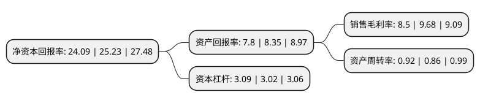

> 本页面由自动化程序生成于 2022年5月20日 01:01
> 内容可能存在错误，如有bug请提交issue至：https://github.com/Eroleice/doc-pi/issues
{.is-warning}

# 上市公司基本情况

## 基本资料

美的集团股份有限公司（以下简称“美的集团”）成立于2000年04月07日，佛山市。于2013年09月18日在深交所主板上市。

美的集团注册资本699,443.654万元，以家电产业为主，涉足电机，物流等领域，旗下分为四大业务板块，分别为大家电，小家电，电机及物流以下是详细信息：

- 公司名称: 美的集团股份有限公司
- 股票代码: 000333.SZ
- 所在地: 广东 - 佛山市
- 成立日期: 2000年04月07日
- 注册资本: 699,443.654万元
- 法定代表人: 方洪波
- 主营业务: 以家电产业为主，涉足电机，物流等领域，旗下分为四大业务板块，分别为大家电，小家电，电机及物流
- 公司官网: www.midea.com
- 公司介绍: 公司是一家消费电器、暖通空调、机器人与自动化系统、智能供应链(物流)的科技集团，提供多元化的产品种类与服务，包括以厨房家电、冰箱、洗衣机、及各类小家电为核心的消费电器业务；以家用空调、中央空调、供暖及通风系统为核心的暖通空调业务；以库卡集团、美的机器人公司等为核心的机器人及自动化系统业务;以安得智联为集成解决方案服务平台的智能供应链业务。公司以“科技尽善，生活尽美”为企业愿景，将“联动人与万物，启迪美的世界”作为使命，恪守“敢知未来——志存高远、务实奋进、包容共协、变革创新”的价值观，整合全球资源，推动技术创新，每年为全球超过3亿用户、及各领域的重要客户与战略合作伙伴提供满意的产品和服务，致力创造美好生活。

## 股东及高管情况

上市公司第一大股东为美的控股有限公司，持股2,169,178,713股，占比30.99%，为上市公司实际控制人。

截至2022年03月31日，上市公司的前十大股东中，共有5名自然人股东，3名机构股东，1个产品账户，1个海外主体，其中5%以上大股东共有2名。上市公司前十大股东明细如下：

> 截至2022年03月31日，上市公司前十大股东信息如下：

| 股东名称 | 持股数量（股） | 持股比例 |
| --- | --- | --- |
| 美的控股有限公司 | 2,169,178,713 | 30.99% |
| 香港中央结算有限公司(陆股通) | 1,182,613,943 | 16.89% |
| 中国证券金融股份有限公司 | 198,145,134 | 2.83% |
| 方洪波 | 116,990,492 | 1.67% |
| 中央汇金资产管理有限责任公司 | 88,260,460 | 1.26% |
| 黄健 | 86,140,000 | 1.23% |
| 加拿大年金计划投资委员会-自有资金(交易所) | 70,126,251 | 1% |
| 栗建伟 | 47,852,845 | 0.68% |
| 袁利群 | 39,320,997 | 0.56% |
| 黄晓祥 | 37,835,332 | 0.54% |

## 利润表分析

上市公司2021年总收入为3,433.6亿元，净利润为290.15亿元，实现盈利。

## 杜邦分析

> 数据列示周期：2021年 | 2020年 | 2019年
{.is-info}

上市公司的净资产收益率在近一年有所下降，下降幅度为-4.52%，其变化情况分解如下：
- 上市公司的销售毛利率在近一年下降了-12.19%，可能是生产效率的下降、商品原材料价格上涨或商品价格的下跌所致。
- 上市公司的资产周转率在近一年上升了6.98%，可能是源自于更快的销售回款或库存管理效果提升。
- 上市公司的财务杠杆比率在近一年上升了2.32%，可能是增加负债扩大生产规模。

