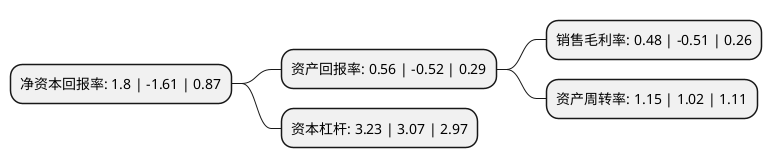

> 本页面由自动化程序生成于 2022年5月20日 01:02
> 内容可能存在错误，如有bug请提交issue至：https://github.com/Eroleice/doc-pi/issues
{.is-warning}

# 上市公司基本情况

## 基本资料

长虹美菱股份有限公司（以下简称“长虹美菱”）成立于1996年11月18日，合肥市。于1993年10月18日在深交所主板上市。

长虹美菱注册资本102,992.372万元，主要产品:电冰箱。以下是详细信息：

- 公司名称: 长虹美菱股份有限公司
- 股票代码: 000521.SZ
- 所在地: 安徽 - 合肥市
- 成立日期: 1996年11月18日
- 注册资本: 102,992.372万元
- 法定代表人: 吴定刚
- 主营业务: 主要产品:电冰箱
- 公司官网: www.meiling.com
- 公司介绍: 公司是中国重要的电器制造商之一，拥有合肥、绵阳、中山和景德镇四大国内制造基地，印尼和巴基斯坦两大海外制造基地。目前，公司已基本完成了综合白电的产业布局，覆盖了冰、洗、空、厨卫、小家电等全产品线，同时进入生鲜电商、生物医疗等新产业领域。公司拥有安徽省首家RoHS公共检测中心，国家级企业技术中心、尖端研发团队，美菱在节能、无霜、深冷、智能化等多个领域不断取得突破性成果，获得发明专利近千项。美菱M鲜生系列冰箱将采用水分子激活保鲜技术，创下冰箱行业长效保鲜的新纪元，带动整个行业的技术进步；美菱M鲜生语音智能冰箱，搭载全语音交互技术，用户通过发布语音指令，即可实现冰箱自动开关门、3秒闪存、食品管理等人性化功能。近年来公司荣获“智慧冰箱智能制造试点示范项目”、“国家级绿色工厂”及“国家级工业设计中心”三项国家级荣誉称号。同时，多款产品进入国家绿色产品名录，斩获多项国内、国际创新大奖，再度彰显美菱智造、美菱品牌智能创新技术的能力和实力。

## 股东及高管情况

上市公司第一大股东为四川长虹电器股份有限公司，持股248,457,724股，占比24.12%，**疑似为**上市公司实际控制人。

截至2022年03月31日，上市公司的前十大股东中，共有2名自然人股东，4名机构股东，2个产品账户，2个海外主体，其中5%以上大股东共有1名。上市公司前十大股东明细如下：

> 未能通过持股比例判定出上市公司实际控制人（持股30%以上）
> 可能存在通过间接持股、联合持股、协议控制等方式拥有实际控制权的主体，具体请参考上市公司定期公告！
{.is-warning}

> 截至2022年03月31日，上市公司前十大股东信息如下：

| 股东名称 | 持股数量（股） | 持股比例 |
| --- | --- | --- |
| 四川长虹电器股份有限公司 | 248,457,724 | 24.12% |
| 合肥市产业投资控股(集团)有限公司 | 47,823,401 | 4.64% |
| 长虹(香港)贸易有限公司 | 27,077,797 | 2.63% |
| CAO SHENGCHUN | 14,766,086 | 1.43% |
| 马国斌 | 14,642,300 | 1.42% |
| 财通基金-宁波银行-海通兴泰(安徽)新兴产业投资基金(有限合伙) | 10,733,452 | 1.04% |
| 珠海市金羿资产管理有限公司-金羿1期私募证券投资基金 | 10,347,600 | 1% |
| 辉立证券(香港)有限公司 | 6,296,913 | 0.61% |
| UBS AG | 5,360,600 | 0.52% |
| 陈钦 | 4,383,888 | 0.43% |

## 利润表分析

上市公司2021年总收入为180.32亿元，净利润为0.87亿元，实现盈利。

## 杜邦分析

> 数据列示周期：2021年 | 2020年 | 2019年
{.is-info}

上市公司的净资产收益率在近一年有所下降，下降幅度为-211.8%，其变化情况分解如下：
- 上市公司的销售毛利率在近一年下降了-194.12%，可能是生产效率的下降、商品原材料价格上涨或商品价格的下跌所致。
- 上市公司的资产周转率在近一年上升了12.75%，可能是源自于更快的销售回款或库存管理效果提升。
- 上市公司的财务杠杆比率在近一年上升了5.21%，可能是增加负债扩大生产规模。

