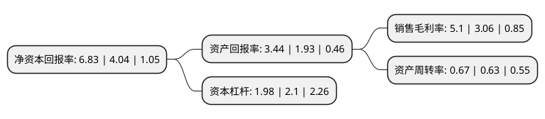

> 本页面由自动化程序生成于 2022年5月20日 01:03
> 内容可能存在错误，如有bug请提交issue至：https://github.com/Eroleice/doc-pi/issues
{.is-warning}

# 上市公司基本情况

## 基本资料

四川九洲电器股份有限公司（以下简称“四川九洲”）成立于1991年11月28日，绵阳市。于1998年05月06日在深交所主板上市。

四川九洲注册资本102,280.665万元，主营业务:以生产广播电视设备为主业。主要产品:音箱，功放，视听产品。从事卫星电视高频头(LNB)和信号多路转换器等产品的研发，生产和经营。以下是详细信息：

- 公司名称: 四川九洲电器股份有限公司
- 股票代码: 000801.SZ
- 所在地: 四川 - 绵阳市
- 成立日期: 1991年11月28日
- 注册资本: 102,280.665万元
- 法定代表人: 夏明
- 主营业务: 主营业务:以生产广播电视设备为主业主要产品:音箱，功放，视听产品从事卫星电视高频头(LNB)和信号多路转换器等产品的研发，生产和经营
- 公司官网: www.jiuzhoutech.com
- 公司介绍: 公司是一家以宽带网络设备、数字电视终端设备为主的高科技企业。公司拥有广播电视领域庞大的科研、生产、营销服务优势，是中国有线电视行业技术实力强、市场占有率大的高科技企业。着力为国内广电及电信运营商提供宽带网络解决方案、数字电视音视频系统解决方案、智慧城市及智能家居解决方案、物联网解决方案。公司是四川省首家通过国家科技部和中科院评审认定的国家级高新技术企业；中国电子信息百强企业；四川省最大规模和最佳效益双百强工业企业；中国广播电视设备工业协会副会长暨有线电视分会、卫星电视分会理事长单位；中国数字电视产业联盟和数据联盟成员单位；工信部机卡分离技术标准化成员单位，全国广播电视标准化技术委员会成员单位。

## 股东及高管情况

上市公司第一大股东为四川九洲投资控股集团有限公司，持股486,907,288股，占比47.61%，为上市公司实际控制人。

截至2022年03月31日，上市公司的前十大股东中，共有2名自然人股东，5名机构股东，2个产品账户，1个海外主体，其中5%以上大股东共有1名。上市公司前十大股东明细如下：

> 截至2022年03月31日，上市公司前十大股东信息如下：

| 股东名称 | 持股数量（股） | 持股比例 |
| --- | --- | --- |
| 四川九洲投资控股集团有限公司 | 486,907,288 | 47.61% |
| 杨捷 | 19,140,000 | 1.87% |
| 四川富润志合投资有限责任公司 | 13,021,016 | 1.27% |
| 中国银行股份有限公司-华夏行业景气混合型证券投资基金 | 12,285,500 | 1.2% |
| 华安未来资产-浦发银行-华安资产-浦发银行-东兴1号资产管理计划 | 10,303,030 | 1.01% |
| 绵阳科技城发展投资(集团)有限公司 | 10,000,000 | 0.98% |
| 绵阳市九华投资管理中心(有限合伙) | 6,815,620 | 0.67% |
| 杨毅 | 5,700,500 | 0.56% |
| 长城国融投资管理有限公司 | 4,924,600 | 0.48% |
| 香港中央结算有限公司(陆股通) | 4,694,833 | 0.46% |

## 利润表分析

上市公司2021年总收入为35.44亿元，净利润为1.8亿元，实现盈利。

## 杜邦分析

> 数据列示周期：2021年 | 2020年 | 2019年
{.is-info}

上市公司的净资产收益率在近一年有所上升，上升幅度为69.06%，其变化情况分解如下：
- 上市公司的销售毛利率在近一年上升了66.67%，可能是生产效率的提升、商品原材料价格下跌或商品价格的上涨所致。
- 上市公司的资产周转率在近一年上升了6.35%，可能是源自于更快的销售回款或库存管理效果提升。
- 上市公司的财务杠杆比率在近一年下降了-5.71%，可能是减少负债降低财务费用。

